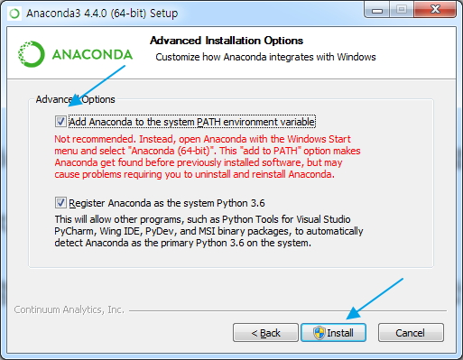

# [01] Python 소개, Python 설치, 개발 환경 설정

- Anaconda 5.1.0(Python 3.6.0 and other package included) install

## [01] Python 소개


### 1. 소개

- 1990년 귀도 반 로섬(Guido van Rossum)이 만든 인터프리터(GW-Basic) 언어
  - Java class처럼 미리 컴파일되어 있지 않고 실행시 라인단위로 읽어서 컴파일 후 실행
- 구글에서 만들어진 소프트웨어의 50%이상이 파이썬으로 만들어 졌음.
- Dropbox, Facebook(Tornado) 개발에 활용됨.
- C/C++과 함께 Machine Learning Open Source framework Tensorflow 기반 머신러닝 개발 언어로 지원됨.

### 2. 장점

- 자바에 비하면 문법이 단순하여 읽고 사용하기가 쉽다. (자바 코드의 약 50% 이하로 제작 가능)
- 라즈베리파이등의 사물인터넷 기기와 연동이 수월하다.
- 비동기식 코딩으로 혼란스러운 자원 경쟁이나 교착상태를 유발하지 않고도
  작성과 유지보수를 수월하게 만들어줌.
- 쓰레딩 대신 단일 이벤트 루프(Queue)를 사용해 소수 유닛에서 작업하는
  비동기식 코드 작성에 유리
- 문법이 쉽고 순서가 영어 구문과 유사하여 빠르게 배울 수 있다.
- 풍부한 라이브러리로 개발 생산성이 매우 높다.
- 멀티패러다임 프로그래밍 언어이다.
   (절차적 언어 지원(Cobol), 객체지향(C++, JAVA), 함수형 프로그래밍 언어(C)
- 다양한 플랫폼에서 사용가능(Python은 Linux에 기본 설치되어 있음, Cafe24 Python 2.7.6)
- 메모리 자동 관리(JAVA와 동일)
- 다른 언어로 작성된 모듈을 연결하는 Glue Language로 이용(CPython, Jython, IronPython, Pypy)
- 웹 프로그래밍, 수치연산 프로그래밍, 데이터베이스 프로그래밍등 다양한 분야 개발 가능
- 데이터 수집 및 분석, 머신 러닝(인공지능), 텐서플로(Google)의 기반 언어

### 3. 단점

- 모바일 컴퓨팅과 브라우저 부재.
- 대단히 빠른 속도를 요구하거나 하드웨어를 직접 접근해야 하는 프로그램에는 부적합
  (빠른속도는 C, C++ 이용, 데이터분석 R에비해 고속)
- 2.X 버전과 3.X 버전이 호환되지 않는다.
- 공공 프로젝트 승인예: JAVA, JSP, Spring, MyBATIS, CSS3, HTML5, Bootstrap, javascript, jQuery...(2018년 기준)
- 공공 프로젝트에 승인이 안됨(2018년 기준 일부 공기업에서 사용).
- Python으로 웹 개발이 가능하나 JAVA 관련 개발 환경을 주로 사용함.
- Python은 데이터 분석이 가능하나 소규모 데이터의 경우 간결한 문법을 지원하는 R language를
  사용하고 대규모 데이터 분석의 경우 Python을 사용.
- Python은 전문적인 데이터분석가, 머신러닝 개발자, 웹 개발자가 주로 사용
- R은 분석하여 결과를 도출하는 코드는 간결하고 수월하나 입출력및 언어의 특성이 부족하여
  다양한 처리를 하기가 어려움.

>> [참고] 파이썬 api-ms-win-crt-runtime-l1-1-0.dll 오류 해결 방법

- URL <http://www.microsoft.com/ko-kr/download/details.aspx?id=48145> 접속
- 'vc_redist.x64.exe' 다운받아 설치

>> Nox Android App Player와 불규칙하게 충돌이 발생할 수 있음으로 사용을 권장하지않음. Nox 삭제 → 'vc_redist.x64.exe' 설치 → Python 설치
  
## [02] Anaconda 5.1.0 download

- 기본 작업 폴더:
  C:/ai_201909
  C:/ai_201909/setup

1. Anaconda 5.1.0 download
   - 파이썬의 머신러닝 라이브러리인 sklearn(scikit-learn, 사이킷런) 등의 패키지와
     Jupyter Notebook 등을 모두 포함한 배포 패키지인
     아나콘다를 설치해야 머신러닝 개발이 편리하다. (개별 Library 설치시 Error 자주 발생)
   - 아나콘다 주요 구성 요소: Python 3.6, PIP, Pandas, Numpy, Scipy, Sklearn등
     수백개의 Library 포함
   - 최신버전 다운로드: <https://www.anaconda.com/download/>
   - 모든 버전 다운로드: <https://repo.continuum.io/archive/index.html>
     'Anaconda3-5.1.0-Windows-x86_64.exe    537.1M    2018-02-15' 다운로드( Python 3.6.0 기준)

## [03] Anaconda3-5.1.0 설치

1. Anaconda3-5.1.0 설치
   1) 'Anaconda3-5.1.0-Windows-x86_64.exe' 파일을 관리자 권한으로 실행합니다.
   2) 설치시 사용자 지정을 'All User'를 선택하고 설치합니다.(중요 ★)
   3) 설치는 기본 경로에 설치합니다.
   4) 설치시 CMD창에서 명령 실행이 편리하도록 옵션을 모두 선택합니다.
   
2. 설치 확인
    - 윈도우 시작 메뉴 -> cmd

```bash
> python --version
Python 3.6.4 :: Anaconda, Inc.
```
