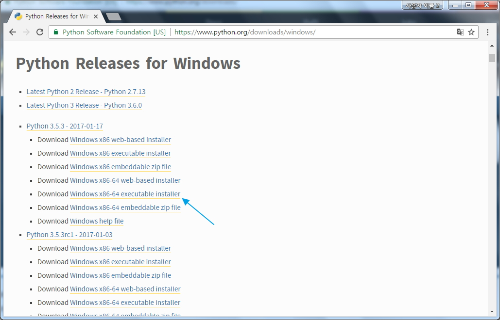

# Python

## [01] Python 소개

1. 소개
   - 1990년 귀도 반 로섬(Guido van Rossum)이 만든 인터프리터 언어
   - 구글에서 만들어진 소프트웨어의 50%이상이 파이썬으로 만들어 졌다.
   - Dropbox, Facebook(Tornado) 개발에 활용
2. 장점
   - 자바에 비하면 문법이 단순하여 읽고 사용하기가 쉽다. (자바의 약 50% 이하로 제작 가능)
   - 라즈베리파이등의 사물인터넷 기기와 연동이 수월하다.
   - 비동기식 코딩으로 혼란스러운 자원 경쟁이나 교착상태를 유발하지 않고도
     작성과 유지보수를 수월하게 만들어줌.
   - 문법이 쉽고 순서가 영어 구문과 유사하여 빠르게 배울 수 있다.
   - 풍부한 라이브러리로 개발 생산성이 매우 높다.
   - 멀티패러다임 프로그래밍 언어이다.
      (절차적 언어 지원(Cobol), 객체지향(C++, JAVA), 함수형 프로그래밍 언어(C)
   - 다양한 플랫폼에서 사용가능
   - 쓰레딩 대신 단일 이벤트 루프를 사용해 소수 유닛에서 작업하는 비동기식 코드 작성에 유리
   - 메모리 자동 관리
   - 다른 언어로 작성된 모듈을 연결하는 Glue Language로 이용(CPython, Jython, IronPython, Pypy)
   - 웹 프로그래밍, 수치연산 프로그래밍, 데이터베이스 프로그래밍등 다양한 분야 개발 가능
   - 데이터 수집 및 분석, 머신 러닝(인공지능), 텐서플로(Google)의 기반 언어
3. 단점
   - 모바일 컴퓨팅과 브라우저 부재.
   - 대단히 빠른 속도를 요구하거나 하드웨어를 직접 건드려야 하는 프로그램에는 부적합(C, C++ 이용)
   - 2.X 버전과 3.X 버전이 호환되지 않는다.
   - 공공 프로젝트 승인예: JAVA, JSP, Spring, MyBATIS, CSS3, HTML5, Bootstrap, javascript, jQuery...
   - 공공 프로젝트에 승인이 안됨.
  
[참고] 파이썬 api-ms-win-crt-runtime-l1-1-0.dll 오류 해결 방법
① <http://www.microsoft.com/ko-kr/download/details.aspx?id=48145> 접속
② 'vc_redist.x64.exe' 다운받아 설치

- Nox Android App Player와 불규칙하게 충돌이 발생할 수 있음으로 사용을 권장하지않음.
- Nox 삭제 → 'vc_redist.x64.exe' 설치 → Python 설치

## [02] 개발 환경 설정

- 3.5, 3.6 동일한 설치 과정 진행

작업 폴더: C:/201705_python
           C:/201705_python/setup
           C:/201705_python/ws_python

1. 다운로드
   - <http://www.python.org>
  
  

2. 설치
   - 설치 경로 수동 설정을위해 'Customize installation'을 선택합니다.
  
   - 다음으로 진행합니다.
  
   - 'Install for all users'를 선택하고 설치 경로를 'C:\Python35'로 지정합니다. 3.6은 'C:\Python36'로 지정합니다.
  
   - 설치가 진행됩니다.
  .jpg)
   - 설치가 성공했습니다.
  .jpg)

3. python shell의 실행
   - 실행 -> Python 3.5.3
  .jpg)

4. IDLE의 실행
   1) /ws_python/01.py
  .jpg)
   2) F5 키 실행
  .jpg)
