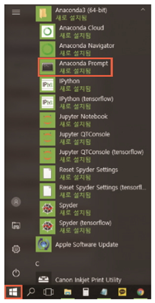
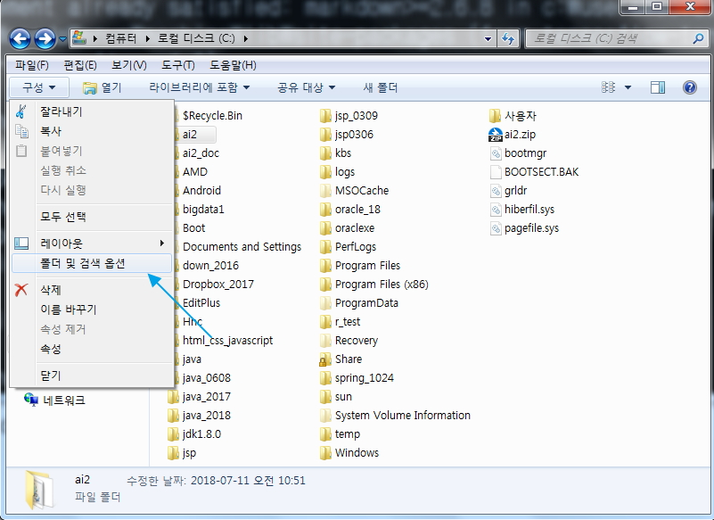
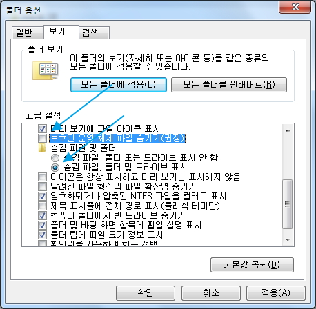
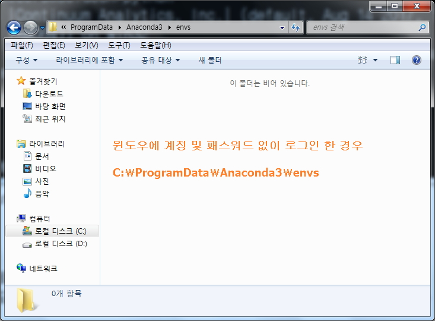
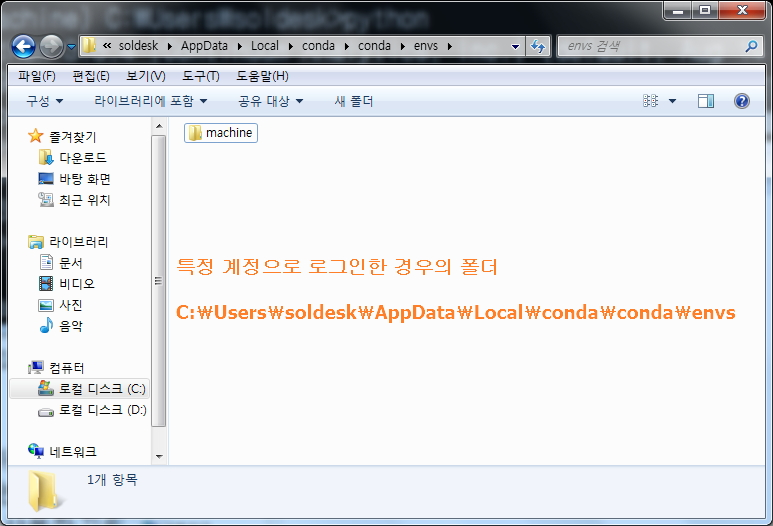

# 가상환경 생성

## [01] Conda를 이용한 Python 3.6 기반 가상환경 생성

- CPU의 종류와 version에 따라 설치할 Tensorflow의 version이 달라짐.
- 개발 환경 1: Anconda 4.4.0, Python 3.5, Tensorflow 1.3+
- 개발 환경 2: Anconda 5.1.0, Python 3.5, Tensorflow 1.5 AVX 미지원 CPU(i5 650)
- 개발 환경 3: Anconda 5.1.0, Python 3.6, Tensorflow 1.6 AVX 지원 CPU 1.3대비 10%이상의 속도 향상됨(i5 2320).

- AVX(Advanced Vector Extensions), AVX2 지원 확인: <https://en.wikipedia.org/wiki/Advanced_Vector_Extensions#CPUs_with_AVX>

- CPU Spec 검색
  intel i5 650 검색 또는 intel i5 2320 검색

### 1. 'Anaconda Prompt' 실행
  

### 2. conda를 이용한 가상 독립환경 구성 (VMWare를 통한 우분투 설치와 비슷한 원리)

1) 주로 딥러닝에 사용되는 Python library
   - numpy(넘파이): NumPy는 행렬이나 일반적으로 대규모 다차원 배열을 쉽게 처리 할 수 있게 해주는 파이썬의 라이브러리. NumPy는 데이터 구조 외에도 수치 계산을 위해 효율적으로 구현 된 기능을 제공.
   - matplotlib(맷플롯립): 데이터 시각화 파이썬 라이브러리.
   - pandas: 데이터 분석을 위한 파이썬 라이브러리, R언어의 데이터프레임과 같은 이름의 데이터프레임 구조에 데이터를 저장하고 다양한 조작으로 데이터 분석을 편리하게 해 줌

   - scipy(사이파이): Python을 위한 과학적 도구의 오픈소스 라이브러리, 프로그래밍, 수학, 과학, 공학을 위한 수치 해석 소프트웨어.
   - spyder(스파이더): NumPy, SciPy, Matplotlib, IPython이 통합된 IDE
   - seaborn(시본): matplotlib 기반의 파이썬 시각화 라이브러리, 양한 색상 테마와 통계용 차트 등의 기능을 제공함.
   - scikit-learn(사이킷런): 파이썬 머신러닝 라이브러리
   - h5py: hdf5(Hierarchical Data Format version 5)는 대용량 데이터를 저장하기 위한 파일 포맷.
2) 'Anaconda Prompt' 관리자 권한으로 실행
3) 설치된 가상 환경의 확인
   - 가상정보 확인

    ```bash
    (base) C:\Users\dev>conda info --envs
    # conda environments:
    base                  *  C:\ProgramData\Anaconda3
    ```

   - 설치된 가상 환경 삭제

    ```bash
    (base) C:\Users\dev>conda remove --name machine --all
    (base) C:\Users\dev>conda remove --name machinegpu --all
    ```

4) 가상환경 생성(-n machine: 작업 환경 이름)

    ```bash
    (base) C:\Users\dev>conda create -n machine python=3.6 numpy scipy matplotlib spyder pandas seaborn scikit-learn h5py
    ```

5) 가상 환경 생성 종료 화면
   - conda 생략 가능

      ```bash
      #
      # To activate this environment, use
      #     $ conda activate machine
      #
      # To deactivate an active environment, use
      #
      #     $ conda deactivate
      (base) C:\Users\dev>
      ```

### 3. CPU 기반 Tensorflow 1.6.0 설치

- CPU spec에 따라서 Tensorflow version이 설치됨.
- Tensorflow 1.3 부터 Tensorflow와 Keras가 결합됨.
- 구형 CPU는 Tensorflow 1.3 버전이 지장이 없음.
- Tensorflow 1.5 AVX 미지원 CPU 설치 가능(i5 650)
- Tensorflow 1.6 AVX 지원 CPU 설치 가능, Tensorflow 1.3대비 10%이상의 속도 향상됨(i5 2320, 2300).

- AVX(Advanced Vector Extensions), AVX2 지원 확인:
  <https://en.wikipedia.org/wiki/Advanced_Vector_Extensions#CPUs_with_AVX>
- CPU spec Google 검색
  intel i5 650 또는 intel i5 2320, intel i7 ...

1) machine 작업 환경 활성화

   - 'Anaconda Prompt'에서 activate machine 입력
   - 비활성화: deactivate machine

    ```bash
    (base) C:\Users\dev>activate machine
    (machine) C:\Users\dev>python -m pip install --upgrade pip
    ## ← Python package 설치 툴 upgrade(생략 가능)
    ```

2) CPU 기반 Tensorflow 1.6.0의 설치

   - 지정된 버전의 설치

    ```bash
    (machine) C:\Users\dev>pip install tensorflow==1.6.0
    ....
    Successfully installed tensorflow-1.6.0 tensorflow-tensorboard-1.6.0
    (machine) C:\Users\dev>
    ```

    >> mkl-random 1.0.1 requires cython, which is not installed. 발생시 추가 설치

    ```bash
    (machine) C:\Users\user>pip install mkl-random==1.0.1
        100% |################################| 1.7MB 87kB/s
    Installing collected packages: cython
    Successfully installed cython-0.29.3
    ```

    >> 자동 권장된 버전의 설치

    ```bash
    (machine) C:\Users\dev>pip install tensorflow
    ```
  
#### 1. Tensorflow 설치 확인

- import tensorflow as tf: 라이브러리 import 및 별명 선언
- print(tf.__version__): Tensorflow 버전 출력
- exit(): 종료

```bash
(machine) C:\Users\dev>python
Python 3.6.4 |Continuum Analytics, Inc.| (default, Aug 14 2018, 13:41:13) [MSC v.1900 64 bit (AMD64)] on win32
Type "help", "copyright", "credits" or "license" for more information.

>>> import tensorflow as tf

C:\Users\dev\AppData\Local\conda\conda\envs\machine\lib\site-packages\h5py\__init__.py:34: FutureWarning: Conversion of the second argument of issubdtype from `float` to `np.floating` is deprecated. In future, it will be treated as `np.float64 == np.dtype(float).type`.
  from ._conv import register_converters as _register_converters
>>> print(tf.__version__)
1.6.0
>>> exit()
```

##### ●  에러 발생시 조치 1

- 메시지
ModuleNotFoundError: No module named '_pywrap_tensorflow_internal' 및 ImportError: DLL load failed: DLL 초기화 루틴을 실행할 수 없습니다.

- 해결 방법
  <https://www.microsoft.com/ko-kr/download/details.aspx?id=48145> 접속
  visual c++ 2015 redistributable (64bit) 다운받아 설치한다.

##### ●  에러 발생시 조치 2

- 메시지
  ImportError: DLL load failed with error code -1073741795
- 해결 방법: Anaconda를 다른 버전을 설치할 것.
  >>> exit()
- Tensorflow 삭제후 재설치

  ```bash
  (machine) C:\Windows\system32>pip uninstall tensorflow
  Uninstalling tensorflow-1.6.0:
    Would remove:
      c:\programdata\anaconda3\envs\machine\lib\site-packages\tensorflow-1.6.0.dist-info\*
      c:\programdata\anaconda3\envs\machine\lib\site-packages\tensorflow\*
      c:\programdata\anaconda3\envs\machine\scripts\freeze_graph.exe
      c:\programdata\anaconda3\envs\machine\scripts\saved_model_cli.exe
      c:\programdata\anaconda3\envs\machine\scripts\tensorboard.exe
      c:\programdata\anaconda3\envs\machine\scripts\toco.exe
      c:\programdata\anaconda3\envs\machine\scripts\toco_from_protos.exe
  Proceed (y/n)? y
    Successfully uninstalled tensorflow-1.6.0
  
  (machine) C:\Windows\system32>
  (machine) C:\Windows\system32>pip install tensorflow==1.6.0
  ```

#### 2. 케라스 설치하기

- 케라스(Keras)는 파이썬으로 작성된 오픈 소스 인공 신경망 라이브러리이다.
- Tensorflow를 사용하기쉽도록 인터페이스 역활을하여 적은 코드로 Tensorflow를 사용할 수 있도록 지원한다.
- Tensorflow 1.2이하는 Keras 독립적으로 설치해야 사용 가능함.
- Tensorflow 1.3 부터 Tensorflow와 Keras가 결합되어 별다른 설치 없이 사용 가능.
- Tensorflow와 Keras의 독립적인 설치도 지원하며 사용 소스는 거의 차이가 없음.
- 공식적으로 Tensorflow 2.0 부터 Keras를 Tensorflow의 인터페이스로 지정함.

- keras 2.1.6은 활성화 함수 softmax 사용법이 변경됨

```bash
(machine) C:\Users\dev>pip install keras==2.2.2
.....
Collecting keras==2.2.2
Successfully installed keras-2.2.2
```

#### 3. 케라스 설치 확인

```bash
(ai) C:\Users\dev>python
Python 3.6.0 |Continuum Analytics, Inc.| (default, Aug 14 2018, 13:41:13) [MSC v.1900 64 bit (AMD64)] on win32
Type "help", "copyright", "credits" or "license" for more information.
```

```python
>>> import keras

C:\Users\dev\AppData\Local\conda\conda\envs\machine\lib\site-packages\h5py\__init__.py:34: FutureWarning: Conversion of the second argument of issubdtype from `float` to `np.floating` is deprecated. In future, it will be treated as `np.float64 == np.dtype(float).type`.
  from ._conv import register_converters as _register_converters
Using TensorFlow backend.
>>>
```

#### 4. 삭제
(ai) C:\Users\dev>pip uninstall keras

#### 5. 권장 버전의 설치

  ```bash
  (ai) C:\Users\dev>pip install keras
  ```

- Keras 설치 실패시 방법
  [시작 -> Anaconda Navigator -> 좌측 메뉴 Environments -> machine 가상환경 선택 -> keras 검색 설치 또는 cmd 관리자 모드로 실행.
- 가상환경이 정상적으로 삭제가 안되는 경우 탐색기에서 확인 삭제
  - 기본 생성 폴더: C:/ProgramData/Anaconda3/envs
  - 숨김 파일 해제
  
- 숨김 파일 출력 설정
  
- 윈도우에 계정 및 패스워드 없이 로그인해도 관리자로 설치하면 목록에 출력됨.
  C:\ProgramData\Anaconda3\envs
  
- 특정 계정으로 로그인한 경우의 폴더: C:\Users\soldesk\AppData\Local\conda\conda\envs
  

```bash
 %windir%\System32\cmd.exe "/K" C:\ProgramData\Anaconda3\Scripts\activate.bat C:\ProgramData\Anaconda3
```
