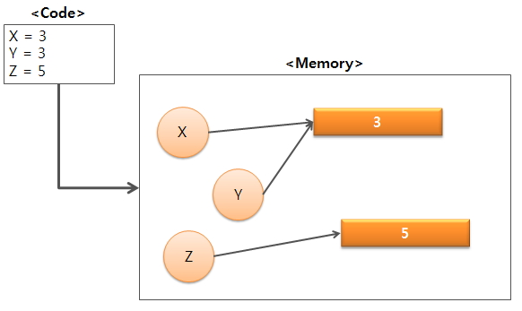
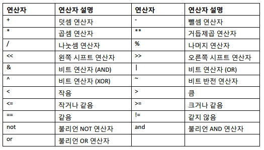
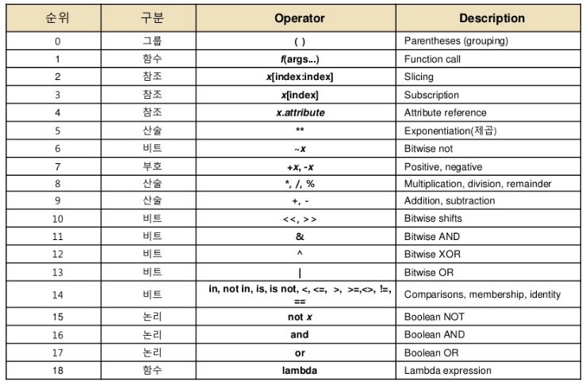

# 파이썬 프로그램 구조

## [01] 컴파일 단계

  컴퓨터의 구조: 현대의 Software는 대부분 프로그램을 메모리에 상주하여 실행하는 폰노이만 구조를 사용하고 있음.

  .jpg)

  - 파일 확장자: py
  - 단계: Python 소스는 라인단위 변환기인 Interpreter에 의하여 기계어로 바로 컴파일되어 실행됨.
  

.jpg)  
  
## [02] 변수

  - 파이썬은 숫자를 포함하여 모든 변수를 내부적으로 객체로 처리됨.
  - 숫자로 시작하면 안된다.
  - 파이썬 예약어는 사용 못한다.
  - 대소문자를 구분한다.  
  - 변수 선언시 데이터 타입을 선언하지 않는다. (Javascript와 비슷)
  - 객체 기반이라 데이터 타입 변환이 자유롭다.
  - 의미 있는 변수명을 지정한다.
  - 특별한 경우가 아니면 변수의 길이는 5이상 권장.
  - 자바의 경우 숫자는 상수로 메모리에 여러개가 존재하나 Python은
  정수도 객체화하여 메모리상에서 공유함.

## [03] 데이터(자료) 형(data type)

  - 프로그램의 실행 흐름: 입력 기능 → 처리 기능 → 출력 기능
  - 데이터를 입력하여 처리하고 출력하면서 메모리에 저장하며, 그 기준은 사전에 지정된 데이터 타입을 기준으로하며, 메모리를 할당하는 기준입니다.
  - 파이썬은 숫자등 데이터를 객체 기반의 형태로 저장하고 출력한다.

1. None - 아무런 값이 없다는 것을 나타내는 기호
2. Boolean형
   - True, False 값 사용, 첫자 대문자 주의
3. 정수형 - 객체 기반의 음의 정수, 양의 정수를 저장한다.
4. 실수형 - 소수점이 들어간 실수를 저장한다.
5. 문자열형 - 문자열을 저장 할 수 있으며 여러라인도 가능하다.
6. 주석 

7) 한라인 주석: #

8) 여러라인 주석: '''  .....  ''' or """ ..... """
  
  
9. 한글 선언: 파일의 맨위에 아래의 코드를 선언합니다.
- Jupyter Notebook, PyCharm은 생략
- Eclipse PyDev: # -*- coding: utf-8 -*-
                     또는
                     # coding=<utf-8>
  
  
8. 데이터 타입 실습
[실행 화면]

▷ /ws_python/notebook/basic/DataType.ipynb
- 정수 / 정수 = 실수

첨부 파일 참고 
   

 
 
  
[04] 연산자(operator: 기사, 조작자, 데이터 조작자)
      - 단항 연산자: 하나의 변수로 연산이 진행
      - 산술 연산자: 사칙연산(*)
      - 비교 연산자: 대소비교, 동일한지 비교(*)
      - 논리 연산자: 참, 거짓 연산자(*)
      - 삼항 연산자: 조건식, 참, 거짓 결합
      - 대입 연산자: 값의 대입(*)
      - ++, -- 없음

  

1. 산술(수치) 연산자 : +, -, *(×: 곱하기), /(÷: 나누기), //(정수 나누기), %(나머지, 모듈러스 연산자)
   - 정수 / 정수 = 실수

1) 몫을 뺀 나머지 연산자, 13으로 나누었을 때의 나머지는 0 ~ 12가됨
1 % 3 = 1
2 % 3 = 2
3 % 3 = 0

4 % 3 = 1
5 % 3 = 2
6 % 3 = 0

7 % 3 = 1
8 % 3 = 2
9 % 3 = 0
어떤수를 나누었을때 나머지가 0이면 어떤수의 배수입니다.

2. 대입 연산자: =
   - 좌변은 상수(숫자, 문자, 문자열)값이 아니라 기억장소(변수(식별자, 메모리))가
     와야합니다.
   - 할당(대입) 연산자의 양면성
     year = 2016;
     '='을 기준으로 오른쪽의 변수는 값을 가져오는 역활을하며, 왼쪽의 변수는 값이
     저장될 메모리 역활을 합니다.

3. 기타 연산자
   - 연산후대입 연산자: +=, -=, *=, /=, %=
   - 증가/감소 연산자 지원 안함: ++(1씩 증가), --(1씩 감소)

[출력 화면]

>> /ws_python/notebook/basic/DataType.ipynb append
첨부 파일 참고

### [05] Library Reference

1. Python API 참조하기
- <https://docs.python.org/3/library/index.html>