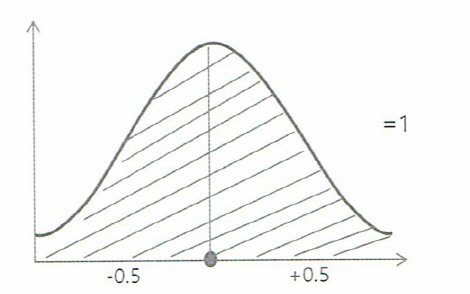
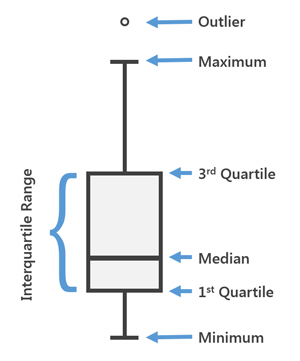

# Matplotlib

## [01] 데이터 시각화 library Matplotlib(맷플롯립)

- <https://matplotlib.org>
- 색상값: <https://matplotlib.org/3.1.0/gallery/color/named_colors.html>
- Color map: <https://matplotlib.org/tutorials/colors/colormaps.html>
- Line style: <https://matplotlib.org/gallery/lines_bars_and_markers/linestyles.html>
- Marker: <https://matplotlib.org/api/markers_api.html>
- 그래프 지원 library

1. 표준정규분포
   - 평균과 분산이 다른 정규분포를 표준화한 것이 표준정규분포이다.
   - 표준정규분포는 정규분포의 근간이 되는 [평균 0과 표준편차를 1]로 고정하는 과정을 의미한다.
    
2. Boxplot
   - 데이터 이상치(Outlier) 정제 목적으로 사용
   - 오류는 아니지만 굉장히 드물게 발생하는 극단적인 값.
   - 논리적으로 존재할 수 없는값  예) 1: 남자, 2 여자이나 3이 입력된 경우
   - 이상치가 포함되어 있으면 머신러닝 결과가 왜곡되기 때문에 학습에 앞서 이상치를 제거해야함.
   - 1st Quartile(Q1): 1 사분위수, 하위 25% 위치하는 값
   - 2st Quartile(Q2): 2 사분위수, 하위 50% 위치하는 값, 중위수
   - 3rd Quartile(Q3): 3 사분위수, 하위 75% 위치 값
   - IQR: Q3 번째 값 - Q1 번째 값
   - Maximum: 위쪽 극단치 경계 값: 3사분위수 값 + ((Q3 - Q1) * 1.5) 영역 안에서의 최대값, 데이터의 최댓값이 아님.
   - Minimum: 아래쪽 극단치 경계 값: 1사분위수 값 - ((Q3 - Q1) * 1.5) 영역 안에서의 최솟값, 데이터의 최솟값이 아님.
   - Outlier: 위아래 극단 경계 임계값(기준값)을 벗어난 값
   
3. 실습
    >> /ws_python/notebook/package/matplotlib_test.ipynb

    ```python
    import pandas as pd
    import numpy as np
    import matplotlib
    import matplotlib.pyplot as plt
    from matplotlib import font_manager, rc

    font_name = font_manager.FontProperties(fname="C:/Windows/Fonts/malgun.ttf").get_name()
    # windows 10
    # font_name = font_manager.FontProperties(fname="C:/Windows/Fonts/malgunsl.ttf").get_name()
    rc('font', family=font_name)           # 맑은 고딕 폰트 지정
    plt.rcParams["font.size"] = 12         # 글자 크기
    # plt.rcParams["figure.figsize"] = (10, 4) # 10:4의 그래프 비율
    plt.rcParams['axes.unicode_minus'] = False  # minus 부호는 unicode 적용시 한글이 깨짐으로 설정

    # Jupyter에게 matplotlib 그래프를 출력 영역에 표시할 것을 지시하는 명령
    %matplotlib inline  

    .....
    x = [0, 1, 2, 3, 4, 5, 6]
    y = [1, 4, 5, 8, 9, 5, 3]

    .....
    x = [0, 1, 2, 3, 4, 5, 6, 7, 8, 9]
    y = [9, 8, 7, 9, 8, 3, 2, 4, 3, 4]

    .....
    plt.plot([10, 20, 30, 40, 50], [2, 6, 8, 12, 20], label='가격')  # 선 그래프

    .....
    # 다중 그래프, range(5): 0 ~ 4
    d = np.arange(0., 10., 1.) # range 기능 확장, 시작값, 종료값, 증가값
    print(d)
    print(type(d))
    # x, y, 선의 스타일(-: 실선, --: 점선 및 색깔(rgb등) 나열
    # 예) x, y, 선 스타일, x, y, 선 스타일, x, y, 선 스타일...
    # r-: 빨간색 실선, g-: 초록색 실선, b--: 파란색 점선
    plt.plot(d, d*2, 'r-', d, d*3, 'g-', d, d*4, 'b--')
    plt.title('X Y 그래프')   # 그래프 제목
    plt.xlabel('X 값')
    plt.ylabel('Y 값')
    plt.legend(('상품1', '상품2', '상품3'))             # 범례 출력
    plt.show()

    .....
    d = np.arange(0., 10., 1.) # range 기능 확장, 시작값, 종료값, 증가값

    # 서브 그래프 1
    plt.subplot(2, 2, 1)     # 가로방향 2개, 새로방향 2개, 1: 첫번째 그래프
    plt.plot(d, d*2, 'r-')     # x, y, 빨간색 실선
    plt.ylabel('Y 값')
    plt.legend()               # 범례 출력
    plt.title('X Y 그래프')   # 그래프 제목

    # 서브 그래프 2
    plt.subplot(2 , 2, 2)        #: 가로방향 2개, 새로방향 2개, 2: 두번째 그래프
    plt.plot(d, d*-2, 'g--')  # x, y, 초록색 점선
    plt.legend()               # 범례 출력
    plt.title('X Y 그래프')   # 그래프 제목

    # 서브 그래프 3
    plt.subplot(2, 2, 3)        # 가로방향 2개, 새로방향 2개, 세번째 그래프
    plt.plot(d, d*-2, 'b--')  # x, y, 파란색 점선
    plt.xlabel('X 값')
    plt.ylabel('Y 값')
    plt.legend()               # 범례 출력

    # 서브 그래프 4
    plt.subplot(2, 2, 4)        # 가로방향 2개, 새로방향 2개, 네번째 그래프
    plt.plot(d, d*2, 'y-')     # x, y, 노란색 실선
    plt.xlabel('X 값')
    plt.legend()               # 범례 출력

    plt.show()

    .....
    def f2(x, w):
        return (x - w) * x * (x + 2)

    plt.figure(figsize=(10, 3)) # (A) figure 지정
    plt.subplots_adjust(wspace=0.5, hspace=0.5) # 그래프의 간격을 지정
    for i in range(6):
        plt.subplot(2, 3, i + 1) # 2행 3열중에 출력될 그래프의 위치 지정
        plt.title(i + 1)
        plt.plot(x, f2(x, i))
        plt.ylim(-20, 20)
        plt.grid(True)
    plt.show()
    .....
    ```
