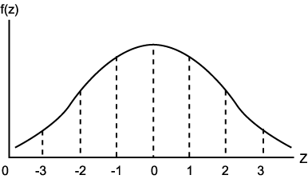
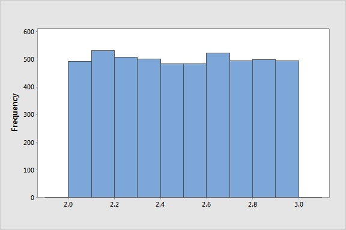
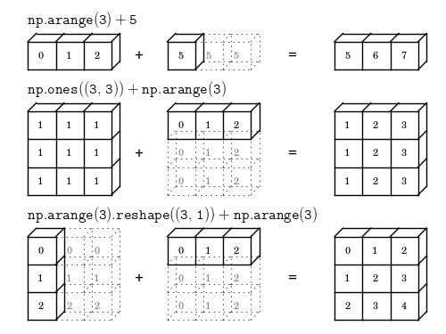
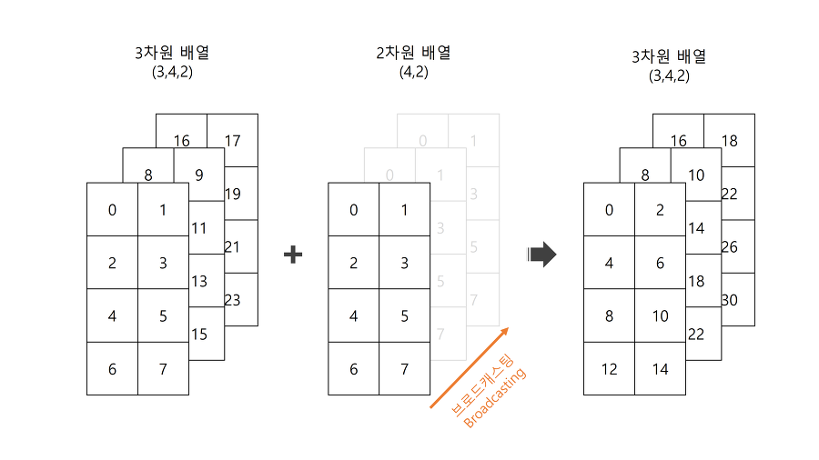
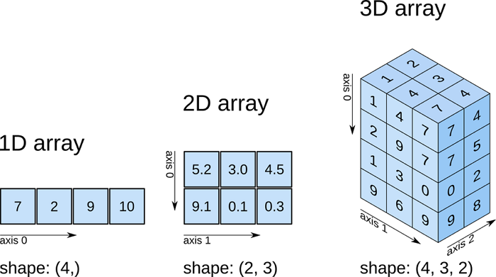

# Numpy

## [01] 대용량 데이터 연산 package(library) Numpy 실습

- <http://www.numpy.org>

1) 수학 및 배열 처리에 최적화된 library
2) Vector: 1차원 배열의 형태, 의미 있는 데이터의 나열
3) Matrix: 행렬의 형태, 벡터의 조합
4) 브로드 캐스팅: 곱셈이 안되는 차원이 다른 행렬도 곱셈이 가능하도록 차원을 맞추어 주는 기능,
   결과는 작은 차원이됨.
5) NumPy의 random 서브패키지에는 난수를 생성하는 다양한 명령
   ① rand: 0부터 1사이의 균일(균등) 분포 난수 발생
   ② randn: 가우시안 표준 정규 분포 난수 발생(예: 시험 점수가 평균에 가장 많이 분포하는 형태)
                (정규 분포(正規 分布, 영어: normal distribution) 또는 가우스 분포(Gauß 分布, 영어: Gaussian distribution))
                
   ③ randint: 균일 분포의 정수 난수 발생
6) 난수는 머신 러닝에서 예측 값을 산출하기전에 임의의 초기값을 지정하는 용도로 사용됨.
7) 균등(균등) 분포 형태의 난수 생성
    

1. 배열의 사용, 타입 변환, 기본 연산, 배열 index의 사용
   1) 배열의 연산 (출처: <https://sacko.tistory.com/16>)
    
   2) 배열의 브로드캐스팅 (출처: <https://sacko.tistory.com/16)>
    
   3) 배열의 차원 (출처: <https://www.safaribooksonline.com/library/view/elegant-scipy/9781491922927/ch01.html>)
    
2. 행렬의 곱, 차원이 다른 행렬의 연산
   - 3행 2열 X 2행 3열 --> 3행 3열, 첫번째 행렬의 렬과 두번째 행렬의 행의 수가 일치해야 곱셈이 가능함.
   - np.matmul(): 2차원 형태의 행렬 곱하기 지원, 행렬곱
   - np.dot(): 1차원 요소간 곱하기 및 다차원 행렬의 곱하기 지원, 내적곱
   1) ndarray를 사용해야 하는 이유는 다음과 같이 요약할 수 있다.
      - ndarray는 numpy에서 지원하는 표준형인 벡터/행렬/텐서 를 저장한다.
      - 많은 numpy 함수가 matrix가 아니라 ndarray를 반환한다.
      - 요소 간 연산과 선형대수 연산에 대해선 명확히 구분되어 있다.
      - 표준 벡터나 열벡터/행벡터를 표현할 수 있다.
   2) ndarray를 사용할 경우의 한 가지 단점은 행렬의 곱셈을 수행할 때 ,dot() method를 사용해야한다는 점이다.
   ndarray 객체 A와 B를 행렬곱하려면 A.dot(B) 와 같이 수행해야 하며 A*B는 요소간 곱셈이 된다.
   matrix객체 A와 B는 단순히 A*B로 행렬곱이 수행된다.
  
>> /ws_python/notebook/package/numpy_test.ipynb

```python
x = np.array([[4, 4, 4], [8, 8, 8]])
y = np.array([[1, 1, 1], [2, 2, 2]])
print(x)
print(y)
print(x + y)

.....
# 행렬의 곱셈: 첫번째 행렬의 열과 두번째 행렬의 행이 같아야함.
# 결과: 첫번째 행렬의 행과 두번째 행렬의 열로 구성됨
v = np.array([[1, 2, 3], [4, 5, 6]])  # 2행 3열
w = np.array([[1, 1], [2, 2], [3, 3]]) # 3행 2열
print('v:', v.shape)
print('w:', w.shape)
print(v)
print(w)
print(v * w)  # ERROR
 
.....
v = np.array([[1, 2, 3]])  # 1행 3열
w = np.array([[1, 1], [2, 2], [3, 3]]) # 3행 2열
print('v:', v.shape)
print('w:', w.shape)
print(v)
print(w)
print(v.dot(w))  # 1행 2열, 1 * 1 + 2 * 2 + 3 * 3 --> 1 + 4 + 9
.....
v = np.array([[1, 2]])  # 1행 2열
w = np.array([[1, 1], [2, 2], [3, 3]]) # 3행 2열
print('v:', v.shape)
print('w:', w.shape)
print(v)
print(w)
print(v.dot(w))  # ERROR
.....
x = np.arange(10)
print(x)
print(x[:5])   # end: 5 - 1
print(x[5:])
print(x[3:8]) # end: 8 - 1
print(x[:])
.....
print(x[3:8:1])  # start: end: index 간격
print(x[3:8:2])
print(x[::-1])
.....
y = np.array([[1, 2, 3], [4, 5, 6], [7, 8, 9]])
print(y)
print(y[:2, 1:2])  # 행범위: 0 ~ 1, 열범위: 1
.....
x = np.array([1, 1, 2, 3, 5, 8, 13])
y = x > 3
print(type(y))
print(y)
.....
```
