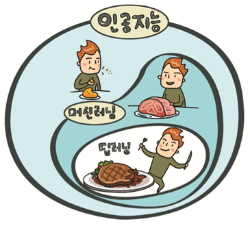
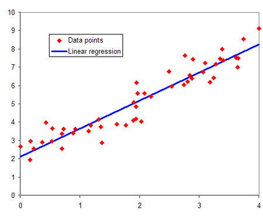
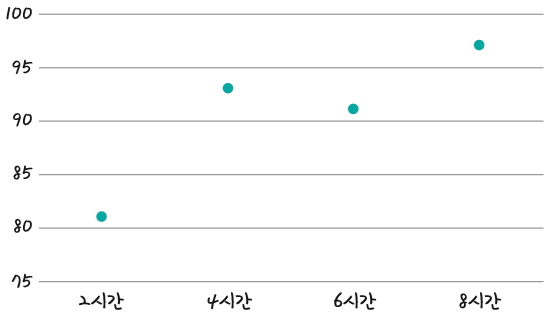
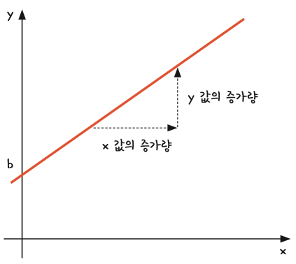
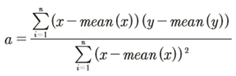
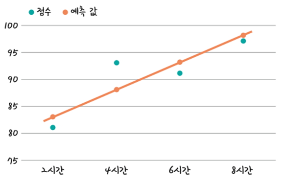

# 인공지능

## [01] 인공 지능

### 1. '인공 지능 위키' Google 검색

### 2. 인공 지능의 규모

- 인간의 능력을 모방하거나 능가하기위해 구현하려는 기계적, 소프트웨어적인 제작 활동
- 컴퓨터가 인간의 사고를 모방하는 기법으로 머신 러닝을 포함하고 있음.



### 3. 머신러닝

- 머신러닝 알고리즘: k-최근접 이웃(KNN), 서포트 벡터 머신(SVM), 의사 결정 트리, 나이브 베이즈, 앙상블, 군집화, 선형회귀,  로지스틱회귀, 주성분 분석등을 적용하여 예측
- 컴퓨터가 스스로 학습하는 기법을 말하며 그 방법으로 인공 신경망등을 이용함.
- 의미적으로 딥 러닝을 포함하고 있음.
- Scikit-learn: 복잡한 수학적 알고리즘을 함수형태로 제공하여 사용하기 편리하도록 지원, CPU만 사용 가능

## [02] 선형 회귀(linear regression)

### 1. 정의



- 어떤 데이터를 기반으로 결과가 선의 형태로 나타나는 유형
  - 공부시간 -> 시험 성적

    ```bash
            x             y
        독립 변수  종속 변수
        정의역       치역
        -----------   ----------
        10 시간 ---> 70 점
        20 시간 ---> 74 점
        36 시간 ---> 76 점
        50 시간 ---> 82 점
        80 시간 ---> 92 점
    ```

- 통계학에서, 선형 회귀(線型回歸, 영어: linear regression)는 종속 변수 y와
  한 개 이상의 독립 변수 (또는 설명 변수) X(Data points)와의 선형 상관 관계를 모델링하는 회귀분석 기법이다.
  한 개의 설명 변수에 기반한 경우에는 단순 선형 회귀, 둘 이상의 설명 변수에 기반한 경우에는
  다중 선형 회귀라고 한다.

  선형 회귀는 선형 예측 함수를 사용해 회귀식을 모델링하며, 알려지지 않은 파라미터는 데이터로부터 추정한다.
  이렇게 만들어진 회귀식을 선형 모델이라고 한다.
- 독립 변수 x 하나만으로는 정확히 설명할 수 없을 때는 x 값을 여러 개(x1, x2, x3 등) 준비한다.
- 하나의 x 값만으로도 y 값을 설명 할 수 있을 때 이를 단순 선형 회귀(simple linear regression)라고 함
- x 값이 여러 개 필요할 때는 다중 선형 회귀(multiple linear regression)라고 함

### 2. 공부 시간에따른 성적의 취득 분석예

- "학생들의 중간고사 성적이 [        ]에 따라 다 다르다."
- 여기서 [     ]에 들어갈 내용을 ‘정보’라고 함
- 머신러닝과 딥러닝은 이 정보가 필요함
- 성적을 변하게 하는 ‘정보’ 요소를 x라고 하고, 이 x 값에 의해 변하는 ‘성적’을  y라할때,
- x 값이 변함에 따라 y 값도 변한다
- 이때, 독립적으로 변할 수 있는 값  x를 독립 변수라고 함
- 이 독립 변수에 따라 종속적으로 변하는 y를 종속 변수라고 함
- 선형 회귀란 독립 변수 x를 사용해 종속 변수 y의 움직임을 예측하고 설명하는 작업!
  
1) 공부한 시간과 중간고사 성적 데이터
    공부한 시간   2시간   4시간   6시간   8시간
    성적             81점    93점    91점    97점

    1차 함수 그래프를 구성하기위한 변수의 사용, 일반적으로 x, y를 사용
     x = {2, 4, 6, 8}
     y = {81, 93, 91, 97}
  
2) 공부한 시간과 성적을 좌표로 표현
    
    >> 데이터 -> 총점 -> 평균 -> 편차 -> 분산(제곱) -> 표준편차

3) 선형회귀의 1차 함수 그래표의 표현: y = ax + b
    x: 독립 변수 예) 공부시간
    y: 종속 변수로 x 변수의 값에따라 결정됨 예) 성적 점수
    a 기울기: x 값의 증가량 / y 값의 증가량, a가 크면 y 값이 급격히 높아짐.
    b: y 축을 지나는 값인 'y 절편'이라고 함, x가 0인 경우의 값.


4) 선형회귀는 a, b 변수의 값을 찾아내어 독립변수 x에 대한 최적의 y 값을 산출하는 과정

5) 선형회귀는 최소제곱법을 이용하여 구할 수 있으며 회귀분석에서 사용되는 표준 방식으로 실험이나
    관찰을 통하여 얻은 데이터를 분석하여 미지의 상수를 구할 때 사용되는 공식.

6) 최소 제곱법을 이용하면 기울기를 바로 산출 할 수 있음
                    (x - x 평균)(y - y 평균)의 합   <- x, y의 편차의 곱을 합
    a 기울기 = ─────────────────
                      (x - x 평균)의 제곱의 합      <- x 편차 제곱의 합

   - mean 함수: 평균


7) y 절편 b(bias) 변수의 산출
  
   b(y 절편) = y의 평균 - (x의 평균 X 기울기 a)
   b = mean(y) - (mean(x) * a)

### 2. Python

1) 선형 회귀 모델 구현
   - 통계 모델: 데이터로부터 만들어지며, 데이터의 숨겨진 패턴을 인식하고 분류하여 특정한 목적의 값을 산출하는 수학적 공식.
    >> /ws_python/notebook/machine/basic/LinearRegression.ipynb append

    ```python
    print('검증')
    print('공부 시간\t실제 성적 값\t예측') # \t: tab
    for i in range(len(x)):
        print(str(x[i]) + '\t\t' + str(y[i]) + '\t\t\n' + str(float(a*x[i] + b)))
    ```

    ```python
    ## 참조
    ## 09.LinearRegression.ipynb
    ```

    ```python
    diff = 0 # 오차의 합
    for i in range(len(x)):
        predict = float(a*x[i] + b)
        print('{0} - {1} = {2}'.format(predict, y[i], (predict - y[i]) ))
        diff = diff + predict - y[i]
    print('오차의 합:', diff)
    ```

2) 오차가 최저가 되는 직선의 완성, y = 2.3x + 79.0을 이용한 학습 시간에의한 성적의 예측

