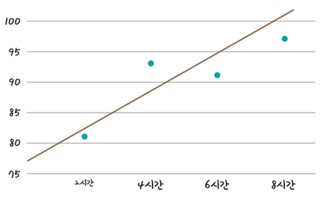
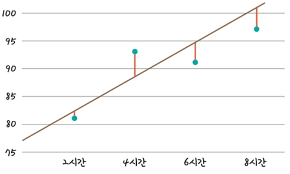
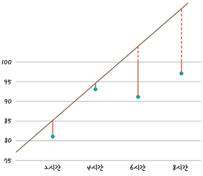
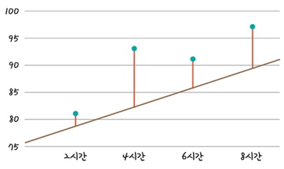

# 평균 제공근 오차

## [01] 평균 제곱근 오차(RMSE: Root Mean Square Error), 오차 평가 알고리즘의 이용

- 여러개의 입력값을 계산하여 최적의 예측값을 산출하는 방법으로 평균 제곱근 오차를 많이 사용함.
- 임의의 선을 그리고 선이 얼마나 잘 그려졌는지 평가하여 조금씩 수정해나가는 것으로, 주어진 선의 오차를 평가하기위한 알고리즘으로 평균 제곱근 오차를 가장 많이 사용함.
- 최소 제곱법을 사용하지않고 임의값을 a(기울기), b(y 절편)에 대입후 오차를 구하고, 이 오차를 최소화하는 방식을 사용하여 최종 a(기울기), b(y 절편)를 구하는 방법

1) 오차 = 예측 값(성적) - 실제 값(성적)  
.jpg)

2) 오차의 합: pi:예측값, yi: 실제값, 44
.jpg)

3) MSE(Mean Squared Error: 평균 제곱 오차, 분산): 오차의 제곱의 합의 평균, 11 (모수인 모분산 공식과 동일)
.jpg)

4) RMSE(Root Mean Squared Error: 평균 제곱근 오차): √오차의 합의 평균, 3.3166 (표준 편차 공식과 동일)

1. NumPy array 배열의 사용
   >> /ws_python/notebook/machine/basic/RMSE.ipynb
   - 파이썬의 배열을 나타내는 list,tuple은 사용이 불편함
   - 파이썬은 배열을 지원하지않음으로 배열을 지원하는 NumPy library를 이용함
   - 배열의 요소는 크기를 변경 할 수 없으며 같은 데이터 타입이어야함.
   - 대용량 데이터의 경우 List보다 NumPy array가 속도가 빠름.

    ```python
    data = [[2, 81],
            [4, 93],
            [6, 91],
            [8, 97]] # list
    ```

    ```python
    ## 10.RMSE.ipynb
    ```

    ```python
    print('y = 3x + 76 이라고 가정한 경우\n')
    print('공부한 시간\t\t성적\t예측값\t오차')  # \t: tab
    for i in range(len(x)):
        forecast = int(a*x[i] + b)
        print('%d \t\t\t %d \t %d \t\t %.1f' %(x[i], y[i], forecast, forecast - y[i]))
    ```

    ```python
    # RMSE(평균 제곱근 오차) 함수
    # NumPy array를 전달받아 배열 전체를 대상으로 예측값 - 실제값 **2의 평균의 제곱근을 산출함.
    # p: 예측값, a: 실제값
    def rmse(p, a):
        return np.sqrt(((p - a) ** 2).mean()) # np.sqrt: √, mean(): 평균
    ```

2. 가설(가정)로 y = 3x + 76를 성적을 예측하기위한 모델로 사용함.
   - y = 3x + 76을 이용한 결과를 1차 함수 그래프로 표현한 경우
    
   1) 임의의 직선과 실제 값 사이의 거리
      - 오차의 합이 작아야 잘 그려진 직선이됨.
      - 임의의 직선이 어느 정도의 오차가 있는지를 확인하려면 각 점과 그래프 사이의 거리를 재면 됨.
      
   2) 기울기가 너무 큰 경우 오차도 큼
    
   3) 기울기가 너무 작은 경우 오차도 큼
    

[실행 화면]
  
공부시간=2, 실제점수=81, 예측점수=82
공부시간=4, 실제점수=93, 예측점수=88
공부시간=6, 실제점수=91, 예측점수=94
공부시간=8, 실제점수=97, 예측점수=100
rmse 최종값: 3.3166247903554
  
>> /ws_python/notebook/machine/basic/RMSE.ipynb append

첨부 파일 참고
