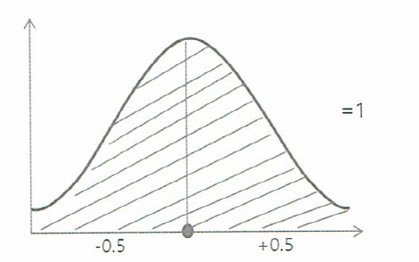
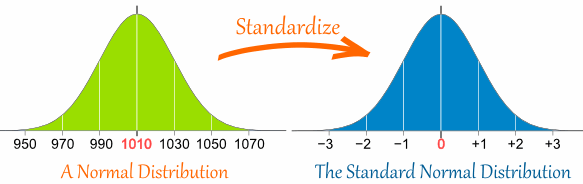
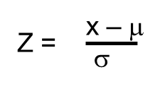
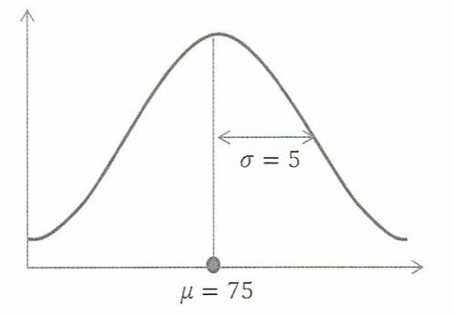
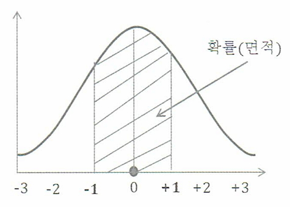

# 예제

## [01] 선형회귀를 이용한 광고에 소요되는 비용으로 클릭수 예측하기

1. Data
    >> /ws_python/notebook/machine/basic/click.csv
    - x: 광고 비용, y: 클릭수

    ```csv
    x,y
    235,591
    216,539
    148,413
    35,310
    85,308
    204,519
    49,325
    25,332
    173,498
    191,498
    134,392
    99,334
    117,385
    112,387
    162,425
    272,659
    159,400
    159,427
    59,319
    198,522
    ```
  
2. Script

    >> /ws_python/notebook/machine/basic/Regression1.ipynb

    ```python
    import pandas as pd
    import numpy as np
    import matplotlib
    import matplotlib.pyplot as plt
    from matplotlib import font_manager, rc

    font_name = font_manager.FontProperties(fname="C:/Windows/Fonts/malgun.ttf").get_name()
    # windows 10
    # font_name = font_manager.FontProperties(fname="C:/Windows/Fonts/malgunsl.ttf").get_name()
    rc('font', family=font_name)           # 맑은 고딕 폰트 지정
    plt.rcParams["font.size"] = 12         # 글자 크기
    # plt.rcParams["figure.figsize"] = (10, 4) # 10:4의 그래프 비율
    plt.rcParams['axes.unicode_minus'] = False  # minus 부호는 unicode 적용시 한글이 깨짐으로 설정

    # Jupyter에게 matplotlib 그래프를 출력 영역에 표시할 것을 지시하는 명령
    %matplotlib inline  
    ```

    ```python
    # skiprows=1: 첫번재 행 skip
    train = np.loadtxt('click.csv', delimiter=',', dtype='int', skiprows=1)
    print(type(train)) # <class 'numpy.ndarray'>
    train_x = train[:, 0] # 모든행 0열
    train_y = train[:, 1] # 모든행 1열

    plt.plot(train_x, train_y, 'o')
    plt.show()
    ```

    ```python
    a = a - ETA * np.sum(((f(train_z) - train_y) * train_z))  # 기울기
    print('a: {0}'.format(ETA * np.sum(((f(train_z) - train_y) * train_z))))
    b = b - ETA * np.sum(f(train_z) - train_y) # 편향, b - ETA * (ax + b의 값 - 실제값)
    print('b: {0}'.format(ETA * np.sum(f(train_z) - train_y)))
    ```

## [참고] 표준정규분포(Standard Normal Distribution)

1. 표준정규분포
   - 평균과 분산이 다른 정규분포를 표준화한 것이 표준정규분포이다.
   - 표준정규분포는 정규분포의 근간이 되는 [평균 0과 표준편차를 1]로 고정하는 과정을 의미한다.
    
   - 정규분포의 확률(신뢰구간)을 구할 때 이용함.
    
   - 표준화 예(TOEIC <-> TOFEL <-> TEPS 점수 인정 비교)
    .jpg)

2. 표준화 변수 Z
   - 정규분포의 확률변수 X를 구하기 위해서 표준정규분포로 바꾸는 변수를 표준화 변수 Z라고한다.
   - 정규분포를 표준정규분포로 바꾸는 Z의 공식
    Z = X-μ / σ (X: 확률변수, μ: 평균, σ: 표준 편차)
    

    예) A 고등학교의 B반 학생의 국어 점수가 평균 75점, 표준편차 5점인 정규분포로 나타났다.
    이 경우에 어느 학생의 점수가 70점~80점 사이일 확률은?

    평균: 75점, 표준 편차: 5점, 확률 변수: 70, 80
    

    z = 70 - 75 / 5 = -1, z = 80 - 75 / 5 = 1

    확률 구간 P(70 < X < 80) => P(Z=70 - 75 / 5 < Z < Z=80 - 75 / 5)
        = P(-1 < Z < 1)
        = P(-0.3413 < Z < +0.3413)
        = P(-34% < Z < + 34%)
        = 어느 학생의 점수가 70점~80점 사이일 확률은 68%이다.
   - Z값에 의해서 평균 0을 기준으로 ±1σ(표준편차)의 표준정규분포로 나타낸 경우
    

    예) A 고등학교의 B반 학생의 국어 점수가 평균 75점, 표준편차 5점인 정규분포로 나타났다.
    이 경우에 어느 학생의 점수가 60점~90점 사이일 확률은?

    z = 60 - 75 / 5 = -3, z = 90 - 75 / 5 = 3

    확률 구간 P(60 < X < 90) => P(Z=60 - 75 / 5 < Z < Z=90 - 75 / 5)
    = P(-3 < Z < 3)
    = P(-0.4987 < Z < +0.4987)
    = P(-49% < Z < + 49%)
    = 어느 학생의 점수가 60점~90점 사이일 확률은 98%이다.
