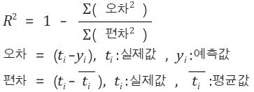

# 선형회귀

## [01] 선형회귀

- 사용: model = linear_model.LinearRegression()

### 1. 모델

1. 기울기(계수), 절편, 결정계수의 출력
    print('계수', model.coef_)
    print('절편', model.intercept_)
    print('결정계수', model.score(x, y))
2. 결정계수: 1에 가까운 값이 정확도가 높은 것임.
   - sklearn의 score 변수는 결정계수값을 리턴함.
    
3. 다중 선형 회귀
    - 변수가 2개이상인 선형회귀

4. Support Vector Machine(SVM)
   - 서포트 벡터 머신(support vector machine, SVM)은 기계 학습의 분야 중 하나로 패턴 인식,자료 분석을 위한 지도 학습 모델이며, 주로 분류와 회귀 분석을 위해 사용한다.
    두 카테고리 중 어느 하나에 속한 데이터의 집합이 주어졌을 때,
    SVM 알고리즘은 주어진 데이터 집합을 바탕으로 하여 새로운 데이터가 어느 카테고리에 속할지 판단하는 비확률적 이진 선형 분류 모델을 만든다.
    만들어진 분류 모델은 데이터가 사상된 공간에서 경계로 표현되는데 SVM 알고리즘은 그 중 가장 큰 폭을 가진 경계를 찾는 알고리즘이다.
    SVM은 선형 분류와 더불어 비선형 분류에서도 사용될 수 있다.
    비선형 분류를 하기 위해서 주어진 데이터를 고차원 특징 공간으로 사상하는 작업이 필요한데, 이를 효율적으로 하기 위해 커널 트릭을 사용하기도 한다.
   - 분류에 사용되었지만 선형회귀도 적용 가능
   - model = svm.SVR()
   - 적은 데이터수로도 분류 가능, 속도가 느림, 기본적으로 이항 분류가 되며 여러 클래스의 분류는 SVM을 조합해야함.
   - 분할 직선의 이미지
    
   - 분할선으로부터 마진의 합(거리의 제곱)이 가장 많은 직선을 선택
    
5. Random Forest
   - 기계 학습에서의 랜덤 포레스트(영어: random forest)는 분류, 회귀 분석 등에 사용되는 앙상블 학습 방법의 일종으로, 훈련 과정에서 구성한 다수의 결정 트리로부터 부류(분류) 또는 평균 예측치(회귀 분석)를 출력함으로써 동작한다.
   - 분류에 사용되었지만 선형회귀도 적용 가능
   - model = ensemble.RandomForestRegressor()
   - 전체 학습 데이터 중에서 중복이나 누락을 허용해 학습 데이터셋을 여러 개 추출하며, 그 일부속성을 이용해 약한 학습기를 생성
   - 처리 속도가 빠르고 학습 데이터의 노이즈에도 강함
   - 분류, 회귀, 클러스터링에 모두 사용 가능
   - 학습 데이터가 적으면 과적합이 발생함으로 권장하지 않음.
   - 사용: classifier = ensemble.RandomForestClassifier(n_estimators=20, max_depth=3, criterion="gini")
    

### 2. Script

>> /ws_python/notebook/machine/sklearn/Regression1.ipynb

```python
import pandas as pd
import numpy as np
import matplotlib
import matplotlib.pyplot as plt
from matplotlib import font_manager, rc

font_name = font_manager.FontProperties(fname="C:/Windows/Fonts/malgun.ttf").get_name()
# windows 10
# font_name = font_manager.FontProperties(fname="C:/Windows/Fonts/malgunsl.ttf").get_name()
rc('font', family=font_name)           # 맑은 고딕 폰트 지정
plt.rcParams["font.size"] = 12         # 글자 크기
# plt.rcParams["figure.figsize"] = (10, 4) # 10:4의 그래프 비율
plt.rcParams['axes.unicode_minus'] = False  # minus 부호는 unicode 적용시 한글이 깨짐으로 설정

# Jupyter에게 matplotlib 그래프를 출력 영역에 표시할 것을 지시하는 명령
%matplotlib inline  
```

### y = 3x -2 데이터 생성

```python
np.random.seed(0)
x = np.random.rand(100, 1)  # 0~1까지 난수를 100행 1열을 생성
x = x * 4 - 2                     # 값의 범위를 -2~2로 변경
print(x[0:5])

.....
y = 3 * x - 2  # y = 3x - 2
print(y[0:5])
```

```python
.....
from sklearn import linear_model

model = linear_model.LinearRegression() # 선형회귀 모델 선언
model.fit(x, y)  # 학습, 최적의 선형회귀 모델 찾음

print('기울기(계수):', model.coef_) # y = 3x - 2
print('y 절편:', model.intercept_)

plt.scatter(x, y, marker='+')
plt.show()
```

### 데이터에 오차 추가

```python
np.random.seed(0)
x = np.random.rand(100, 1)  # 0~1까지 난수를 100개 만든다
x = x * 4 - 2               # 값의 범위를 -2~2로 변경

y = 3 * x - 2  # y = 3x - 2
print(y[0:5])
y = y + np.random.randn(100, 1)  # 표준 정규 분포(평균 0, 표준 편차 1)의 난수를 추가함
print(y[0:5])

.....
model = linear_model.LinearRegression() # 모델 생성
model.fit(x, y)

print('기울기(계수):', model.coef_)
print('y 절편:', model.intercept_)

r2 = model.score(x, y)
print('결정 계수:', r2)

plt.scatter(x, y, marker='+')
plt.scatter(x, model.predict(x), marker = 'o')  # 선형 회귀 모델 사용
plt.show()
```

### 2차함수 형태를 갖는 선형회귀

```python
np.random.seed(0)
x = np.random.rand(100, 1)  # 0~1까지 난수를 100개 만든다
x = x * 4 - 2                     # 값의 범위를 -2~2로 변경

y = 3 * x**2 - 2  # y = 3x² - 2
print(y[0:5])
y = y + np.random.randn(100, 1)  # 표준 정규 분포(평균 0, 표준 편차 1)의 난수를 추가함
print(y[0:5])

.....
model = linear_model.LinearRegression() # 모델 생성
model.fit(x**2, y)

print('기울기(계수):', model.coef_)
print('y 절편:', model.intercept_)

r2 = model.score(x**2, y)
print('결정 계수:', r2)

plt.scatter(x, y, marker='+')
plt.scatter(x, model.predict(x**2), marker = 'o')  # 선형 회귀 모델 사용
plt.show()
```

### 다중 선형 회귀

```python
np.random.seed(0)
x1 = np.random.rand(100, 1)  # 0~1까지 난수를 100개 만든다
x1 = x1 * 4 - 2              # 값의 범위를 -2~2로 변경
print(x1[0])
x2 = np.random.rand(100, 1)  # x2에 대해서도 같게
x2 = x2 * 4 - 2
print(x2[0])
y = 3 * x1 - 2 * x2 + 1
```

### 다중 선형 회귀

```python
np.random.seed(0)
x1 = np.random.rand(100, 1)  # 0~1까지 난수를 100개 만든다
x1 = x1 * 4 - 2              # 값의 범위를 -2~2로 변경
print(x1[0])
x2 = np.random.rand(100, 1)  # x2에 대해서도 같게
x2 = x2 * 4 - 2
print(x2[0])
y = 3 * x1 - 2 * x2 + 1

.....
x1_x2 = np.c_[x1, x2]  # [[x1_1, x2_1], [x1_2, x2_2], ..., [x1_100, x2_100]] 형태로 변환
print(x1_x2[0:5])
print(x1_x2.shape)

.....
model = linear_model.LinearRegression()
model.fit(x1_x2, y)
print('계수', model.coef_)
print('절편', model.intercept_)
print('결정계수', model.score(x1_x2, y))

y_ = model.predict(x1_x2)  # 구한 회귀식으로 예측

plt.subplot(1, 2, 1)
plt.scatter(x1, y, marker='+') # 예측 데이터에 가려져서 안보임.
plt.scatter(x1, y_, marker='o')
plt.xlabel('x1')
plt.ylabel('y')

plt.subplot(1, 2, 2)
plt.scatter(x2, y, marker='+')
plt.scatter(x2, y_, marker='o')
plt.xlabel('x2')
plt.ylabel('y')

plt.tight_layout()
plt.show()
```

### 다중 선형 회귀 오차 추가

```python
np.random.seed(0)
x1 = np.random.rand(100, 1)  # 0~1까지 난수를 100개 만든다
x1 = x1 * 4 - 2              # 값의 범위를 -2~2로 변경
print(x1[0])
x2 = np.random.rand(100, 1)  # x2에 대해서도 같게
x2 = x2 * 4 - 2
print(x2[0])
y = 3 * x1 - 2 * x2 + 1
print(y[0])
y = y + np.random.randn(100, 1) # 표준 정규 분포 형태 난수
print(y[0])

.....
x1_x2 = np.c_[x1, x2]  # [[x1_1, x2_1], [x1_2, x2_2], ..., [x1_100, x2_100]] 형태로 변환
print(x1_x2[0:5])
print(x1_x2.shape)

.....
model = linear_model.LinearRegression()
model.fit(x1_x2, y) # y 값이 난수로 변화가 생긴 데이터를 학습

print('계수', model.coef_)
print('절편', model.intercept_)
print('결정계수', model.score(x1_x2, y))

y_ = model.predict(x1_x2)  # 구한 회귀식으로 예측

plt.subplot(1, 2, 1)
plt.scatter(x1, y, marker='+')
plt.scatter(x1, y_, marker='o')
plt.xlabel('x1')
plt.ylabel('y')

plt.subplot(1, 2, 2)
plt.scatter(x2, y, marker='+')
plt.scatter(x2, y_, marker='o')
plt.xlabel('x2')
plt.ylabel('y')

plt.tight_layout()
plt.show()
```
