# 분류

## [01] 분류(Classification)

1. 분류기 성능 평가

1) Confusion Matrix(혼동 행렬)
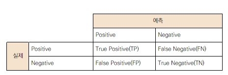

2) 주요 성능지표 3가지
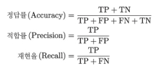

① 정답률
    - 전체 예측에서 정답이 있는 비율
② 적합률
    - 분류기가 positive로 예측했을때 정말로 positive로 예측한 비율
③ 재현률
    - 분류기가 진짜 positive인것을 분류기가 얼마나 positive로 예측했는지 비율
④ F 값
    - 적합률과 재현률의 조화 평균
    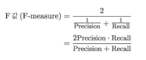

### 2. 앙상블 학습

- 앙상블 학습의 일종으로 약한 학습기를 여러개 조합하여 성능이 높은 학습기 제작

1) 배깅
   - 학습 데이터를 빼고 중복을 허용해 그룹 여러개로 분할하고 학습 데이터의 그룹마다 약한 학습기를 생성하는 방법, 분류할 때는 각각의 약한 하습기가 출력한 결과를 다수결로 취함.
   - 모델: Random Forest(랜덤 포레스트)
    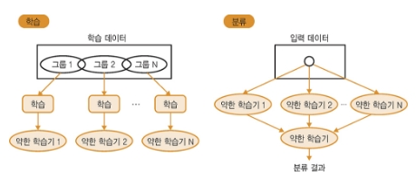
  
2) 부스팅
   - 약한 학습기를 여러개 준비하고 가중치가 있는 다수결로 분류하는 방법, 가중치도 학습에따라 결정,
     난이도가 높은 학습 데이터를 올바르게 분류할 수 있는 약한 학습기의 판별 별과를 중시하도록 가중치를 업데이트해나감, 난이도 높은 학습 데이터와 성능이 높은 약한 학습기에 가중치부여
   - 모델: AdaBoost(에이다 부스트)
   - 난이도 높은 학습 데이터
    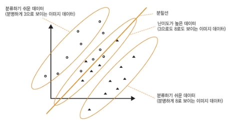
   - 부스팅의 학습 이미지
    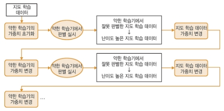

### 3. 분류기 종류

1) 결정 트리
   - 분류를 트리 형태로 출력
   - 지도 학습의 일종으로 적은 데이터로도 분류 가능, 과적합이 쉽게 발생할 수 있음.
   - 사용: classifier = tree.DecisionTreeClassifier()
   - 분류 데이터 테이블
    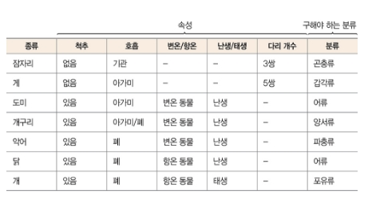
   - 동물의 분류 트리 모델
    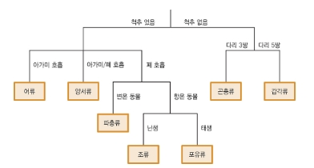
   - 숫자 3, 8의 분류 트리 모델
    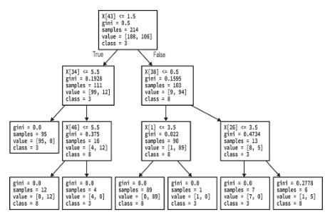
2) Random Forest
   - 전체 학습 데이터 중에서 중복이나 누락을 허용해 학습 데이터셋을 여러 개 추출하며, 그 일부속성을 이용해 약한 학습기를 생성
   - 처리 속도가 빠르고 학습 데이터의 노이즈에도 강함
   - 분류, 회귀, 클러스터링에 모두 사용 가능
   - 학습 데이터가 적으면 과적합이 발생함으로 권장하지 않음.
   - 사용: classifier = ensemble.RandomForestClassifier(n_estimators=20, max_depth=3, criterion="gini")
    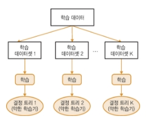
3) 에이다 부스트(AdaBoost: adaptive boosting)  
    - 다른 학습 알고리즘(약한 학습기, weak learner)의 결과물들을 가중치를 두어 더하는 방법으로 가속화 분류기의 최종 결과물을 표현할 수 있다.
    AdaBoost는 이전의 분류기에 의해 잘못 분류된 것들을 이어지는 약한 학습기들이 수정해줄 수 있다는 점에서 다양한 상황에 적용할 수 있다.
    따라서 에이다 부스트는 잡음이 많은 데이터와 이상점(outlier)에 취약한 모습을 보인다.
    그러나 또 다른 경우에는, 다른 학습 알고리즘보다 과적합(overfitting)에 덜 취약한 모습을 보이기도 한다.  
    - 난이도 높은 학습 데이터와 성능이 높은 약한 학습기에 가중치를 부여하여 정확도를 높임.
    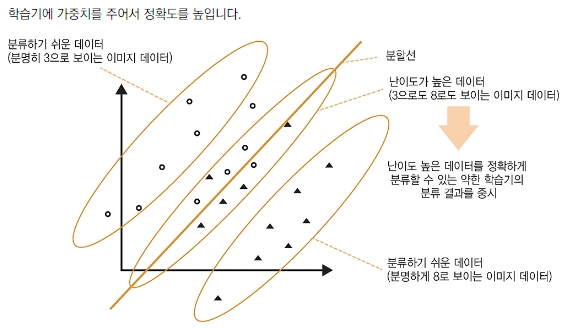
4) Support Vector Machine(SVM)
    - 적은 데이터수로도 분류 가능, 속도가 느림, 기본적으로 이항 분류가 되며 여러 클래스의 분류는 SVM을 조합해야함.
    - 분할 직선의 이미지
    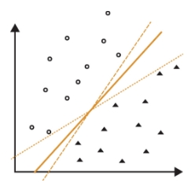
    - 분할선으로부터 마진의 합(거리의 제곱)이 가장 많은 직선을 선택
    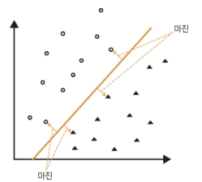

### 4. Script

>> /ws_python/notebook/machine/sklearn/Classifier.ipynb
