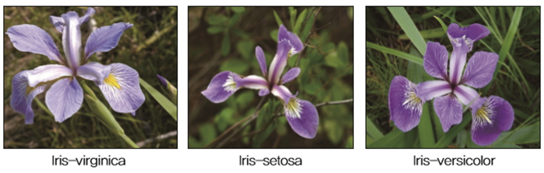
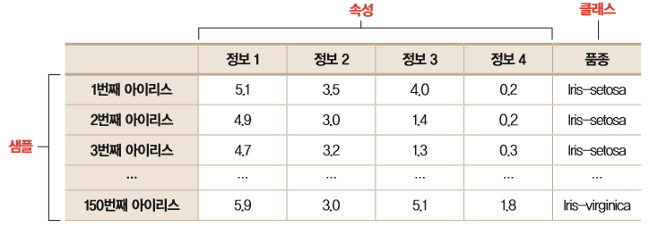
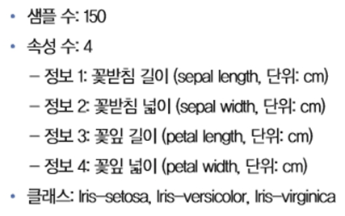

# 군집화

## [01] 군집화(Clustering)

- 주어진 데이터들의 특성을 고려해 데이터 집단(클러스터)을 정의하고 대표점을 찾는 것
- 대상을 유사성 지표에 따라서 여러 개의 집합(클러스터)으로 분류·유형화하는 통계 분석 방법
- 데이터 간의 거리를 구하고, 가까운 데이타를 모아 몇 개의 그룹(집락, cluster)으로 분류
- 주로 유사성(비유사성, 거리) 기반으로 그룹을 묶는 일
- 거리 측정방법을 어떻게 할지가 중요함  
  예: 유클리드 거리, 맨하탄 거리 등

### 1. 군집화 절차

1) 각 데이터를 적절한 방법으로 클러스터에 할당, 클러스터 중심을 처음에 정해 초기 클러스터를 형성할 때도 있음. 초기화 방법은 랜덤이어도 상관없지만, 나중에 계산을 효율적으로 할 수 있는 k-means++ 방법을 자주 이용함.
2) 클러스터 마다 중심을 계산, 보통 클러스터에 속한 데이터 점의 산술 평균을 많이 이용
3) 각 데이터에서 클러스터 중심으로 거리를 구함, 데이터가 가장 가까운 클러스터가 아닌 다른 클러스터에 속한 것 같으면 데이터를 가장 가까운 클러스터가 아닌 다른 클러스터에 속한 것 같으면 데이터를 가장 가까운 클러스터 소유로 변경
4) 3)에서 클러스터를 변경하지 않거나 미리 정한 문턱 값보다 변화량이 작으면 처리를 종료
5) 새로운 클러스터 할당을 사용해 2) 부터 다시 처리

## [02] 아이리스(붓꽃) 품종 예측

- 아이리스는 꽃잎의 모양과 길이에 따라 여러 가지 품종으로 나뉨

### 1. 데이터

- 관련 데이터를 <http://archive.ics.uci.edu>에 접속하여 검색창에 iris이라고 검색 <http://archive.ics.uci.edu>에서 다운받을 수 있음(2018년 5월 접속 불가능).

1) 구조

- Sample: 데이터, instance, example등
- 속성: attribute, feature, sample의 데이터 항목
- 클래스: 처리 결과, class, label등
    
    
- 4개의 속성(정보), 1개의 class, 150건의 데이터
- 하나의 class는 3가지 종류로 Iris-setosa, Iris-versicolor, Iris-virginica 나누어짐.

### 2. Script

>> /ws_python/notebook/machine/sklearn/Clustering.ipynb
