# 인공신경망

## [01] 인공 신경망(Artificial neural network)의 구현

- 뇌를 구성하는 신경세포 뉴런(Neuron)의 동작원리에 기초한 기술
- 인간의 뇌는 1000억개의 뉴런으로 구성됨.

### 1. 신경 세포

- 생물의 신경 세포의 동작은 축색말단에서 가지돌기로 시냅스가 전송되고 시냅스의 값은 0이상의 아날로그 값으로 다양하다.
- 축색(축색말단)은 가지돌기(수상돌기)에게 시냅스를 전달한다. 이 시냅스는 인공신경망에서 실수값으로 표현이 가능하며 가중치 변경을통한 예측 결과 산출이 가능하다.
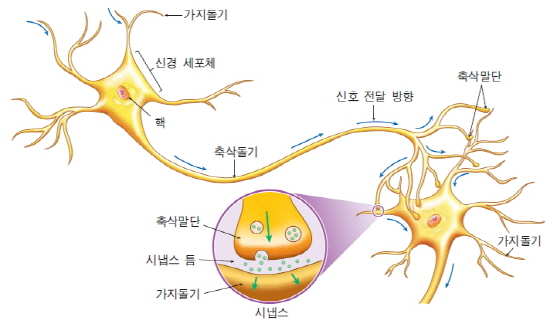

### 2. 퍼셉트론 step 함수, 신경세포의 동작을 0과 1의 디지털 수식으로 표현

- 축색말단은 가지돌기로 시냅스 전송시 시냅스의 값은 일정한것으로 표현했으며 디지털 값으로 0과 1로 나타냈다.
- 가지돌기로 들어온 데이터의 합이 임계값을 넘어가면 1을 출력하고 그렇지 않으면 0을 출력한다.
  - 가지돌기(수상돌기): 입력값, 정보의 종류, x1 ~ x5
  - 가지돌기(수상돌기)로 들어오는 정보의 종류의 가중치: w1 ~ w5
  - 스텝함수: ∑ 정보의 종류 x 정보의 가중치를 구하여 지정된 값을 넘어가면 1을 그렇지않으면 0을 출력

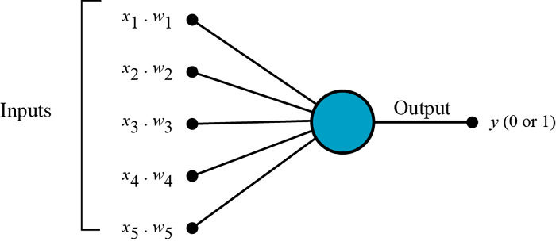
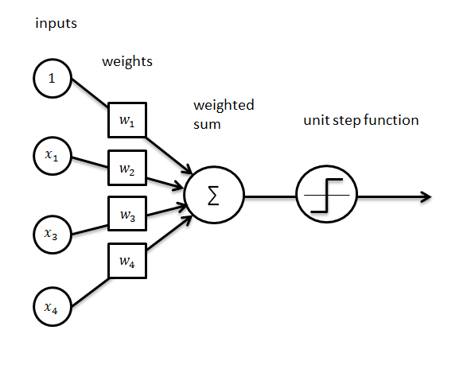

1) 스텝함수
    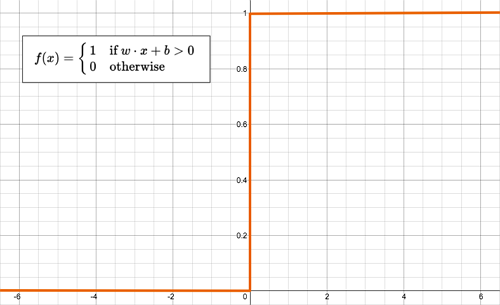
2) 퍼셉트론 분류 문제
   - 입력값과 가중치를 이용하여 곱셈을 실행한후 합을 구함.
   - 합의 결과는 step 함수를 이용하여 0 또는 1의 값을 출력함.
   - AND, OR 연산 가능함.
    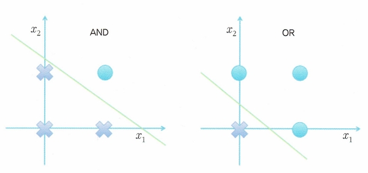
   - XOR 연산이 처리가 안됨.
    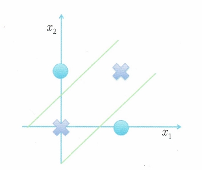
3) 다층 퍼셉트론
   - 의사 결정선을 2개이상 사용
    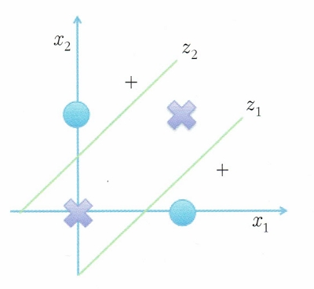
   - 2개이상의 의사결정선을 이용하여 데이터가 어디에 위치하는지 판단할 경우의 배치
    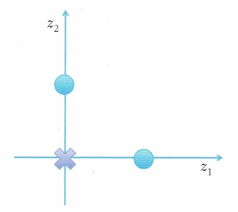
   - 퍼셉트론이 2개이상 결합된경우
    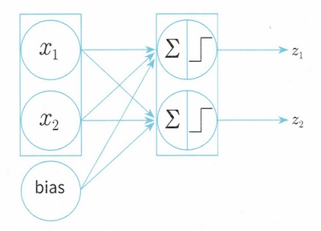
   - 2개 이상의 퍼셉트론에서의 최종 출력
    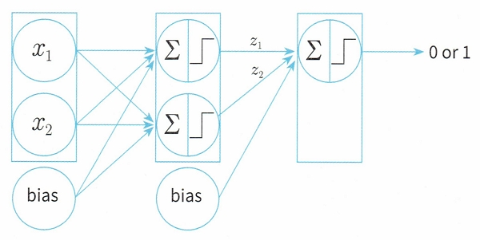
  
### 3. 딥러닝의 활성화 함수

- 퍼셉트론의 스텝함수는 정확도가 떨어지고 선현회귀에서 XOR문제가 해결이안됨.
- 퍼셉트론의 스텝함수는 0또는 1이 출력
- 딥러닝의 출력함수는 뉴런의 축색말단의 출력값이 정교한 0 ~ 1(실수)사이의 값이 출력됨으로
  퍼셉트론의 step 함수에 비해 수준높은 정확도 구현 가능
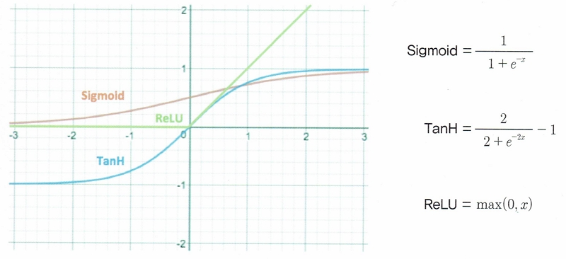

### 4. 인공 뉴런들을 연결해 구성한 인공신경망

1) 단순 신경망
   - 입력층, 은닉층, 출력층으로 구성, Sigmoid(x(입력) * (가W중치) + b(편향)) →  y(출력)
    
2) 심층 신경망
   - 은닉층이 여러개가 연속적으로 연결된 신경망
   - 제프리 힌튼 교수는 심층 신경망을 효율적으로 학습 시킬 수 있는 신경망 학습 알고리즘을 개발함.
    Sigmoid(x(입력) * (가W중치) + b(편향))
    → Sigmoid(x(입력: 이전의 y 출력) * (가W중치) + b(편향))
    → Sigmoid(x(입력: 이전의 y 출력) * (가W중치) + b(편향)) → y 최종 출력
    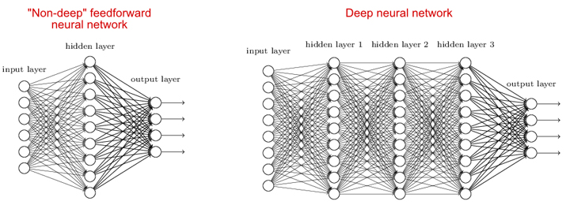
   - 심층 신경망의 복잡한 형태
    

### 5. 심층 신경망의 해석

- 2개의 데이터
- 1개의 Input Layer
- 2개의 Hidden Layer
    . 첫번재 은닉층은 4개의 node로 구성, 행렬 곱하기 연산 실행
    . 두번재 은닉층은 2개의 node로 구성, 행렬 곱하기 연산 실행
- 1개의 출력 Layer
    . 활성화 함수 사용
    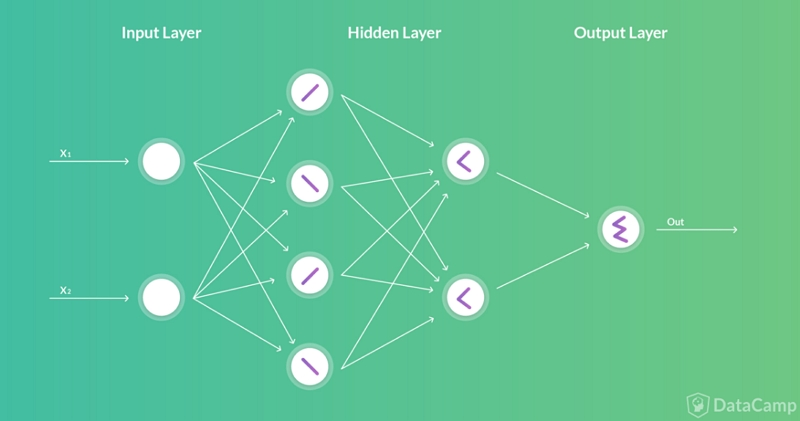

### 6. 가중치의 계산

1) 첫번째 input node: 2.00
2) 첫번째 hidden node: (2.00*0.1) + (3.00*0.5) + (4.00*0.9) + (-2.0)
    입력값 * 가중치 + 임계값
    = 0.2 + 1.5 + 3.6 - 2.0
    = 3.3

    시그모이드 함수 적용(e=2.71828): 1.0 / (1.0 + 2.71828^-(3.3)) = 0.96
    = 1.0 / (1.0 + 0.036883)
    = 1.0 / 1.036883
    = 0.964429

- ih_w: input layer에서 hidden layer로 갈때의 가중치
- ho_w: hidden layer에서 output layer로 갈때의 가중치
    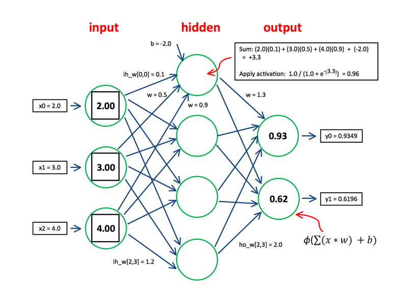
