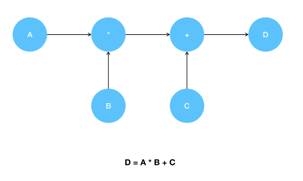

# Tensorflow

## [01] Tensorflow 1.6(AVX/AVX2 지원 CPU), 1.5(AVX 미지원 구형 CPU)

- Google이 2015년 아파치 라이센스 2.0으로 오픈소스 프레임워크로 공개되었다.
- 데이터 흐름 그래프를 기반으로하는 수치 계산을 위한 소프트웨어 프레임워크이다.
- 머신러닝 알고리즘 중에서도 심층신경망을 표현하고 구현하기 위한 인터페이스를  주 목적으로 설계되었다.
- 내부는 C++로 개발되었으며 간결한 호출을위해 주로 파이썬을 이용하여 Tensorflow를 사용한다.
- 텐서플로는 경사 하강법등 모든 미분을 개발자가 단순한 함수 호출로 자동 처리 할 수 있도록 지원한다.
- 텐서플로 오차를 줄이기위해 미분을 사용하며 자동 미분 계산기 열활을 함.
- 텐서플로는 파이썬 기반의 딥러닝 라이브러리인 케라스를 이용하여 더욱 적은 코드로
  고성능의 최적화된 머신러닝 개발 환경을 구축할 수 있다.
- 데이터에 대하여 선형회귀, 분류를 할것인지에 따라 활성화 함수가 달라진다.

### 1. 텐서 구조

- Tensor: 텐서플로에서의 자료형의 일종으로 배열과 비슷, 랭크와 셰이프로 구성됨
  - Rank: python의 list와 비슷한 자료형으로 구성됨, 배열에서 차원의 수
  - Rank 0: 스칼라(int 형등의 숫자하나), 각각의 한개의 요소를 이르는 말, 0차원 텐서
  - Rank 1: 벡터, 어떤 방향성(목적, 성질)을 갖는 1차원 배열의 데이터, 1차원 텐서
  - Rank 2: 행과 열로 구성된 행렬, 2차원 텐서, 2차원 배열 형태
  - Rank 3: 3차원 행렬, 3차원 텐서, 3차원 배열
  - Rank 4이상: n-Tensor, n 차원 텐서라고 부름, 4차원 배열 이상, 이미지 처리시 주로 이용.

- Shape: list의 요소와 같은 기능, 각 차원의 요소의 정보
    예) Shape의 구분
    랭크 1(1차원 배열의 내용):
    [1., 2., 3.]:
    랭크 2(2차원 배열), 셰이프 [2, 3](2차원 배열의 내용):
    [
        [1., 2., 3.],
        [1., 2., 3.]
    ]
    랭크 3(3차원 배열), 셰이프 [2, 1, 3](3차원 배열의 내용):
    [
        [
            [1., 2., 3.]
        ],
        [
            [7., 8., 9.]
        ]
    ]

## [02] 텐서와 그래프 실행 절차

### 1. 그래프 실행 준비

```python
import tensorflow as tf

a = tf.constant(100)
b = tf.constant(200)
c = tf.constant(300)

d = tf.add(tf.multiply(a, b), c)
```

### 2. 그래프의 생성 시작

- tf.global_variables_initializer(): 세션 속의 tf.Variable 형태로 저장한 변수를 초기화 해주는 기능을 수행
- 텐서플로우는 세션을 기준으로 성능을 향상시키기 위해 정의와 실행을 분리함

```python
session = tf.Session()
tf.global_variables_initializer()
```

1) 실행 1 단계: 개발자가 코드 선언후 실행시에 텐서로 변환되어 그래프의 tree 형태로 구성됨, 내부적으로 방향성 그래프가 생성이됨
2) 실행 2 단계: 하나의 Session이 생성되고 Session에 값을 할당하여 tree를 운행(실행)하게됨.


### 3. Session 객체의 run() 메소드를 이용한 연산 그래프 실행 및 결과 출력

```python
print(session.run([a, b, c, d]))  # [100, 2, 300, 500]
```

### 4. 메모리 해제

```python
session.close()
```

## [03] 상수(constant), 변수(Variable), 텐서의 데이터 타입

### 1. constant()

- 상수 선언 함수
- dtype: 데이터 타입
- name: 그래프 노드의 이름, Tensorflow에서 사용되는 변수명, 생략 가능
- 선언 : tf.constant(값, dtype=데이터 타입, name=’그래프 노드의 이름’)
- 예) kor = tf.constant(5, dtype=tf.float32, name=’tf_kor’)
  
### 2. Variables : 변수로 값의 변화는 Tensor가 연산되면서 바뀌게 됩니다

- 선언 : tf.Variable(값, dtype=타입, name=’그래프 노드의 이름’)
- 데이터 타입: tf.float16, float32, float64, complex64, complex128등
- 예) x = tf.Variable(9, dtype=tf.float32, name=’tf_x’)
    weight = tf.Variable([1, 2, 3, 4, 5], name=’tf_weight’)  

### 3. 텐서의 데이터 타입

- 텐서플로우는 텐서라는 기본 데이터 구조로 모든 데이터들을 표현합니다.
텐서는 동적 사이즈를 갖는 다차원 데이터 배열로 볼 수 있으며 불리언(boolean), 문자열(string)이나 여러 종류의 숫자형 같은 정적 데이터 타입을 가집니다.

  |텐서플로우 타입|파이썬|타입 설명|
  |:--:|:--:|:--:|
  |DT_FLOAT|tf.float32|32비트 실수|
  |DT_INT16|tf.int16|16비트 정수|
  |DT_INT32|tf.int32|32비트 정수|
  |DT_INT64|tf.int64|64비트 정수|
  |DT_STRING|tf.string|문자열|
  |DT_BOOL|tf.bool|불리언|

## [04] Tensorflow 기초 문법, 상수(constant), 변수(Variable), 텐서의 데이터 타입 실습

- 텐서플로는 텐서들의 연산을 먼저 정의하여 그래프를 만들어 놓고, 이후 연산을 실행하는
  코드를 넣어 '원하는 시점'에 실제 연산을 수행함(지연 실행: Lazy evaluation).
- 그래프의 실행은 Session안에서 이루어지며 Session 객체의 run 메소드를 이용하여 수행
- shape: 데이터의 차원, 갯수

1) 경고 메시지 숨기기

```python
import warnings
warnings.filterwarnings(action='ignore')

# warnings.filterwarnings(action='default') # 메시지 출력, 기본값
```

>> /ws_python/notebook/machine/tsbasic/TSbasic.ipynb

```python
import warnings
warnings.filterwarnings(action='ignore')
# warnings.filterwarnings(action='default')

import matplotlib.pyplot as plt
%matplotlib inline
```

### [05] Tensorboard의 사용

1. Tensorboard 용 log 파일 기록 script

    ```python
    # 기존 그래프 출력시 Jupyter Notebook, Tensorboard 재시작
    LOG_DIR = '../../logs' # 폴더는 자동 생성됨. /ws_python/notebook/logs
    graph = tf.get_default_graph()
    with tf.summary.FileWriter(LOG_DIR) as writer:
        writer.add_graph(graph)
    ```

2. 실행

    ```bash
    (base) C:\Windows\system32>activate machine
    (machine) C:\Windows\system32> tensorboard --logdir=C:\ai_201909\doc\ws_python\notebook\logs
    ```

3. 접속

    <http://soldesk-PC:6006>
