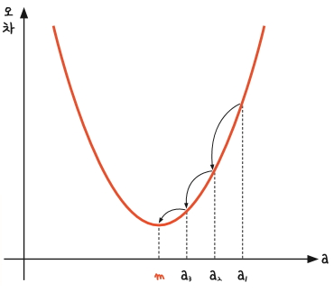
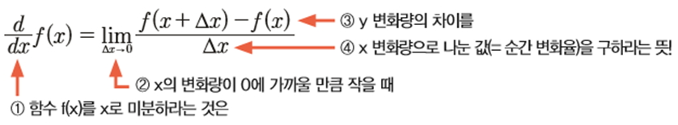
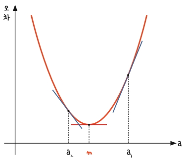
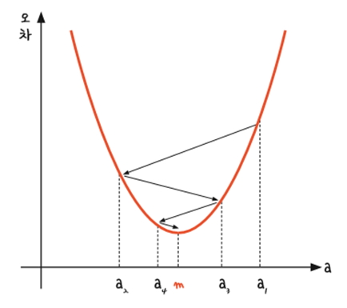
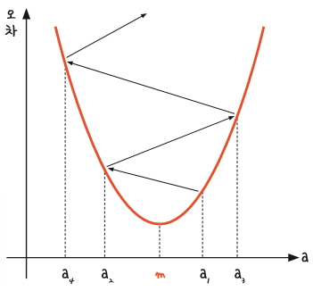

# 경사각

## [01] 기울기와 오차와의 관계(성질, 특성)

- 기울기 x축 a가 작아지면 오차 y축 값도 작아짐
- 기울기 a가 커지면 오차 y도 커짐
- 기울기 a를 무한대로 키우면 오차도 무한대로 커지고, a를 무한대로 작게 해도 역시 오차도 무한대로 작아지는 이러한 관계는 “이차 함수 그래프”로 표현할 수 있음
    y = ax² + bx + c
- 적절한 기울기를 찾아야 오차가 최소화된다.

- 경사 하강법(gradient decent): 미분 기울기를 이용해 오차를 비교하여 가장 작은 방향으로 이동시켜
  오차가 가장 작은 점을 찾는 방법
- Tensorflow는 경사 하강법과 관련된 미분을 자동으로 지원함.
    gradient_decent = tf.train.GradientDescentOptimizer(learning rate: 학습률).minimize(rmse: 평균 제곱근 오차)

### 1. 함수 f(x)의 미분

- 값이 아주 미세하게 움직일 때의 y 변화량을 구한 뒤, 이를 x의 변화량으로 나누어 한 점에서의 순간 기울기를 구하는 과정
- △x: 델타 x, x의 변화량을 나타냄.
    

### 2. 경사 하강법

- y = x² 그래프에서 x에 a1, a2그리고 m을 대입하여 그 자리에서 미분하면 아래처럼 각 점에서의 순간 기울기가 그려짐.
- 순간 기울기가 0인 즉 미분값이 0인 지점이 우리가 찾는곳이며 아래의 2차원 그래프에서 최솟값 m이 있는 지점임.
- 미분값이 0이면 기울기는 x 축과 평행한 선이됨.
    

### 3. 경사하강법(gradient decent)을 수행하는 과정

과정 1. a1에서 미분을 구한다.
과정 2.구해진 기울기의 반대 방향 얼마간 이동시킨 a2에서 미분을 구한다.
과정 3. a3에서 미분을 구한다.
과정 4. 과정 3의 값이 0이 아니면 a2에서 2~3번 과정을 반복한다.

- 경사 하강법은 이렇게 반복적으로 기울기 a를 변화시켜서 m의 값을 찾아내는 방법
- 케라스는 다양한 경사하강법을 제공함.
    

### 4. 학습률(learning rate)

- 기울기를 얼마나 크게 줄여 나갈것인지의 값
- 어느 간격 만큼 이동시킬지를 정해주는 것 : 학습률(learning rate)
- 학습률을 너무 크게 잡으면 기울기가 0인 지점을 지나갈 위험이 있음, 경사 하강이 크게 이루어져 최저점을 지나감.
- 학습률이 너무 작으면 진행이 늦어져서 학습 효과가 떨어짐, 경사 하강이 작게 이루어짐.
- 기울기의 부호를 바꿔 이동시킬 때 적절한 거리를 찾지 못해 너무 멀리 이동시키면 a 값이 한 점으로 모이지 않고 위로 치솟아 버림
- 학습률을 너무 크게 잡으면 잘못된 방향으로 향하게되어 오차가 커지게됨.
- 학습률을 변경하면서 최적의 학습률을 찾는 것은 중요한 최적화 과정 중 하나임.
- 케라스는 학습률을 자동으로 조절함.
- y 절변 상수 b도 값이 너무 크면 오차도 커지고, 너무 작아도 오차가 커짐으로 최적의 b 값을 구할 때 역시 경사 하강법을 사용함.
- 케라스는 학습률을 자동으로 계산하여 Tensorflow를 호출
    

### 5. 경사 하강법을 적용한 단순 선형회귀

- 기존 데이터를 분석하여 선형회귀에 기반한 추세선을 만들면 내가 공부한 시간에 대한 성적을 예측 할 수 있음.

>> /ws_python/notebook/machine/tsbasic/SimpleLinearRegression.ipynb

```python
import warnings
warnings.filterwarnings(action='ignore')

import tensorflow as tf
import numpy as np

.....
# x, y의 데이터 값
# ----------------------------------
# 공부 시간: 2   4   6   8
# 실제 성적: 81  93  91  97
# ----------------------------------
data = [[2, 81], [4, 93], [6, 91], [8, 97]]
```

```python
.....
# 균등분포 난수 발생: tf.random_uniform(shape, 최소값, 최대값)
atest = tf.Variable(tf.random_uniform([1], 0, 10, dtype=tf.float64, seed=0), name='atest')
btest = tf.Variable(tf.random_uniform([1], 0, 100, dtype=tf.float64, seed=0), name='btest')

session.run(tf.global_variables_initializer())
```

```python
.....
# 텐서플로 RMSE(Root Mean Squared Error) 평균 제곱근 오차 함수의 제작
# 평균 오차를 줄이는 역활을 함.
# 오차 = y(예측 성적, List 형식) - y_data(실제 성적)
# square: 제곱, reduce_mean: 모든 차원을 줄이고 하나의 스칼라값인 평균을 출력, sqrt: 루트

.....
# 학습률을 0.1(10%)로 가정, 오차를 줄여 나가는 비율
learning_rate = 0.1

# RMSE 값을 최소로 하는 값을 Tensorflow가 찾아줌
# 오차의 줄이는 경사 하강법 자동 실행, 학습률과 평균 제곱근 오차 함수 이용
gradient_decent = tf.train.GradientDescentOptimizer(learning_rate).minimize(rmse)
# <class 'tensorflow.python.framework.ops.Operation'>
print('--> gradient_decent type: ', type(gradient_decent))
gradient_decent
```

```python
.....
session = tf.Session()
session.run(tf.global_variables_initializer())

print('1) a(기울기 가정): ', session.run(a))
print('2) b(y 절편 가정): ', session.run(b))
print('3) 성적 산출 예상 공식(1차 함수 그래프): y = %.4fx + %.4f' % (session.run(a), session.run(b)))
```

```python
.....
print('4) 예상 성적 y List 값: ', session.run(y)) # y = 8.0690x + 80.6901의 값
print('5) rmse(평균 제곱근 오차): ', session.run(rmse))
print('6) learning_rate(학습률): ', learning_rate)
```

```python
.....
print('7) Tensorflow에의한 경사 하강법을 이용한 기울기a와 y절편 b 최적화 시작')

        # Epoch: 반복 횟수
        print("Epoch: %.f, RMSE = %.04f, 기울기 a = %.4f, y 절편 b = %.4f" % (step, v_rmse, v_a, v_b))

print('08) 최적의 산출 공식: y = %.1fx + %.d' % (v_a, v_b))  # y = 2.3x + 79
```

```python
.....
# 2시간 학습 실제 성적: 81
print('학습률 %.3f: y = %.1fx + %.f 2시간 예상 성적: %d' % (learning_rate, v_a, v_b, v_a*2 + v_b))  
# 학습률 0.001: y = 6.7x + 80 2시간 예상 성적: 93
# 학습률 0.010: y = 2.3x + 79 2시간 예상 성적: 83
# 학습률 0.030: y = 2.7x + 76 2시간 예상 성적: 81
# 학습률 0.050: y = 3.1x + 74 2시간 예상 성적: 80
# 학습률 0.100: y = 3.7x + 71 2시간 예상 성적: 78
# 학습률 0.300: y = 4.2x + 68 2시간 예상 성적: 76
# 학습률 0.600: y = 3.3x + 67 2시간 예상 성적: 74
# 학습률 0.900: y = 6.1x + 68 2시간 예상 성적: 80
# 학습률 2.000: y = -0.6x + 67 2시간 예상 성적: 65

# 최적의 학습률은 우수한 결과가 발생하나 개발자가 찾는 것은 어려움으로
# 여러가지 자동화된 학습률 기법을 이용
```
