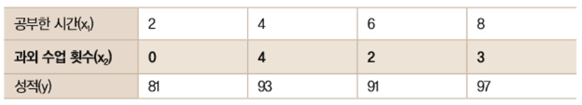

# 다중 선형 회귀

## [01] 다중 선형 회귀(Multiple Linear Regression)

1. 선형회귀에서 하나의 독립변수 x로 결과를 예측하였으나 결과가 정확하지않아 추가적으로
   다른요소를 적용하여 변수의 개수가 2개이상인 선형회귀
2. 변수가 2개인 경우
   
   - 독립변수가 1개일경우 기울기는 1개가 산출되었으나, 독립 변수가 2개임으로 기울기도 2개가 산출됨.
   - 산출식: 예측값 = 첫번째 기울기*변수1+두번째기울기*변수2+y절편b
    y = a₁x₁ + a₂x₂ + b
3. 다중 선형 회귀 모델 구현
   - 통계 모델: 데이터로부터 만들어지며, 데이터의 숨겨진 패턴을 인식하고 분류하여 특정한 목적의 값을 산출하는 수학적 공식.
  
>> /ws_python/notebook/machine/tsbasic/MultiLinearRegression.ipynb

```python
import warnings
warnings.filterwarnings(action='ignore')

import tensorflow as tf

import matplotlib
import matplotlib.pyplot as plt
from matplotlib import font_manager, rc

font_name = font_manager.FontProperties(fname="C:/Windows/Fonts/malgun.ttf").get_name()
# windows 10
# font_name = font_manager.FontProperties(fname="C:/Windows/Fonts/malgunsl.ttf").get_name()
rc('font', family=font_name)           # 맑은 고딕 폰트 지정
plt.rcParams["font.size"] = 12         # 글자 크기
# plt.rcParams["figure.figsize"] = (10, 4) # 10:4의 그래프 비율
plt.rcParams['axes.unicode_minus'] = False  # minus 부호는 unicode 적용시 한글이 깨짐으로 설정

# Jupyter에게 matplotlib 그래프를 출력 영역에 표시할 것을 지시하는 명령
%matplotlib inline  
```

```python
# x1, x2, y의 데이터 값

# 데이터의 구조: [공부시간, 과외 시간, 실제 취득 성적]
data = [[0, 0, 60], [2, 0, 81], [4, 4, 93], [6, 2, 91], [8, 3, 97]]
x1 = [row[0] for row in data]  # 독립 변수 1
x2 = [row[1] for row in data]  # 독립 변수 2
yr = [row[2] for row in data]  # 실제 취득 성적

.....
# 기울기 a와 y절편 b의 값을 임의로 정함. 단 기울기의 범위는 0-10 사이, y 절편은 0-100사이에서 변하게 함
a1 = tf.Variable(tf.random_uniform([1], 0, 10, dtype=tf.float64, seed=0))
a2 = tf.Variable(tf.random_uniform([1], 0, 10, dtype=tf.float64, seed=0))
b = tf.Variable(tf.random_uniform([1], 0, 100, dtype=tf.float64, seed=0))
y = a1 * x1 + a2 * x2 + b

rmse = tf.sqrt(tf.reduce_mean(tf.square(y - yr)))  # 예측값에서 실제값을 뺌
learning_rate = 0.03  # 학습률 값
gradient_decent = tf.train.GradientDescentOptimizer(learning_rate).minimize(rmse)
```

```python
# 검증
# x, y의 데이터 값
# ----------------------------------
# 공부      시간  : 0    2    4    6    8
# 과외 수업 횟수: 0    1    4    2    3
# 시험      성적  : 60  81  93  91  97
# ----------------------------------
print('학습률 %.2f의 경우' % learning_rate)
print('산출된 선출회귀 모델: y = %.4f × x1 + %.4f × x2 + %.4f' % (v_a1, v_a2, v_b))
# 학습률 0.01의 경우
# 산출된 선형회귀 모델: y = 0.8407 × x1 + 4.4382 × x2 + 79.0128
# 학습률 0.03의 경우
# 산출된 선형회귀 모델: y = 0.9186 × x1 + 3.6437 × x2 + 77.1793
```

```python
print(x1)
print(range(len(x1)))
print(range(4))
for i in range(len(x1)):     # 1차원 배열
    print(x1[i])
for i in range(len(data)):  # 2차원 배열
    print(data[i])  
for i in range(len(data)):  # 2차원 배열
    print(' ', data[i][0], end='')
print('\n------------------')
for i in range(len(data)):  # 2차원 배열
    print(' ', data[i][1], end='')
```
