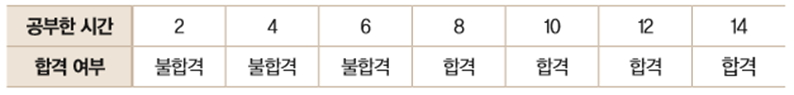
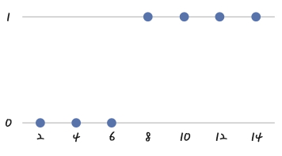
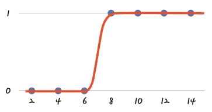
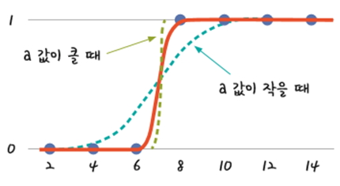
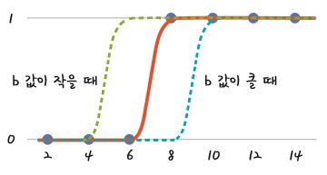

# 로지스틱 회귀

## [01] Tensorflow를 이용한 로지스틱 회귀(Logistic Regression), 하나의 변수를 입력값으로 사용하는 Logistic Regression

- 로지스틱 회귀는 종속변수가 이항형 문제(즉, 유효한 범주의 개수가 두개인 경우, 참/거짓, 합격/불합격)를 해결할 때 사용된다.

1. 성적 처리에 로지스틱 회귀의 사용

1) 합격 여부를 표로 나타 경우
    
2) 합격을 1, 불합격을 0이라 하고, 이를 좌표 평면에 표현하면 다음과 같음.
    
3) 0과 1사이에 값이 없음으로 선을 그리기 어려우며, 점들의 특성을 정확하게 표현하려면 'S'자 형태의 곡선을 사용해야함.
    
4) 시그모이드 함수는 0과 1사이의 입력데이터에 대해서 S 형태를 갖는 그래프를 생성함.
   - e는 자연 상수로 2.71828...의 값을 갖으며 'S' 자형태의 그래프 산출에 사용됨.
   - Python code: `y = 1 / (1 + np.e**(a * x_data + b))`
    
5) `y = 1 / (1 + np.e**(a * x_data + b))`의 적용에서 a 는 경사도로 사용됨.
   - 경사가 너무 적으면 오차가 무한대가되어 구분값으로 쓰일 수 없음.
   - 경사도가 커지면 오차가 감소하여 목표값에 도달할 확률이 높아짐.
    
6) `y = 1 / (1 + np.e**(a * x_data + b))`에서 b는 그래프의 좌우 이동을 의미
    

### 2. Sigmode 함수 실습

>> /ws_python/notebook/machine/tsbasic/LogisticRegression1.ipynb

```python
import tensorflow as tf

import pandas as pd
import numpy as np
import matplotlib
import matplotlib.pyplot as plt
from matplotlib import font_manager, rc

font_name = font_manager.FontProperties(fname="C:/Windows/Fonts/malgun.ttf").get_name()
# windows 10
# font_name = font_manager.FontProperties(fname="C:/Windows/Fonts/malgunsl.ttf").get_name()
rc('font', family=font_name)           # 맑은 고딕 폰트 지정
plt.rcParams["font.size"] = 12         # 글자 크기
# plt.rcParams["figure.figsize"] = (10, 4) # 10:4의 그래프 비율
plt.rcParams['axes.unicode_minus'] = False  # minus 부호는 unicode 적용시 한글이 깨짐으로 설정

# Jupyter에게 matplotlib 그래프를 출력 영역에 표시할 것을 지시하는 명령
%matplotlib inline  
```

```python
def sigmoid(x):
    a = []  
    for itr in x:   # parameter로 전달 받은 x 변수(여기서는 array 만큼) 반복 실행
        a.append(1/(1+np.exp(-itr)))  # 반복 횟수는 x array만큼이며, 변경되는 값은 itr
    return a  
```

```python
# numpy의  linspace (start, end, num)를 이용해서 -8과 8사이에 100개의 값 생성
x = np.linspace(-32, 32, 100)
print(x)
sig = sigmoid(x)
print(type(sig))
```

```python
# x,y의 데이터 값
data = [[2, 0],
          [4, 0],
          [6, 0],
          [8, 1],
          [10, 1],
          [12, 1],
          [14, 1]]
x = [row[0] for row in data]  # 기초 데이터
print(x) # 하나의 행으로 구성된 행 벡터
x = np.array(x).reshape(7, 1) # 7행 1열로 변환
print(x) # 하나의 열로 구성된 열벡터
```

```python
# 입력 값을 플레이스 홀더에 저장, None: 모든 크기의 데이터를 받을 수 있음.
# tf.placeholder(데이터형, 행렬의 차원, 이름)
X = tf.placeholder(tf.float64, shape=[None, 1], name='X') # 행은 무제한, 변수는 1개
Y = tf.placeholder(tf.float64, shape=[None, 1], name='Y') # 답변용 변수는 1개

# 행렬의 곱셈을 해야함으로 행의 수는 열의 수와 동일하게 1개 생성,
# 행의수는 변수의 열수와 동일하게 해야함.
# 변수 1개: 1행 1열
a = tf.Variable(tf.random_normal([1, 1], dtype=tf.float64, seed=0), name='a')
print(a)
print(a.shape)
b = tf.Variable(tf.random_normal([1], dtype=tf.float64, seed=0), name='b')    # 답 1개
print(b)
print(b.shape)
```

```python
# 시그모이드 함수: 0과 1사이의 입력데이터에 대해서 S 형태를 갖는 그래프를 생성함, 활성화 함수
# y 시그모이드 함수의 방정식 선언
# y = 1/(1 + np.e**(a * x_data + b))
y = tf.sigmoid(tf.matmul(X, a) + b)  # X, a는 행렬곱임으로 차원을 2차원으로 맞추어 주어야함.

# loss(오차)를 구하는 함수
# loss = -tf.reduce_mean(np.array(y_data) * tf.log(y) + (1 - np.array(y_data)) * tf.log(1 - y))
# 오차를 구하는 함수, reduce_mean: 평균 산출
loss = -tf.reduce_mean(Y * tf.log(y) + (1 - Y) * tf.log(1 - y))

# 학습률 값
learning_rate=0.1

# loss(오차)를 최소로 하는 값 찾기, 경사 하강법
gradient_decent = tf.train.GradientDescentOptimizer(learning_rate).minimize(loss)
```

```python
session = tf.Session()
session.run(tf.global_variables_initializer())

print('난수로 발생한 기울기 a: ', session.run(a))
print('난수로 발생한 편향(바이어스) b: ', session.run(b))

.....
for i in range(6001): # 0 ~ 6000
    # a: 기울기, b: 편향, loss: 오차, gradient_decent: 경사 하강 함수,
    # x_data: 공부 시간, 개인 과외 횟수, y_data: 합격 여부
    # feed_dict={X: x_data, Y: y_data} dictionary 형태의 데이터를 loss 함수에 대입
    # session.run() 함수에서 4개의 값을 처리함으로 할당받는 변수도 4개여야함.
    # _: 갯수를 맞추기위한 변수
    # gradient_decent: 경사하강 알고리즘
    a_, b_, loss_, _ = session.run([a, b, loss, gradient_decent], feed_dict={X: x_data, Y: y_data})

    if i  % 600 == 0:
        print("Epoch=%d, a=%.4f, b=%.4f, loss=%.4f" % (i + 1, a_, b_, loss_))
```

```python
# 활용예
x_data = np.array([
                   [2],
                   [4],
                   [6],
                   [7],
                   [8],
                   [10],
                   [12],
                   [1],
                   [15]
                        ])  # 데이터
print(x_data[0])         # 첫번째 행
print(x_data[0].shape) # 첫번째행의 차원, 1차원
print(x_data[0].reshape(1,1).shape) # 2차원 배열로 변경
```

```python
for index in range(len(x_data)):
    new_x = np.array([x_data[index]]).reshape(1, 1) # [[2]], 1차원 텐서 -> 2차원 텐서

    # y 시그모이드 함수에 X 데이터 전달, y = tf.sigmoid(tf.matmul(X, a) + b)
    new_y = session.run(y, feed_dict={X: new_x})
    print(new_y)
    # new_x[:,0]: 1행 1열
    # new_x[:,1]: 1행 2열
    if new_y >= 0.5:
        print("합격! 공부 시간: %d 합격 가능성: %6.15f %%" % (new_x[0,0], new_y * 100))  # %%: % 출력
    else:
        print("불합격! 공부 시간: %d 합격 가능성: %6.15f %%" % (new_x[0,0], new_y * 100))  # %%: % 출력
```
