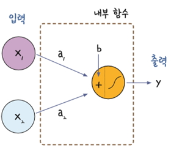

# LogisticRegression2

## [01] Tensorflow를 이용한 여러개의 변수를 입력값으로 사용하는 Logistic Regression
  
1. 여러개의 변수를 입력값으로 사용하는 Logistic Regression  
   - 더 정확한 값을 산출하기위하여 변수가 2개 이상인것
   - tf.placeholder(데이터형, 행렬의 차원, 이름): 함수로 전달할 값을 저장하는 저장소
   - tf.matmul(행렬1, 행렬2): 행렬의 곱
  
>> /ws_python/notebook/machine/tsbasic/LogisticRegression2.ipynb

```python
# 여러개의 변수를 입력값으로 사용하는 Logistic Regression
import tensorflow as tf
import numpy as np

# x 데이터 값, 7행 2열 배열
x = np.array([
                 [2, 3],
                 [4, 3],
                 [6, 4],
                 [8, 6],
                 [10, 7],
                 [12, 8],
                 [14, 9]
                 ]) # 데이터
# y 데이터 값, reshape(7, 1): 배열 1행 7열을 7행 1열로 변경한다.
yr = np.array([0, 0, 0, 1, 1, 1, 1]).reshape(7, 1)
```

```python
# 행렬의 곱셈을 해야함으로 행의 수는 열의 수와 동일하게 1개 생성,
# 행의수는 변수의 열수와 동일하게 해야함, 행렬 곱셈: 1행 2열 * 2행 1열.
# 변수 2개: a1 * x + a2 * x + b, 2행 1열
# 변수 3개: a1 * x + a2 * x + a3 * x + b, 3행 1열
```

```python
# 활용예
x_data = np.array([
                  [2, 3],
                  [4, 3],
                  [6, 4],
                  [8, 6],
                  [10, 7],
                  [12, 8],
                  [14, 9],
                  [1, 1],
                  [1, 10]
                  ])  # 데이터

print('x_data[index]:', x_data[0])
print('x_data[index]:', x_data[0].shape)
new_x = np.array(x_data[0]).reshape(1, 2)# [7, 6]은 각각 공부 시간과 과외 수업수, 1행 2열로 변경
print('x_data[index]:', new_x)
print('x_data[index]:', new_x.shape)
```

```python
session.close()
```

```python
# 기존 그래프 출력시 Jupyter Notebook, Tensorboard 재시작
LOG_DIR = '../../logs' # 폴더는 자동 생성됨. /ws_python/notebook/logs
graph = tf.get_default_graph()
with tf.summary.FileWriter(LOG_DIR) as writer:
    writer.add_graph(graph)
```

### 2. 로지스틱 회귀에서 퍼셉트론으로

1) 로지스틱 회귀를 퍼셉트론 방식으로 표현한 예
   - x1과 x2가 입력되고, 각각 가중치 a1, a2를 만남
   - 여기에 b 값을 더한 후 시그모이드 함수를 거쳐 1 또는 0의 출력 값 y를 출력
   - 이 그림의 개념이 1957년, 코넬 항공 연구소의 프랑크 로젠블라트라는 사람이 발표한, ‘퍼셉트론(perceptron)’임
   - 이 퍼셉트론은 그 후 여러 학자들의 노력을 통해 인공 신경망, 오차 역전파 등의 발전을 거쳐 지금의 딥러닝으로 이어지게 됨
  
  