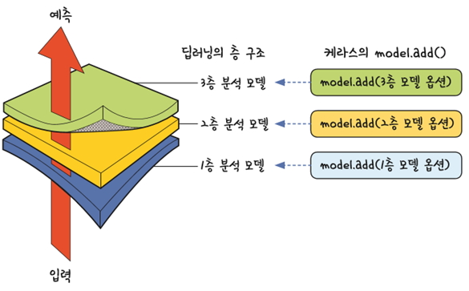

# Keras 소개

## [01] Keras의 사용

- Tensorflow 1.2부터 통합, Tensorflow 2.0부터 공식적인 Tensorflow의 상위 계층으로 지정
- Keras는 Tensorflow의 까다로운 문법과 여러 학습의 최적화 기법을 지원

### 1. Sequential 함수

- Sequential 함수는 딥러닝의 구조를 한 층 한 층 쉽게 쌓아올릴 수 있게 해 줌
  Sequential 함수를 선언하고 나서 model.add() 함수를 사용해 필요한 층을 차례로 추가하면 됨

1. add 함수는 Dense 함수를 이용하여 계층 추가
    
2. 입력층+은닉층
   - 코드: model.add(Dense(100, input_dim=17, activation='relu'))
   - Keras는 입력층과 은닉층이 결합되어 있음.
   - 은닉층의 각노드는 입력값과 임의(random)의 가중치를 할당받고 활성화 함수를 거쳐 최종 출력 값을 생성함.
   - 100: 출력 노드의 갯수
   - input_dim=17: 입력 노드(속성/변수) 17 개임
   - activation='relu': 활성화 함수는 'relu' 함수를 사용함.
    
3. 은닉층
   - 코드(전결합층, 밀집층, 완전 연결층): model.add(Dense(40, activation='relu'))
   - 은닉층의 각노드는 입력값과 임의(random)의 가중치를 할당받고 활성화 함수를 거쳐 최종 출력 값을 생성함.
   - 40: 출력 노드의 갯수
   - activation='relu': 활성화 함수는 'relu' 함수를 사용함.
4. 출력층
   - 코드: model.add(Dense(1)): 수치 예측
   - 코드: model.add(Dense(1, activation='sigmoid')): 이항 분류
   - 코드: model.add(Dense(1, activation='softmax')): 다항 분류
   - 출력층의 출력 데이터 개수는 1개임으로 1임
   - 은닉층으로부터의 입력데이터에 가중치를 곱하고 활성화 함수를 이용하여 최종 결과를 산출함.
5. 모델 학습 과정 설정
   - 코드: model.compile(loss='mean_squared_error', optimizer='adam', metrics=['accuracy'])
   - 지정한 모델이 효과적으로 구현될 수 있게 여러 가지 환경을 설정하는 부분
   - loss : 현재 가중치 세트를 평가하는 데 사용한 손실 함수(오차 함수).
    . mean squared error(mse: 평균 제곱 오차): 수치 예측   예) 매출액
    . binary_crossentropy(이항 교차 엔트로피): 이항 분류   예) 참/거짓, 0/1, 생존/사망, 합격/불합격
    . categorical_crossentropy(범주형 교차 엔트로피): 다항(다중/범주) 분류   예) 품종 분류, 자동차의 종류 분류, 등급 분류
   - 평균으로부터의 오차를 계산하는 오차 함수의 종류, loss 옵션에 사용
    
   - optimizer(경사 하강법의 종류(최적화 함수)) : 최적의 가중치를 검색하는 데 사용되는 최적화 알고리즘으로 효율적인 경사 하강법 알고리즘 중 하나인 ‘adam’을 사용.
   - metrics : 평가 척도를 나타내며 분류 문제에서는 일반적으로 ‘accuracy’으로 지정.
6. 모델 학습시키기
   - 코드: model.fit(X, Y, epochs=10, batch_size=10)
   - 에포크(epochs): 전체 데이터에 대하여 반복할 학습 횟수
   - batch_size: 데이터를 한번에 몇건씩 처리할 것인지 선언
     batch_size는 적당히 커야하는데 너무 크면 학습 속도가 빨라지나 정확도는 떨어지고, 많은 메모리를 사용함으로 메모리 overflow문제 발생 할 수 있음으로 자신의 컴퓨터 메모리가 감당할 만큼의 batch_size를 찾아 설정, 너무 작으면 데이터의 이상치(outlier)의 각 실행 값의 편차가 생겨서 전체 결괏값이 불안정해질 수 있음
   - batch_size가 1이면 1건 처리시마다 가중치를 변경하며, 2000이면 2000건의 처리후 가중치를 변경하여 세부적인 가중치 변경이 어려움.
7. 진행 사항을 챠트로 표현

    ```python
    # # 진행 사항을 챠트로 표현
    # fig, loss_ax = plt.subplots()
    fig.set_size_inches(10, 5)  # 챠트 크기 설정

    acc_ax = loss_ax.twinx()   # x 축을 공유하는 새로운 Axes 객체를 만든다.

    loss_ax.set_ylim([0.0, 1.0])
    acc_ax.set_ylim([0.0, 1.0])

    loss_ax.plot(hist.history['loss'], 'y', label='train loss')
    acc_ax.plot(hist.history['acc'], 'b', label='train acc')

    loss_ax.set_xlabel('epoch')
    loss_ax.set_ylabel('loss')
    acc_ax.set_ylabel('accuray')

    loss_ax.legend(loc='upper left')
    acc_ax.legend(loc='lower left')

    plt.show()
    ```

8. 모델 평가하기
   - 코드: `print("\n Accuracy: %.4f" % (model.evaluate(X, Y)[1]))`
   - 데이터와 처리 결과를 이용해 정확도를 결과로 출력
   - 학습데이터가 아닌 다른 데이터를 평가 대상으로 선정, 일반화 성능을 높이려는 의도.
9. 모델의 저장
   - model.save('CancerSurvival.h5')
   - 모델 저장 파일 형식 및 저장 내용: h5
     ① 나중에 모델을 재구성하기 위한 모델의 구성 정보
     ② 모델를 구성하는 각 뉴런들의 가중치
     ③ 손실함수, 최적하기 등의 학습 설정
     ④ 재학습을 할 수 있도록 마지막 학습 상태
10. 모델 로딩
    - model = load_model('CancerSurvival.h5')
11. 모델의 사용
    - 코드

    ```python
    predict_value = model.predict_classes(x_data[0:10])
    print('type(predict_value):', type(predict_value))
    print('predict_value:', predict_value)
    model.summary()
    print('-------------------------------------------------------')
    for i in range(len(x_data)):
        print('실제값:', y_data[i], '예측값:', predict_value[i])
    ```
  
12. 모델의 사용 챠트로 확인

    ```python
    # 모델 사용 결과를 챠트로 표현
    plt.scatter(x_data, y_data, color='g')
    plt.plot(x_data, y_data, color='g')
    plt.scatter(x_data, y_predict, color='r')
    plt.plot(x_data, y_predict, color='r')
    plt.grid(True)
    plt.show()
    ```

    - matplotlib 관련 에러 발생시의 처리
    _getfullpathname: embedded null character : Python3.x 에서 plt 오류
    import matplotlib.pyplot as plt 시 _getfullpathname: embedded null character 오류 메세지가 나타나면,

    'C:\ProgramData\Anaconda3\envs\machinegpu\Lib\site-packages\matplotlib' 설치 폴더내의
    'font_manager.py' 파일 241번 라인 편집

    def win32InstalledFonts(directory=None, fontext='ttf'):  함수 안의
    direc = os.path.abspath(direc).lower() 를 `direc = direc.split('\0', 1)[0]` 로 변경할 것.
13. 네트워크, 층, 손실 함수, 옵티마이저 사이의 관계
    
14. 마지막층의 활성화 함수와 손실함수 선택 기준(활성화 함수, 손실 함수)
    1) 이진 분류: Sigmoid, binary_crossentropy
    2) 단일 레이블 다중 분류: softmax, categorical_crossentropy
    3) 다중 레이블 다중 분류: simoid,  binary_crossentropy
    4) 임의 값에 대한 회귀:  없음, mse
    5) 0과 1사이 값에 대한 회귀: Sigmoid, mse 또는 binary_crossentropy

## [02] Keras 기반 Python script 기초 코드

- 경고 메시지 출력 중지 및 matplotlib 한글 깨짐처리

```python
import warnings
warnings.filterwarnings(action='ignore')

import os
import random

import pandas as pd
import seaborn as sns

import numpy as np
import tensorflow as tf

import matplotlib
import matplotlib.pyplot as plt

from matplotlib import font_manager, rc
from keras.models import Sequential
from keras.layers import Dense
from keras.utils import to_categorical
from keras.utils import np_utils
from keras.models import load_model

from sklearn.preprocessing import LabelEncoder  # class가 문자열인경우 변환
from keras.callbacks import EarlyStopping
from keras.callbacks import ModelCheckpoint
from sklearn.model_selection import train_test_split # 학습셋과 테스트셋을 나눔
from sklearn.model_selection import StratifiedKFold  # K겹 교차 검증

#
# CNN 테스트시 failed to create cublas handle: CUBLAS_STATUS_ALLOC_FAILED 에러 발생시 추가
config = tf.ConfigProto()
# config.gpu_options.per_process_gpu_memory_fraction = 1.0 # 메모리를 사전에 모두 할당
config.gpu_options.allow_growth = True                     # 메모리를 필요시 할당
session = tf.Session(config=config)
session = tf.Session(config=tf.ConfigProto(log_device_placement=True)) # 연결된 device 확인
#

font_name = font_manager.FontProperties(fname="C:/Windows/Fonts/malgun.ttf").get_name()
# windows 10
# font_name = font_manager.FontProperties(fname="C:/Windows/Fonts/malgunsl.ttf").get_name()
rc('font', family=font_name)           # 맑은 고딕 폰트 지정
plt.rcParams["font.size"] = 12         # 글자 크기
# plt.rcParams["figure.figsize"] = (10, 4) # 10:4의 그래프 비율
plt.rcParams['axes.unicode_minus'] = False  # minus 부호는 unicode 적용시 한글이 깨짐으로 설정

# Jupyter에게 matplotlib 그래프를 출력 영역에 표시할 것을 지시하는 명령
%matplotlib inline  
  
seed = 0
tf.set_random_seed(seed)
np.random.seed(seed)
```

## [03] 시각화 기초 코드

```python
fig, loss_ax = plt.subplots()
# plt.figure(figsize=(6,4)) # ERROR
fig.set_size_inches(10, 5)  # 챠트 크기 설정

acc_ax = loss_ax.twinx()  # 오른쪽 y 출 설정

loss_ax.plot(hist.history['loss'], 'y', label='train loss')
loss_ax.plot(hist.history['val_loss'], 'r', label='val loss')
loss_ax.set_ylim([0.0, 10.0]) # 값을 반영하여 변경

acc_ax.plot(hist.history['acc'], 'b', label='train acc')
acc_ax.plot(hist.history['val_acc'], 'g', label='val acc')
acc_ax.set_ylim([0.0, 1.0])

loss_ax.set_xlabel('epoch')
loss_ax.set_ylabel('loss')
acc_ax.set_ylabel('accuray')

loss_ax.legend(loc='upper left')
acc_ax.legend(loc='lower left')

plt.show()
```
