# 오차 연전파

## [01] 오차 역전파(Back Propagation)

1. 오차 역전파 개론
   - 퍼셉트론으로 해결되지 않던 문제를 신경망(다층 퍼셉트론)을 이용해 해결할 수 있음.
   - 신경망 내부의 가중치는 오차 역전파 방법을 사용해 수정.
   - 오차 역전파는 오차를 줄이기위하여 수행된 경사 하강법을 역 방향으로 수행하기위한 확장 개념임.
    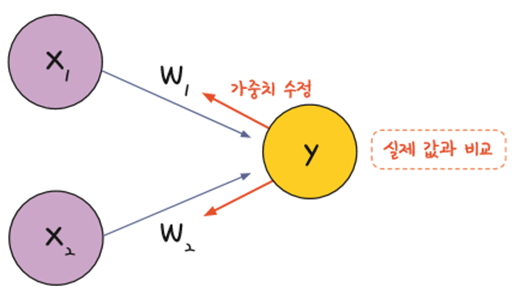
   - 다층 퍼셉트론 역시 결괏값의 오차를 구해 이를 토대로 하나 앞선 가중치를 차례로 거슬러 올라가며 조정해 감
   - 최적화의 계산 방향이 출력층에서 시작해 앞(뒤어서 앞으로)으로 진행되며 오차 역전파(back propagation)라고 부름.
    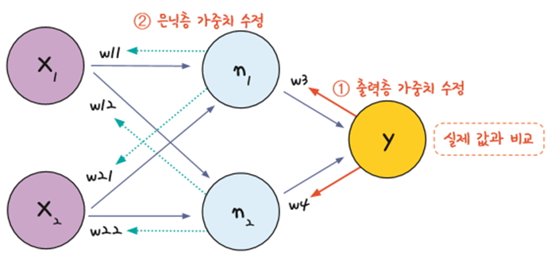
2. 오차 역전파 구동 방식
   1) 임의의 초기 가중치(w(1))를 준 뒤 결과(yout)를 계산한다.
   2) 계산 결과와 우리가 원하는 값 사이의 오차를 구한다.
   3) 경사 하강법을 이용해 바로 앞 가중치를 오차가 작아지는 방향으로 업데이트한다.
   4) 1~3 과정을 더이상 오차가 줄어들지 않을 때까지 반복한다.
   - ‘오차가 작아지는 방향으로 업데이트한다’는 의미는 미분 값이 0에 가까워지는 방향으로 나아간다는 말
    즉, ‘기울기가 0이 되는 방향’으로 나아가야 하는데, 이 말은 가중치에서 기울기를 뺐을 때 가중치의 변화가 전혀 없는 상태를 말함
    따라서 오차 역전파를 다른 방식으로 표현하면 가중치에서 기울기를 빼도 값의 변화가 없을 때까지 계속해서 가중치 수정 작업을 반복하는 것
    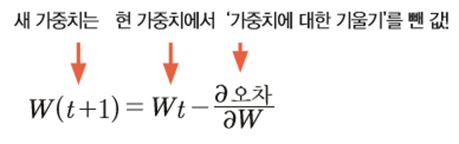
    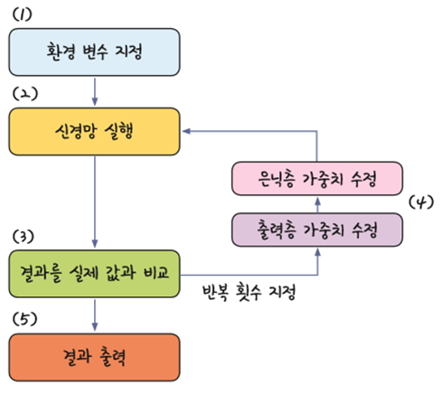

## [02] 기울기 소실 문제와 활성화 함수

1. 다층 퍼셉트론이 오차 역전파를 만나 신경망이 되었고, 신경망은 XOR 문제를 가볍게 해결했으나 기대만큼 결과가 좋아지지 않았음
    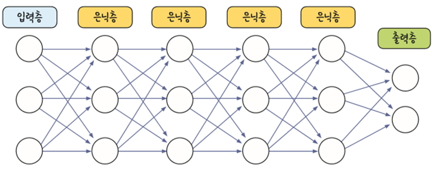
2. 오차 역전파는 출력층으로부터 하나씩 앞으로 되돌아가며 각 층의 가중치를 수정하는 방법
   - 가중치를 수정하려면 미분 값, 즉 기울기가 필요하나 층이 늘어나면서 기울기가 중간에 0이 되어버리는 기울기 소실(vanishing gradient) 문제가 발생하기 시작
    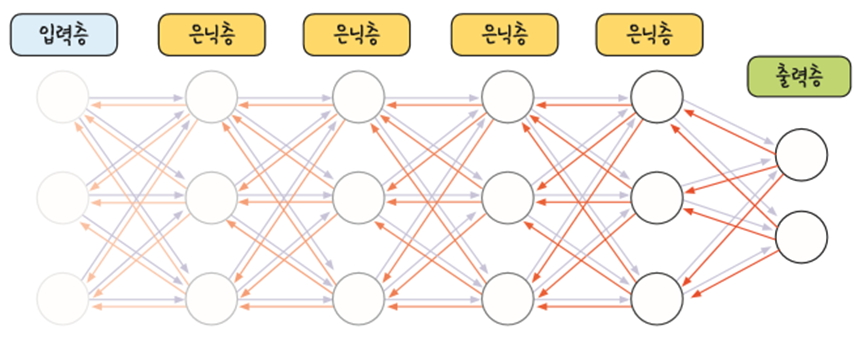
   - 이는 활성화 함수로 사용된 시그모이드 함수의 특성 때문임
   - 아래처럼 시그모이드를 미분하면 최대치가 0.3이되며, 1보다 작으므로 계속 곱하다 보면 0에 가까워짐 따라서 층을 거쳐 갈수록 기울기가 사라져 가중치를 수정하기가  어려워지는 것
    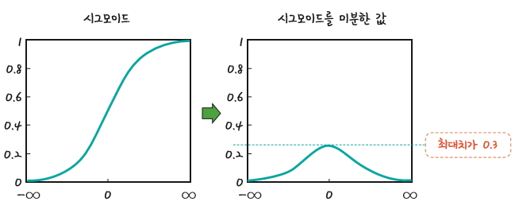
   - 이를 해결하고자 활성화 함수를 시그모이드가 아닌 여러 함수로 대체하고 있음.
3. activation : 활성화 함수 설정
    . linear: 디폴트 값, 입력뉴런과 가중치로 계산된 결과값이 그대로 출력됨, 예) 매출액, 수치 예측
    . relu: rectifier 함수, 은닉층에 주로 쓰임, 음수값은 0으로 대체하여 사용
    . sigmoid: 시그모이드 함수, 이진 분류 문제에서 출력층에 주로 쓰임 예) 참/거짓, 0/1, 생존/사망, 합격/불합격
    . softmax: 소프트맥스 함수, 다중 클래스 분류 문제에서 출력층에 주로 쓰임 예) 품종 분류, 자동차의 종류 분류, 등급 분류
   - 렐루: 토론토대학교의 제프리 힌튼 교수가 제안한 렐루(ReLU)는 시그모이드의 대안으로 떠오르며 현재 가장 많이 사용되는 활성화 함수 렐루는 x가 0보다 작을 때는 모든 값을 0으로 처리하고, 0보다 큰 값은 x를 그대로 사용하는 방법. 이 방법을 쓰면 x가 0보다 크기만 하면 미분 값이 1이 됨, 따라서 여러 은닉층을 거치며 곱해지더라도 맨 처음 층까지 사라지지 않고 남아 있을 수 있음, 딥러닝의 발전에 속도가 붙게 되는 활성화 함수임.
    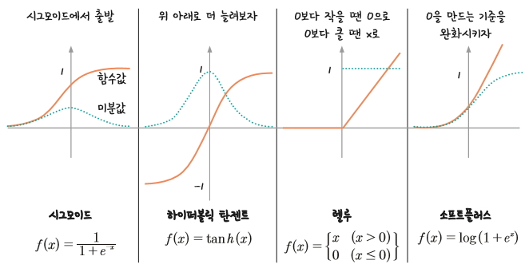
4. 경사 하강법은 정확하게 가중치를 찾아가지만, 한 번 업데이트할 때마다 전체 데이터를 미분해야 하므로 계산량이 매우 많다는 단점이 있음
    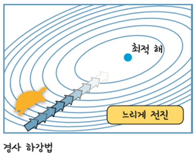
5. 확률적 경사 하강법(SGD: Stochastic Gradient Descent)
   전체 데이터를 사용하는 것이 아니라, 랜덤하게 추출한 일부 데이터를 사용 일부 데이터를 사용하므로 더 빨리 그리고 자주 업데이트를 하는 것이 가능해짐
    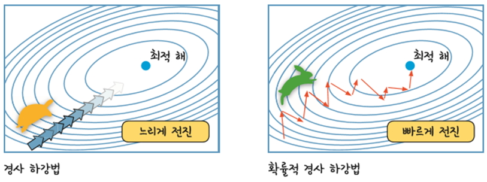  
6. 모멘텀
    경사 하강법과 마찬가지로 매번 기울기를 구하지만, 이를 통해 오차를 수정하기 전 바로 앞 수정 값과 방향(+, -)을 참고하여 같은 방향으로 일정한 비율만 수정되게 하는 방법으로 좀더 이동에 가속도가 붙는다.
    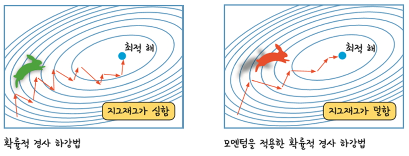  
7. 경사 하강법의 종류(최적화 함수)
    - 딥러닝 구동에 필요한 고급 경사 하강법과 케라스 내부에서의 활용법 정리
    - 가중치 및 역전파 가중치의 할당 및 변경
    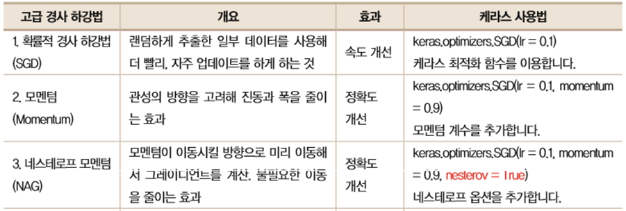  
    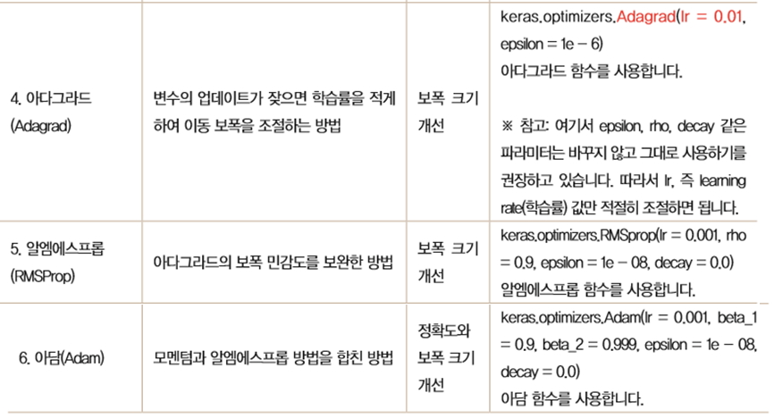  
    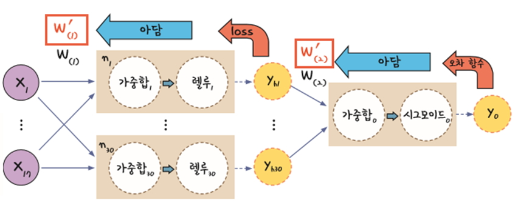  
