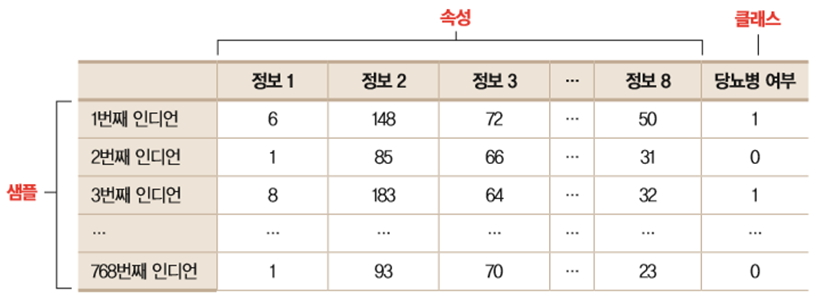
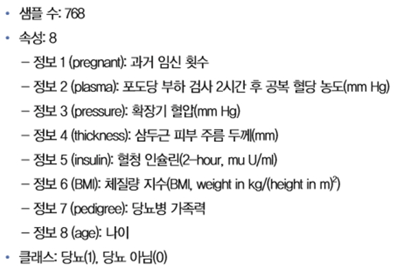
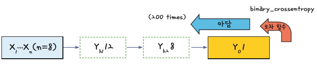

# 이항분포

## [01] 이항 분류(Binary Classification), 피마인디언 데이터 분석

- 미국 남서부에 살고있는 피마 인디언은 1950년대만해도 비만인 사람이 0%였으나 현재는 부족의 60%가 당뇨, 80%가 비만으로 고통을 받고 있음.
이는 생존하기위해 위해 영양분을 체내에 저장하는 뛰어난 능력을 물려받은 인디언들이 미국의 기름진 패스트푸드 문화를 만나면서 벌어진 일.


1. 데이터
   - 관련 데이터를 <http://archive.ics.uci.edu>에 접속하여 검색창에 pima indian이라고 검색 <http://archive.ics.uci.edu>에서 다운받을 수 있음(2018년 5월 접속 불가능).
  
   (1) 구조
   - Sample: 데이터, instance, example등
   - 속성: attribute, feature, sample의 데이터 항목
   - 클래스: 처리 결과, class, label등
    

   - 8개의 속성(정보), 1개의 class(당뇨병 여부), 768명의 인디언 데이터
    

   - 8번째 항목 생존 결과
      ① 1: 당뇨병, true
      ② 0: 당뇨병 아님, false

    (2) 견본
    6,148,72,35,0,33.6,0.627,50,1
    1,85,66,29,0,26.6,0.351,31,0
    8,183,64,0,0,23.3,0.672,32,1
    1,89,66,23,94,28.1,0.167,21,0
    0,137,40,35,168,43.1,2.288,33,1

    (3) 모델의 도식화
    

2. 검증 데이터의 직접 적용
   `validation_data=(x_val, y_val)`

3. 가장 작은 오차가 발생했을 경우의 학습 중지
    - monitor='loss': loss 오차 값을 가지고 자동 중지
    - patience=10: 최소 오차 10번 발생시까지 학습 진행

    ```python
    from keras.callbacks import EarlyStopping

    # 가장 작은 오차가 10번 발생하면 학습 자동 중지
    early_stopping = EarlyStopping(monitor='loss', patience=10)
    hist = model.fit(x, y, validation_data = (x_val, y_val), epochs=1000, batch_size=10,callbacks=[early_stopping])
    ```

4. 과적합 방지를 위한 가중치 규제 추가
   - 특정 가중치의 값이 너무 커지는 것을 방지하는 알고리즘
   - L1 규제 : 가중치의 절대값에 비례하는 비용이 추가됩니다(가중치의 L1 노름).
   - L2 규제 : 가중치의 제곱에 비례하는 비용이 추가됩니다(가중치의 L2 노름).
   - L2 규제는 신경망에서 가중치 감쇠라고도 부름 가중치의 파라미터들을
   - 모두 제곱하여 더한후 이 값의 제곱근을 구한후 0.001을 곱하여 가중치를 감쇠처리함.
   - 사용

    ```python
    from keras import regularizers
    model.add(Dense(128, input_dim=8, activation='relu',
    kernel_regularizer=regularizers.l1_l2(l1=0.001, l2=0.001))) # 입력 값: 8, 출력값: 16
    ```

5. Script
   - 데이터의 특징으로 인해 정확도는 70% 정도 산출됨.

    (1) 과적합이 쉽게 발생(훈련 데이터에만 정확도가 높음)  
    >> /ws_python/notebook/machine/pima/Pima1.ipynb

    ```python
    # 데이터 준비
    df = pd.read_csv('./pima.csv', names = ["pregnant", "plasma", "pressure", "thickness", "insulin", "BMI", "pedigree", "age", "class"])
    print(type(df))
    print(df.head(5))
    print(df.info())
    ```

    ```python
    # https://matplotlib.org/users/colormaps.html
    colormap = plt.cm.gist_heat   # 그래프의 색상 구성을 정합니다. 열그래프, gist_heat, autumn, cool
    plt.figure(figsize=(10,5))      #그래프의 크기를 정합니다.

    # df.corr(): 상관관계 분석 데이터
    # linewidths=0.1: 상자의 외곽선 두께
    # vmax=0.1: 밝기, 0에 가까울수록 밝은 색으로 표시됨.
    # cmap=colormap: 적용할 색상값 지정, 기본값 지정,
    # linecolor='white': 상자의 외곽선 색깔
    # annot=True: Annotation의 약자로 각 셀의 값을 표시할지의 여부 결정
    sb.heatmap(df.corr(),linewidths=5,vmax=0.5, cmap=colormap, linecolor='white', annot=True)
    plt.show()  # 챠트 출력
    ```

    ```python
    grid = sb.FacetGrid(df, col='class') # col: Y축 값, 0 또는 1
    # 히스토그램 그래프 출력, plasma: 공복 혈당 농도를 x 좌표로 사용
    grid.map(plt.hist, 'plasma', bins=10) # 10개 구간으로 분리
    plt.show()
    ```

    ```python
    data = np.loadtxt('./pima.csv', delimiter=",")
    print('total:', data.shape)
    x=data[0:668, 0:8]         # 총 768건중 668 건의 학습 데이터, 668행 8열의 구성
    y=data[0:668, 8:]  
    print(x.shape)
    print(y.shape)

    x_val=data[668:718, 0:8]  # 50 건의 검증 데이터, 50행 8열의 구성
    y_val=data[668:718, 8:]  
    print(x_val.shape)
    print(y_val.shape)

    x_test=data[718:, 0:8]     # 50 건의 테스트 데이터, 50행 8열의 구성
    y_test=data[718:, 8:]  
    print(x_test.shape)
    print(y_test.shape)
    ```

    ```python
    test_loss, test_acc = model.evaluate(x_test, y_test, batch_size=1)
    print('손실값:', test_loss, '/정확도:', (test_acc*100), '%')
    ```

    ```python
    model.save('./Pima.h5')
    ```

    (2) 과적합을 해결하기위한 L1, L2규제의 적용
    >> /ws_python/notebook/machine/pima/Pima2.ipynb

```python
from keras import regularizers
```

```python
# 과적합 방지를 위한 가중치 규제 추가
# L1 규제 : 가중치의 절대값에 비례하는 비용이 추가됩니다(가중치의 L1 노름).
# L2 규제 : 가중치의 제곱에 비례하는 비용이 추가됩니다(가중치의 L2 노름).
# L2 규제는 신경망에서 가중치 감쇠라고도 부름 가중치의 파라미터들을
# 모두 제곱하여 더한후 이 값의 제곱근을 구한후 0.001을 곱하여 가중치를 감쇠처리함.

model = Sequential()
# 최적의 모델
model.add(Dense(128, input_dim=8, activation='relu',
         kernel_regularizer=regularizers.l1_l2(l1=0.001, l2=0.001))) # 입력 값: 8, 출력값: 128
model.add(Dense(64, activation='relu',
               kernel_regularizer=regularizers.l1_l2(l1=0.001, l2=0.001)))
model.add(Dense(30, activation='relu'))
model.add(Dense(10, activation='relu'))
model.add(Dense(1, activation='sigmoid'))

model.compile(optimizer='adam', loss='binary_crossentropy', metrics=['accuracy'])

# 가장 작은 오차가 20번 발생하면 학습 자동 중지
early_stopping = EarlyStopping(monitor='loss', patience=10)

# validation_data=(): 검증 데이터의 직접 지정
hist = model.fit(x, y, validation_data = (x_val, y_val), epochs=1000, batch_size=10,
                    callbacks=[early_stopping] )
```
