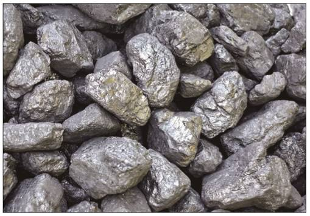
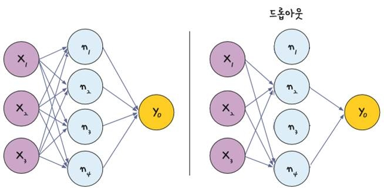
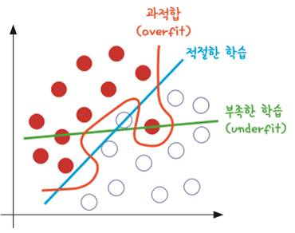
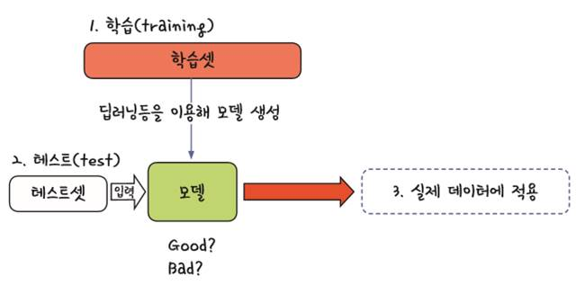
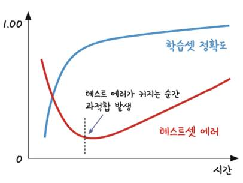
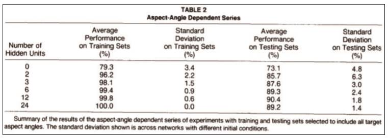
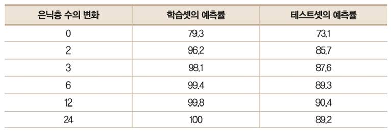
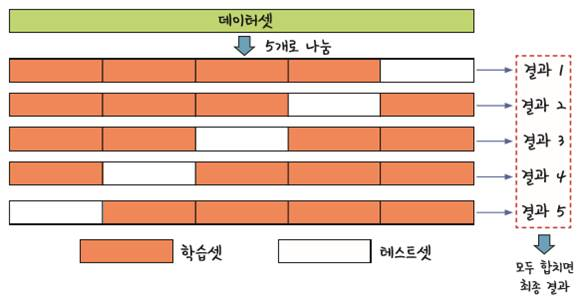

# 이항분포2

## [01] 과적합 피하기, 초음파 광물 예측하기

- 1988년 존스홉킨스대학교의 세즈노프스키(Sejnowski) 교수는 2년 전 힌튼 교수가 발표한
  역전파 알고리즘에 관심을 가지고 있었음
  그는 역전파가 얼마나 큰 효과가 있는지를 직접 실험해 보기 위해 광석과 일반 돌을 갖다 놓고
  음파 탐지기를 쏜 후 그 결과를 데이터로 정리


(1) LabelEncoder()

- 문자열을 숫자로 그룹화해서 변경, 문자 코드순서 적용
예)

```python
from sklearn.preprocessing import LabelEncoder

e = LabelEncoder() # 문자열을 숫자로 그룹화해서 변경, 문자 코드순서 적용
e.fit(Y_obj)  #
Y = e.transform(Y_obj)  # 0, 1, 2 정수로 변환
print(Y)
```

(2) 난수 기반 훈련/검증 데이터 추출

```python
from sklearn.model_selection import train_test_split # 학습셋과 테스트셋의 분리 지원

seed = 0
x_train, x_val, y_train, y_val = train_test_split(X, Y, test_size=0.2, random_state=seed)
print(y_val)
print(y_val.shape)
```

(3) 과적합 방지를 위한 Dropout층의 추가

- 많아진 노드로인해 학습 조건이 안좋아질 경우 과적합을 피하기위해 은닉층에 있는 노드의 일부를 임의로 꺼줌, n1, n3는 사용하지 않게됨.
- 25%의 노드를 끄려는 경우 Keras의 구현: model.add(Dropout(0.25)), 노드의 값을 0으로 변경
- 컨볼루션층이나 Max pooling층은 2차원 배열의 형태로 다룸.
- MLP 기반의 Dense층에서도 사용가능



```python
from keras.layers import Dropout
model.add(Dropout(0.25)) # 25 %의 노드를 사용하지 않음.
```

1. 데이터

   1) 구조
   - Index가 208개이므로 총 샘플의 수는 208개이고, 컬럼 수가 61개이므로 60개의 속성과 1개의 클래스로 이루어져 있음을 짐작할 수 있음
   - 모든 컬럼이 실수형(float64)인데, 맨 마지막 컬럼만 객체형인 것으로 보아 마지막에 나오는 컬럼은 클래스이며 데이터형 변환이 필요한 것을 알 수 있음
    >> /ws_python/notebook/machine/sonar/sonar.csv

2. script
    - 훈련용, 검증용
    >> /ws_python/notebook/machine/sonar/Sonar1.ipynb

    ```python
    # 훈련용, 검증용
    df = pd.read_csv('./sonar.csv', header=None)
    # print(df.info())
    df.head()
    ```

    ```python
    data = df.values
    print(type(data))
    X = data[:, 0:60].astype(float)  # 0 ~ 59
    print(X[0:5, 0:4])
    Y_obj = data[:, 60]  # 1차원 배열
    print(Y_obj[0:5])
    ```

    ```python
    # 여러 건의 데이터
    x_data = np.array([
        [0.0100,0.0171,0.0623,0.0205,0.0205,0.0368,0.1098,0.1276,0.0598,0.1264,0.0881,0.1992,0.0184,0.2261,0.1729,0.2131,0.0693,0.2281,0.4060,0.3973,0.2741,0.3690,0.5556,0.4846,0.3140,0.5334,0.5256,0.2520,0.2090,0.3559,0.6260,0.7340,0.6120,0.3497,0.3953,0.3012,0.5408,0.8814,0.9857,0.9167,0.6121,0.5006,0.3210,0.3202,0.4295,0.3654,0.2655,0.1576,0.0681,0.0294,0.0241,0.0121,0.0036,0.0150,0.0085,0.0073,0.0050,0.0044,0.0040,0.0117],
        [0.0762,0.0666,0.0481,0.0394,0.0590,0.0649,0.1209,0.2467,0.3564,0.4459,0.4152,0.3952,0.4256,0.4135,0.4528,0.5326,0.7306,0.6193,0.2032,0.4636,0.4148,0.4292,0.5730,0.5399,0.3161,0.2285,0.6995,1.0000,0.7262,0.4724,0.5103,0.5459,0.2881,0.0981,0.1951,0.4181,0.4604,0.3217,0.2828,0.2430,0.1979,0.2444,0.1847,0.0841,0.0692,0.0528,0.0357,0.0085,0.0230,0.0046,0.0156,0.0031,0.0054,0.0105,0.0110,0.0015,0.0072,0.0048,0.0107,0.0094],
        [0.0286,0.0453,0.0277,0.0174,0.0384,0.0990,0.1201,0.1833,0.2105,0.3039,0.2988,0.4250,0.6343,0.8198,1.0000,0.9988,0.9508,0.9025,0.7234,0.5122,0.2074,0.3985,0.5890,0.2872,0.2043,0.5782,0.5389,0.3750,0.3411,0.5067,0.5580,0.4778,0.3299,0.2198,0.1407,0.2856,0.3807,0.4158,0.4054,0.3296,0.2707,0.2650,0.0723,0.1238,0.1192,0.1089,0.0623,0.0494,0.0264,0.0081,0.0104,0.0045,0.0014,0.0038,0.0013,0.0089,0.0057,0.0027,0.0051,0.0062],
        [0.0491,0.0279,0.0592,0.1270,0.1772,0.1908,0.2217,0.0768,0.1246,0.2028,0.0947,0.2497,0.2209,0.3195,0.3340,0.3323,0.2780,0.2975,0.2948,0.1729,0.3264,0.3834,0.3523,0.5410,0.5228,0.4475,0.5340,0.5323,0.3907,0.3456,0.4091,0.4639,0.5580,0.5727,0.6355,0.7563,0.6903,0.6176,0.5379,0.5622,0.6508,0.4797,0.3736,0.2804,0.1982,0.2438,0.1789,0.1706,0.0762,0.0238,0.0268,0.0081,0.0129,0.0161,0.0063,0.0119,0.0194,0.0140,0.0332,0.0439],
        [0.1313,0.2339,0.3059,0.4264,0.4010,0.1791,0.1853,0.0055,0.1929,0.2231,0.2907,0.2259,0.3136,0.3302,0.3660,0.3956,0.4386,0.4670,0.5255,0.3735,0.2243,0.1973,0.4337,0.6532,0.5070,0.2796,0.4163,0.5950,0.5242,0.4178,0.3714,0.2375,0.0863,0.1437,0.2896,0.4577,0.3725,0.3372,0.3803,0.4181,0.3603,0.2711,0.1653,0.1951,0.2811,0.2246,0.1921,0.1500,0.0665,0.0193,0.0156,0.0362,0.0210,0.0154,0.0180,0.0013,0.0106,0.0127,0.0178,0.0231],
    ])
    # 1건의 데이터
    # data = "0.0100,0.0171,0.0623,0.0205,0.0205,0.0368,0.1098,0.1276,0.0598,0.1264,0.0881,0.1992,0.0184,0.2261,0.1729,0.2131,0.0693,0.2281,0.4060,0.3973,0.2741,0.3690,0.5556,0.4846,0.3140,0.5334,0.5256,0.2520,0.2090,0.3559,0.6260,0.7340,0.6120,0.3497,0.3953,0.3012,0.5408,0.8814,0.9857,0.9167,0.6121,0.5006,0.3210,0.3202,0.4295,0.3654,0.2655,0.1576,0.0681,0.0294,0.0241,0.0121,0.0036,0.0150,0.0085,0.0073,0.0050,0.0044,0.0040,0.0117"
    # data = np.array(data.split(','), dtype=float)  # or int
    # x_data = np.array([
    #     data,
    # ])
    ```

## [02] 과적합 피하기(훈련데이터, 검증 데이터의 분할)

- 과적합(over fitting)이란 모델이 학습 데이터셋 안에서는 일정 수준 이상의 예측 정확도를 보이지만, 새로운 데이터에 적용하면 잘 맞지 않는 것을 말함
  

- 학습 데이터와 테스트 데이터, 사용 데이터의 분리
  

- 학습횟수를 늘린다고 모든 데이터의 정확도가 증가하지는 않음.

  
- 세즈노프스키 교수가 논문에 포함한 실험 결과의 일부분
  

- 세즈노프스키 교수가 논문에 포함한 실험 결과의 일부분 정리
- 학습셋의 훈련과 테스트셋의 검증 결과가 다름으로 학습시 데이터를 다양하게 사용할 필요가 있음.
  

## [03] k겹 교차 검증(5-fold cross validation)

1. 데이터 셋을 여러 조각으로 나누어 검증하면 학습과 함께 모든 데이터를 검증 데이터로 이용하게되어 정확한 검증이 발생함.
      

2. Script
    >> /ws_python/notebook/machine/sonar/Sonar2.ipynb
