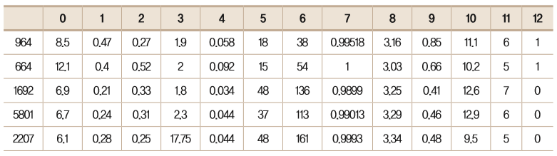
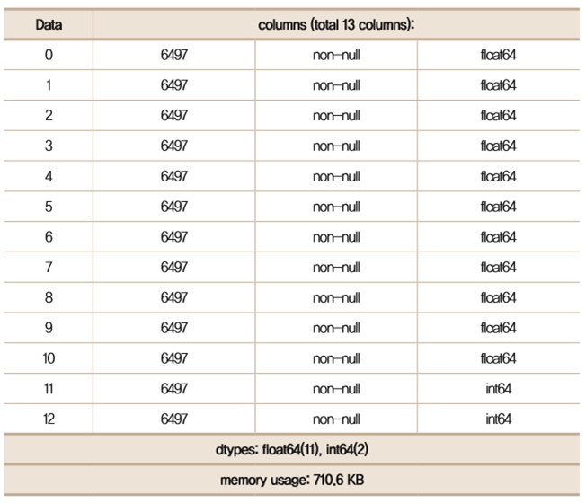
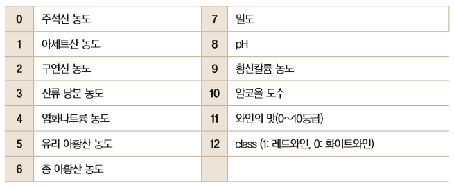

# 이항분포3

## [01] 와인의 종류 예측하기

- 이번 실습을 위해 사용되는 데이터는 포르투갈 서북쪽의 대서양을 맞닿고 위치한 비뉴 베르드(Vinho Verde) 지방에서 만들어진 와인을 측정한 데이터
- 레드와인 샘플 1,599개를 등급과 맛, 산도를 측정해 분석하고 화이트와인 샘플 4,898개를 마찬가지로 분석해
  데이터를 만들었음


1. 데이터 확인
    (1) 데이터 견본
    

    (2) 데이터 구조
    
  
   - 독립 변수 설명
    

2. 와인의 종류 예측
   - 이항 분류(binary classification) 문제이므로 오차 함수는 binary_crossentropy를 사용하고 최적화 함수로 adam을 사용

    >> /ws_python/notebook/machine/wine/Wine.ipynb

    ```python
    # 데이터 준비
    data = np.loadtxt('./wine.csv', delimiter=',', dtype=np.float64)
    print(type(data))
    print(data.shape)
    print(data)
    X = data[:, 0:12] # 0 ~ 11
    Y = data[:, 12]   # 12
    ```

    ```python
    MODEL_DIR = './model/'
    if not os.path.exists(MODEL_DIR): # 폴더가 존재하지 않으면 생성
        os.mkdir(MODEL_DIR)

    modelpath='./model/{epoch:04d}-{val_acc:.4f}.h5'
    # 검증 정확도가 개선되었을 때만 학습 모델 파일로 저장
    checkpointer = ModelCheckpoint(filepath=modelpath, monitor='val_acc', verbose=1, save_best_only=True)
    ```
