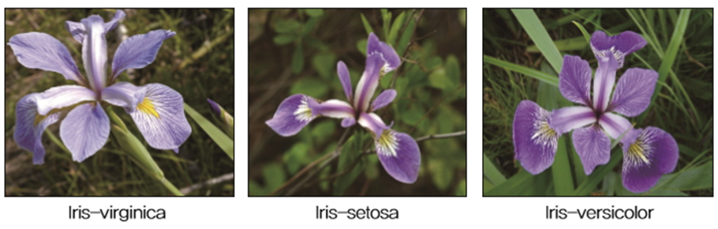
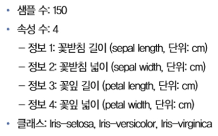
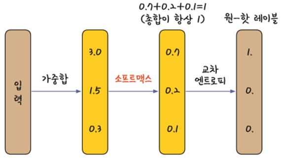

# 다중 분류(Multi Classification)

## [01] 아이리스(붓꽃) 품종 예측

- 딥러닝을 이용하여 붓꽃 구별하기
- 아이리스는 꽃잎의 모양과 길이에 따라 여러 가지 품종으로 나뉨


1. 데이터
   - 관련 데이터를 <http://archive.ics.uci.edu>에 접속하여 검색창에 iris이라고 검색
   <http://archive.ics.uci.edu>에서 다운받을 수 있음(2018년 5월 접속 불가능).
  
    (1) 구조
   - Sample: 데이터, instance, example등
   - 속성: attribute, feature, sample의 데이터 항목
   - 클래스: 처리 결과, class, label등

   

   

   - 4개의 속성(정보), 1개의 class, 150건의 데이터
   - 하나의 class는 3가지 종류로 Iris-setosa, Iris-versicolor, Iris-virginica 나누어짐.

   - 150건의 데이터를 훈련용으로 120건, 검증용으로 30건을 분리하여 사용함.

    (2) 견본

    ```python
    5.1,3.5,1.4,0.2,Iris-setosa
    4.9,3.0,1.4,0.2,Iris-setosa
    4.7,3.2,1.3,0.2,Iris-setosa
    4.6,3.1,1.5,0.2,Iris-setosa
    5.0,3.6,1.4,0.2,Iris-setosa
    ```

2. 원 핫 인코딩

    (1) Y 값이 문자열일 경우 클래스 이름을 숫자 형태로 바꿔 주어야 함

   - sklearn 라이브러리의 LabelEncoder()를 이용하여 변환함.
   - 이렇게 하면 array(['Iris-setosa', 'Iris-versicolor','Iris-virginica'])가 array([1,2,3])로 바뀜
   - 코드

    ```python
    from sklearn.preprocessing import LabelEncoder

    e = LabelEncoder()
    e.fit(Y_obj)
    Y = e.transform(Y_obj)
    ```

    (2) 활성화 함수를 적용하려면 Y 값이 숫자 0과 1로 이루어져 있어야 함
    이 조건을 만족시키려면 keras.util의  np_utils.categorical() 함수를 적용해야 함
   - 이렇게 하면 array([1,2,3])가 다시 array([[1., 0., 0.], [0., 1., 0.],[0., 0., 1.]])로 바뀜
   - 이처럼 여러 개의 Y 값을 0과 1로만 이루어진 형태로 바꿔 주는 기법을 원-핫 인코딩(one-hot-encoding)이라고 함
   - 코드

    ```python
    from keras.utils import np_utils
    Y_encoded = np_utils.to_categorical(Y)
    ```

3. 활성화 함수 소프트맥스

    
   - Softmax 활성화 함수는 최종 결과를 총합이 1이되는 실수형태로 출력함.
   - 합계가 1인 형태로 변환하면 큰 값이 두드러지게 나타나고 작은 값은 더 작아짐
   - 다중 분류는 손실함수로(오차) 교차 엔트로피를 사용하며 실수로 출력된 softmax 활성하 함수의 값 중에서 numpy.argmax() 함수를 이용해 최대값의 index를 산출함.
   (예) 품종이 3개이면 0 ~ 2

   ```python
   argmax() 0: [1., 0., 0.]
   argmax() 1: [0., 1., 0.]
   argmax() 2: [0., 0., 1.]
   ```

   - ont hot encoding을 진행하여 [1., 0., 0.]으로 값을 가중치를 비교하여 값을 분류하여 최종 결과를 산출함.
   가장 큰 값 하나만 1이고 나머지는 모두 0인 형태로 전환시킬 수 있음

4. Script

   (1) 훈련과 검증 데이터를 2개의 파일로 분리한경우
    >> /ws_python/machine/iris/Iris.ipynb

    ```python

    df = pd.read_csv('./iris.csv', names = ["sepal_length", "sepal_width", "petal_length", "petal_width", "species"])
    print(df.head())
    ```

    ```python
    data = df.values
    print(type(data))
    X = data[:, 0:4].astype(float)  # 행렬, 2차원 배열
    print(X[0:5, 0:4])
    Y_obj = data[:, 4]  # 1차원 배열
    print(Y_obj[0:5])
    ```

    (2) 훈련과 검증 데이터를 통합하고 테스트 테이터를 분리한경우
    >> /ws_python/machine/iris/Iris2.ipynb

    (3) 테스트
    >> /ws_python/machine/iris/Iris2_use.ipynb

```python
# 배열 데이터 사용
```

```python
# csv 파일의 사용
```

```python
# input 함수의 이용
```
