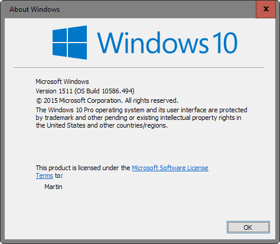

# CUDA

## [00] NVIDIA Driver

- Windows 7은 별 다른 문제 없음.
- GeForce GTX 1060 Windows 10 드라이버 설치시 윈도우 버전 확인
- C:\Users\soldesk>winver

- 윈도우 10이 1511 버전이 아니면 재설치 또는 업그레이드 할 것.

## [01] CUDA 설치

- NVIDIA 병렬컴퓨팅 지원 library 설치
- CUDA 8.0: Tensorflow 1.4 설치 필요
- CUDA 9.0: Tensorflow 1.5+ 설치 필요
- CUDA 10.0: Tensorflow 1.13.0+ 설치 필요

### 1. Tensorflow GPU 지원 확인

- <https://www.tensorflow.org/install/gpu>

### 2. <https://developer.nvidia.com/cuda-downloads> --> Legacy Releases --> CUDA Toolkit 9.0 다운로드

- Operating System: Windows
- Architecture: x86_64
- Version: 7
- Installer Type: exe(local) 1.4 GB --> Base Installer

### 3. 'C:\Program Files\NVIDIA GPU Computing Toolkit\CUDA\v9.0\bin' 경로를 시스템 환경 변수인 Path에 등록

- Windows 7 기준 설정된 내역
C:\Users\soldesk>echo %Path%

```bash
C:\ProgramData\Anaconda3;
C:\ProgramData\Anaconda3\Library\mingw-w64\bin;
C:\ProgramData\Anaconda3\Library\usr\bin;
C:\ProgramData\Anaconda3\Library\bin;
C:\ProgramData\Anaconda3\Scripts;
C:\cuda\bin;C:\cuda\include;
C:\cuda\lib;
C:\Program Files\NVIDIA GPU Computing Toolkit\CUDA\v9.0\bin;   ◀─ 추가
C:\Program Files\NVIDIA GPU Computing Toolkit\CUDA\v9.0\libnvvp; ◀─ 추가
C:\oraclexe\app\oracle\product\11.2.0\server\bin;C:\jdk1.8.0\bin;
C:\Program Files (x86)\Common Files\Oracle\Java\javapath;
C:\Program Files (x86)\EditPlus 3;
C:\oraclexe\app\oracle\product\11.2.0\server\bin;
C:\Windows\system32;
C:\Windows;
C:\Windows\System32\Wbem;
C:\Windows\System32\WindowsPowerShell\v1.0\;
C:\Program Files (x86)\NVIDIA Corporation\PhysX\Common;
C:\Program Files\NVIDIA Corporation\NVIDIA NvDLISR
```

- 설치 에러 발생시 '선택 설치'에서 'Visual Studio Integration'을 해제하고 설치할것.
  
## [02] cuDNN 7.0.5

- 딥러닝 지원 최적화 library
- Tensorflow 1.2: cuDNN 5.1 설치
- Tensorflow 1.3: cuDNN 6 설치
- Tensorflow 1.5+: cuDNN 7.0.5 설치

### 1. <https://developer.nvidia.com/cudnn> --> Download cuDNN --> Archived cuDNN Releases

--> Login후 다운로드(회원가입을 해야 가능)
--> Archived cuDNN Releases
--> Download cuDNN v7.0.5 (Dec 5, 2017), for CUDA 9.0
--> cuDNN Library for Windows 7

### 2. cudnn-9.0-windows7-x64-v7.zip 파일 선택후 [여기에 압축 풀기] 선택

### 3. 아래의 폴더 구성이 되도록 이동

```bash
C:\cuda
├─bin
├─include
└─lib
    └─x64
```

### 4. cuDNN 압축을 푼 'C:/cuda/bin, C:/cuda/include, C:/cuda/lib;' 폴더를 복사하여 CUDA가 설치된 'C:/Program Files/NVIDIA GPU Computing Toolkit/CUDA/v9.0' 폴더에 덮어씀
  
### 5. [컴퓨터 --> 속성 --> 고급 시스템 설정]에서 시스템 환경 변수인 'Path' 환경 변수에 아래의 경로를 등록합니다

C:\cuda\bin;C:\cuda\include;C:\cuda\lib;
  
- ImportError: DLL load failed: 지정된 모듈을 찾을 수 없습니다. 에러 발생시의 조치 압축을 풀어 cuda 폴더를 'C:/' 폴더에 붙입니다. 최종 폴더는 아래와 같습니다.

```bash
C:\CUDA
├─bin
├─include
└─lib
    └─x64
```

## [03] Conda를 이용한 Python 3.6 기반 가상환경 생성

- 개발 환경 1: Anconda 5.1.0, Python 3.6, Tensorflow 1.5   AVX 미지원 CPU
- 개발 환경 2: Anconda 5.1.0, Python 3.6, Tensorflow 1.6   AVX 지원 CPU
- 개발 환경 3: Anconda 5.1.0, Python 3.6, Tensorflow 1.13 AVX2 지원 CPU

- AVX(Advanced Vector Extensions) 지원 확인: <https://en.wikipedia.org/wiki/Advanced_Vector_Extensions#CPUs_with_AVX>

### 1. 'Anaconda Prompt' '관리자 권한'으로 실행

### 2. conda를 이용한 가상 독립환경 구성 (VMWare를 통한 우분투 설치와 비슷한 원리)
  
(1) 주로 딥러닝에 사용되는 Python library

- numpy(넘파이): NumPy는 행렬이나 일반적으로 대규모 다차원 배열을 쉽게 처리 할 수 있게 해주는 파이썬의 라이브러리.NumPy는 데이터 구조 외에도 수치 계산을 위해 효율적으로 구현 된 기능을 제공.
- scipy(사이파이): Python을 위한 과학적 도구의 오픈소스 라이브러리, 프로그래밍, 수학, 과학, 공학을 위한 수치 해석 소프트웨어.
- matplotlib(맷플롯립): 데이터 시각화 파이썬 라이브러리.
- spyder(스파이더): NumPy, SciPy, Matplotlib, IPython이 통합된 IDE
- pandas: 데이터 분석을 위한 파이썬 라이브러리, R언어의 데이터프레임과 같은 이름의 데이터프레임 구조에 데이터를 저장하고 다양한 조작으로 데이터 분석을 편리하게 해 줌
- seaborn(시본): matplotlib 기반의 파이썬 시각화 라이브러리, 양한 색상 테마와 통계용 차트 등의 기능을 제공함.
- scikit-learn(사이킷런): 파이썬 머신러닝 라이브러리
- h5py: hdf5(Hierarchical Data Format version 5)는 대용량 데이터를 저장하기 위한 파일 포맷.

(2) 패키지 설치 관리자 upgrade

- 실행이 안되면 cmd command창을 다시 오픈함

```bash
(base) C:\Users\dev>python -m pip install --upgrade pip
100% |????????????????????????????????| 1.4MB 93kB/s
Installing collected packages: pip
Found existing installation: pip 9.0.1
Uninstalling pip-9.0.1:
Successfully uninstalled pip-9.0.1
Successfully installed pip-19.0.1
```

(3) CPU 기반 가상 환경 생성

- 설치된 가상 환경의 확인

```bash
(base) C:\Users\dev>conda info --envs
```

- 설치된 가상 환경 삭제

```bash
(base) C:\Users\dev>conda remove --name machinegpu --all
```

(4) 가상환경 생성(-n machine: 작업 환경 이름)

```bash
(base) C:\Users\dev>conda create -n machinegpu python=3.6 numpy scipy matplotlib spyder pandas seaborn scikit-learn h5py
```

(5) 가상 환경 생성 종료 화면

```bash
#
# To activate this environment, use:
# > conda activate machinegpu
#
# To deactivate this environment, use:
# > conda deactivate machinegpu
#
# * for power-users using bash, you must source
#
(base) C:\Users\dev>
```

### 3. GPU 기반 Tensorflow 1.6.0 설치

#### 1) machinegpu 작업 환경 활성화

- 'Anaconda Prompt'에서 activate machinegpu 입력
- 비활성화: deactivate machinegpu

```bash
(base) C:\Users\dev>activate machinegpu
(machinegpu) C:\Users\dev>python -m pip install --upgrade pip
```

#### 2) GPU 기반 Tensorflow 1.6의 설치

```bash
(machinegpu) C:\Users\dev>pip install tensorflow-gpu==1.6

....
Successfully installed tensorflow-gpu-1.6.0 tensorflow-tensorboard-1.6.0

(machinegpu) C:\Users\dev>
```

>> You are using pip version 10.0.1, however version 19.0.1 is available. You should consider upgrading via the 'python -m pip install --upgrade pip' comm and. 발생시

```bash
(machinegpu) C:\Users\user>python -m pip install --upgrade pip
Installing collected packages: pip
Successfully installed pip-19.2.3
```

>> mkl-random 1.0.1 requires cython, which is not installed. 발생시 추가 설치

```bash
(machinegpu) C:\Users\user>pip install mkl-random==1.0.1
100% |################################| 1.7MB 87kB/s
Installing collected packages: cython
Successfully installed cython-0.29.3
```

#### 3) 삭제

  ```bash
  (machinegpu) C:\Users\user>pip uninstall tensorflow-gpu
  ```

### 4. Tensorflow 설치 확인

- import tensorflow as tf: 라이브러리 import 및 별명 선언
- print(tf.__version__): Tensorflow 버전 출력
- exit(): 종료

```bash
(machinegpu) C:\Users\dev>python
Python 3.5.4 |Continuum Analytics, Inc.| (default, Aug 14 2017, 13:41:13) [MSC v.1900 64 bit (AMD64)] on win32
Type "help", "copyright", "credits" or "license" for more information.

>>> import tensorflow as tf
C:\Users\dev\AppData\Local\conda\conda\envs\machine\lib\site-packages\h5py\__init__.py:34: FutureWarning: Conversion of the second argument of issubdtype from `float` to `np.floating` is deprecated. In future, it will be treated as `np.float64 == np.dtype(float).type`.
  from ._conv import register_converters as _register_converters

>>> print(tf.__version__)
1.6.0

>>> session=tf.Session()
2019-02-06 07:20:10.086396: I C:\tf_jenkins\workspace\rel-win\M\windows-gpu\PY\3
5\tensorflow\core\platform\cpu_feature_guard.cc:140] Your CPU supports instructi
ons that this TensorFlow binary was not compiled to use: AVX2
2019-02-06 07:20:10.367197: I C:\tf_jenkins\workspace\rel-win\M\windows-gpu\PY\3
5\tensorflow\core\common_runtime\gpu\gpu_device.cc:1212] Found device 0 with pro
perties:
name: GeForce 840M major: 5 minor: 0 memoryClockRate(GHz): 1.124
pciBusID: 0000:01:00.0
totalMemory: 2.00GiB freeMemory: 1.93GiB
2019-02-06 07:20:10.367197: I C:\tf_jenkins\workspace\rel-win\M\windows-gpu\PY\3
5\tensorflow\core\common_runtime\gpu\gpu_device.cc:1312] Adding visible gpu devi
ces: 0
2019-02-06 07:21:34.719496: I C:\tf_jenkins\workspace\rel-win\M\windows-gpu\PY\3
5\tensorflow\core\common_runtime\gpu\gpu_device.cc:993] Creating TensorFlow devi
ce (/job:localhost/replica:0/task:0/device:GPU:0 with 1708 MB memory) -> physica
l GPU (device: 0, name: GeForce 840M, pci bus id: 0000:01:00.0, compute capability: 5.0)

>>> exit()
```

#### 에러 발생시 조치

- 메시지
  ModuleNotFoundError: No module named '_pywrap_tensorflow_internal' 및 ImportError: DLL load failed: DLL 초기화 루틴을 실행할 수 없습니다.

- 해결 방법
  <https://www.microsoft.com/ko-kr/download/details.aspx?id=48145> 접속
  visual c++ 2015 redistributable (64bit) 다운받아 설치한다.

### 5. 케라스 설치하기

- 케라스(Keras)는 파이썬으로 작성된 오픈 소스 인공 신경망 라이브러리이다.
- Tensorflow를 사용하기쉽도록 인터페이스 역활을하여 적은 코드로 Tensorflow를 사용할 수 있도록 지원한다.

#### keras 2.1.6은 활성화 함수 softmax 사용법이 변경되어 2.1을 설치합니다

```bash
(machinegpu) C:\Users\dev>pip install keras==2.2.2
.....
Collecting keras==2.2.2
Successfully installed keras-2.2.2
```

### 6. 케라스 설치 확인

```bash
(machinegpu) C:\Users\dev>python
Python 3.5.4 |Continuum Analytics, Inc.| (default, Aug 14 2017, 13:41:13) [MSC v.1900 64 bit (AMD64)] on win32
Type "help", "copyright", "credits" or "license" for more information.

>>> import keras
C:\Users\dev\AppData\Local\conda\conda\envs\machine\lib\site-packages\h5py\__init__.py:34: FutureWarning: Conversion of the second argument of issubdtype from `float` to `np.floating` is deprecated. In future, it will be treated as `np.float64 == np.dtype(float).type`.
  from ._conv import register_converters as _register_converters
Using TensorFlow backend.
>>>
```

#### Keras 설치 실패시 방법
  [시작 -> Anaconda Navigator -> 좌측 메뉴 Environments -> machinegpu 가상환경 선택 -> keras 검색 설치

## [04] Jupyter Notebook 커널(Conda 가상환경) 연동

### 1. [Anaconda Prompt] 관리자 권한으로 실행

```bash
(base) C:\Windows\system32> activate machinegpu
```

### 2. ipykernel 라이브러리 설치

```bash
(machinegpu) C:\Windows\system32>pip install ipykernel
```

### 3. jupyter notebook에 가상환경 kernel 추가
-GPU 기반 커널 연동

```bash
(machinegpu) C:\Windows\system32>python -m ipykernel install --user --name=machinegpu
```

### 4. 커널 해제

```bash
(base) C:\Windows\system32>jupyter kernelspec uninstall machinegpu
Kernel specs to remove:  machine  C:\Users\soldesk\AppData\Roaming\jupyter\kernels\machinegpu

Remove 1 kernel specs [y/N]: y
```

### 5. Jupyter Notebook 실행 파일 생성

- 기본적으로 사용자 계정 폴더가 작업 폴더로 열림으로 아래처럼 실행 파일 생성.

>> C:/ai_201906/jupyter_gpu.cmd, 제작후 관리자 권한으로 실행

```bash
c:
cd C:\ai_201909\doc\ws_python\notebook
call activate machinegpu
call jupyter notebook
```
