# 컨볼루션 신경망

## [01] 컨볼루션 신경망(CNN: Convolution Neural Network)

- 컨볼루션 신경망은 입력된 이미지에서 다시 한번 특징을 추출하기 위해 마스크
  (필터, 윈도 또는 커널이라고도 함)를 도입하는 기법
- 특성의 파악
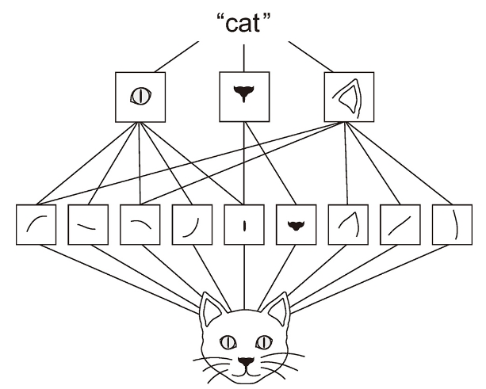
- 이미지의 특징을 찾아내기 위해 필터의 사용
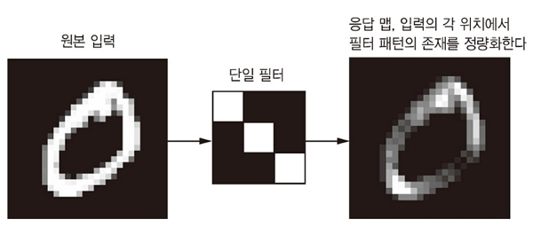

-특성을 찾아가는 과정, 해상도 높은 이미지를 단순한 픽셀로 추상화
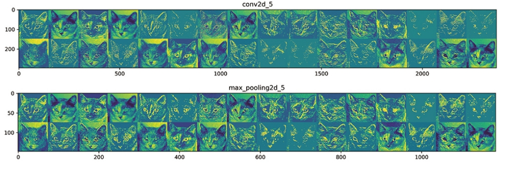
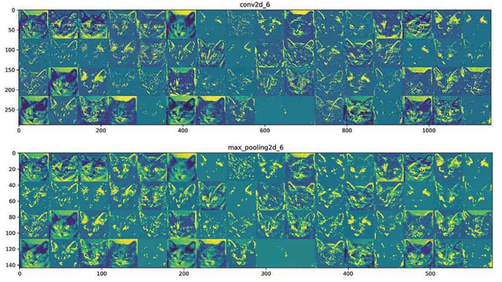

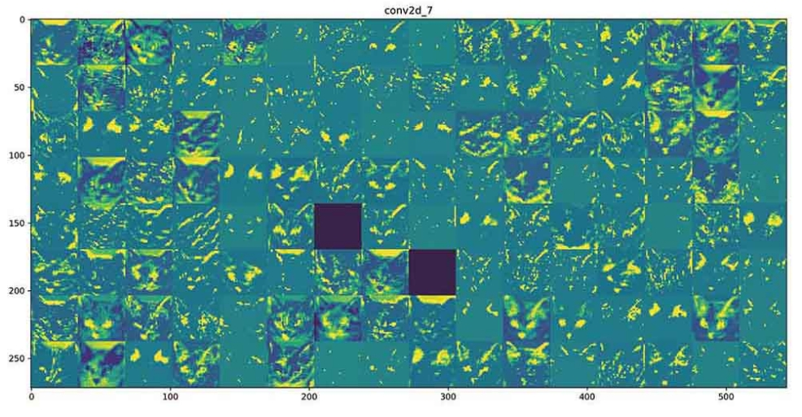
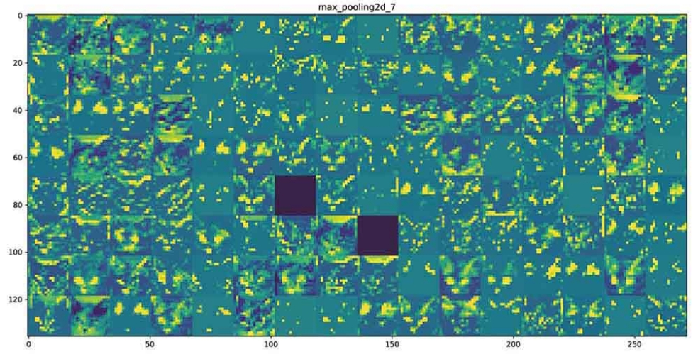
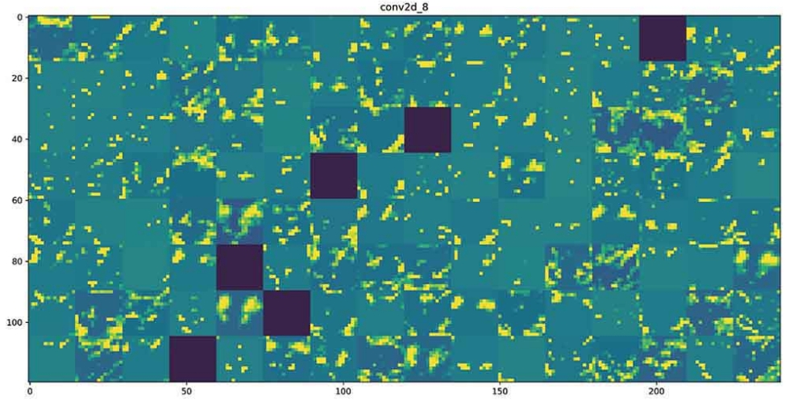
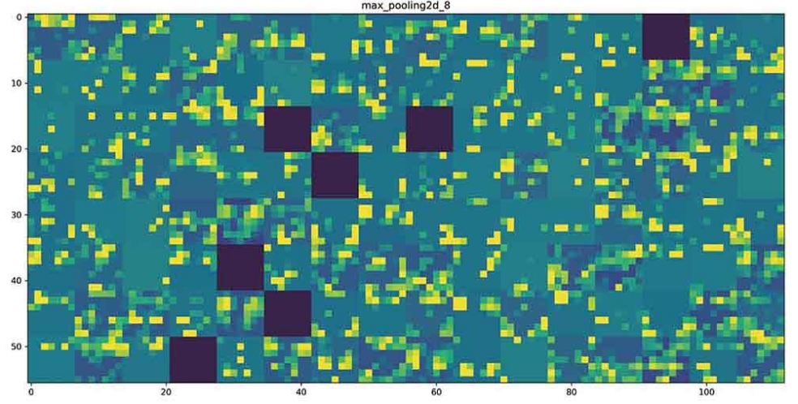

- 픽셀을 감소

### 1. 컨브넷의 학습 시각화하기

1) OpenCV 설치
   - OpenCV(Open Source Computer Vision)은 Intel이 개발 했으며 주로 실시간 컴퓨터 비전을 목적으로 한 프로그래밍 라이브러리임
   - 실시간 이미지 프로세싱에 중점을 둔 라이브러리, 인텔 CPU에서 사용되는 경우 속도의 향상을 볼 수 있는 IPP(Intel Performance Primitives)를 지원한다.
   - 이 라이브러리는 윈도, 리눅스 등에서 사용 가능한 크로스 플랫폼이며 오픈소스 BSD 허가서 하에서 무료로 사용할 수 있다.
   - OpenCV는 TensorFlow , Torch / PyTorch 및 Caffe의 딥러닝 프레임워크를 지원한다.
   - Python 3.6의 경우 OpenCV 3.2.0 설치(OpenCV 4.0 버전은 에러남)
  
    ```bash
    (base) C:\Windows\system32>activate ai
    (ai) C:\Windows\system32>pip install opencv-python==3.2.0.6

    ERROR: (ai) C:\Windows\system32>conda install -c conda-forge opencv=3.2.0
    ```

2) pillow 설치
   - StopIteration: Could not import PIL.Image. The use of `array_to_img` requires PIL. 에러 처리

    ```bash
    (base) C:\Windows\system32>activate machine
    (machine) C:\Users\user>pip install pillow
    ERROR: (machine) C:\Users\user>conda install pillow

    (machine) C:\Users\user>deactivate

    (base) C:\Windows\system32>activate machinegpu
    (machinegpu) C:\Users\user>pip install pillow
    ERROR:(machinegpu) C:\Users\user>conda install pillow
    ```

3) Script
   - `/ws_python/notebook/machine/keras/visualizing.ipynb`

### 2. CNN 흐름, 마스크(필터, 커널)의 동작

- 마스크(필터,커널) : 큰이미지를 단순화
- 이미지를 구성하는 큰 특징을 수치적으로 표현이 가능함
- 픽셀수를 줄여서 이미지 사용을 최소화함
- 픽셀수의 계산 : 가로 256, 세로 256, 256 칼라 이미지의 변수, 256*256*160000

1) 0과 1로 구성된 원본 이미지 준비
  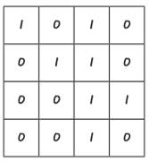
2) 가중치가 할당된 2 X 2 마스크(필터, 커널)의 준비
  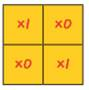
3) 마스크와 원본 이미지를 좌측 상단부터 곱한 결과를 더함.
   - (1 x 1) + (0 x 0) + (0 x 0) + (1 x 1) = 2
   - 특징이 크면 발생하는 수도 큼
  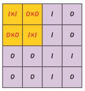
4) 다음열과 행으로 이동하며 가중치를 곱함.
  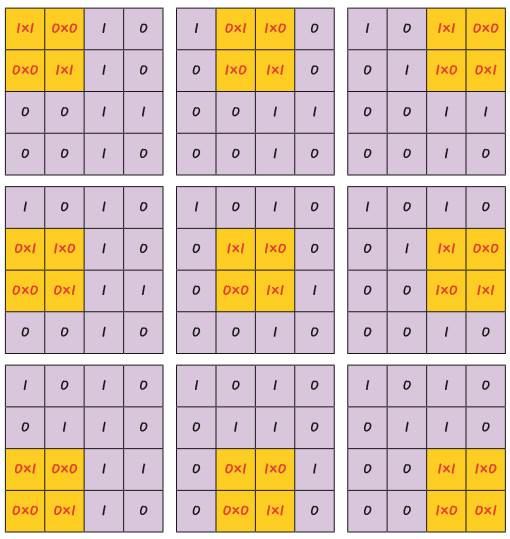
5) 요약된 컨볼루션(합성곱)
   - 4 X 4 이미지에 2 X 2 필터 적용시 3 X 3 이미지가 생성됨
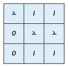
6) 여러개의 마스크를 이용한 합성곱 신경망(CNN)
  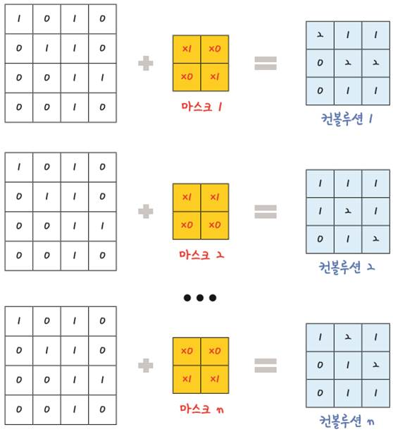
  
  <https://medium.freecodecamp.org>
7) 필터(마스크) 적용과정의 3차원 형태
   - 5 X 5 = 25 이미지에 3 X 3 필터 적용시 3 X 3 = 9가 생성됨
  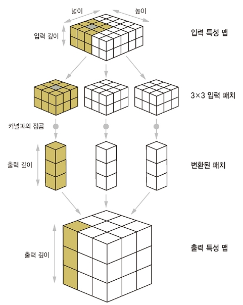

### 3. CNN layer 구성

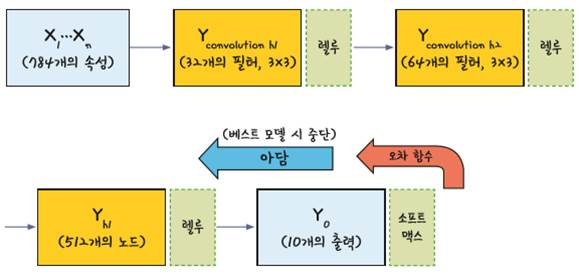
  
1) Convolution layer
  model.add(Conv2D(32, kernel_size=(3, 3), input_shape=(28, 28, 1), activation='relu'))
2) 대표값 산출
  model.add(MaxPooling2D(pool_size=2))
3) Dropout layer
  model.add(Dropout(0.25))
4) 평탄화: Conv net -> Dense
5) Desnse layer
  model.add(Dense(10, activation='softmax'))

### 4. CNN Convolution층 구현

- 케라스에서 컨볼루션 층을 추가하는 함수는 Conv2D()

1) 정의
  model.add(Conv2D(32, kernel_size=(3, 3), padding='valid', input_shape=(28, 28, 1), activation='relu'))
  ① 첫 번째 인자: 마스크(커널)를 몇 개 적용할지 정한다. 여기서는 32개의 마스크를 적용함
  ② kernel_size: 마스크(커널)의 크기를 정한다. kernel_size=(행, 열) 형식으로 정하며, 여기서는 3×3 크기의 마스크를 사용하게끔 정한다. 일반적으로 3X3
  ③ padding='valid': 경계(외곽) 처리 방법을 정의하며 'valid' 또는 'same'을 지정, valid로 선언시 은닉층이 많으면 크기가 계속 작아져 정보 소실이 심함으로 적당히 'same'을 선언 권장
  ④ input_shape=(행, 열, 채널수) 형식으로 정한다. 채널은 흑백 1 또는 RGB 칼라 3 지정
  input_shape=(30, 30, 1): 30 X 30 흑백 이미지 1장
  input_shape=(30, 30, 3): 30 X 30 칼라 이미지 1장
  input_shape=(10, 30, 30, 1): 30 X 30 흑백 이미지 10장
  input_shape=(10, 30, 30, 3): 30 X 30 칼라 이미지 10장
  ⑤ activation: 활성화 함수를 정의
  
  예)
  model.add(Conv2D(32, kernel_size=(3, 3), padding='valid', input_shape=(28, 28, 1), activation='relu'))
  커널수 32, 28 x 28 픽셀의 흑백이미지 입력
  model.add(Conv2D(32, kernel_size=(3, 3), padding='valid', input_shape=(28, 28, 3), activation='relu'))
  커널수 32, 28 x 28 픽셀의 컬러이미지 입력
  
### 5. Max pooling( Sub sampling)

- 복잡한 컨볼루션층을 축소하는 기법으로 최대값을 대표값으로 사용
- 풀링 기법 중 가장 많이 사용되는 방법이 맥스 풀링(max pooling)
- 맥스 풀링은 정해진 구역 안에서 가장 큰 값만 다음 층으로 넘기고 나머지는 버림
- 사용: model.add(MaxPooling2D(pool_size=(2, 2))) <-- 크기가 50%로 줄어듬.
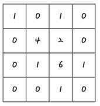
- 4개의 영역으로 분할
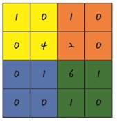
- 최대값 추출
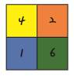
- pool_size는 풀링 창의 크기를 정하는 것으로, 2로 정하면 전체 크기가 절반으로 줄어듦
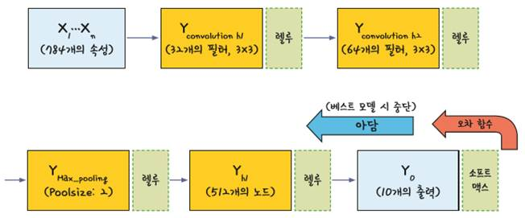

### 6. 드롭아웃(Dropout)

- 많아진 노드로인해 학습 조건이 안좋아질 경우 과적합을 피하기위해
은닉층에 있는 노드의 일부를 임의로 꺼줌, n1, n3는 사용하지 않게됨.
- 25%의 노드를 끄려는 경우 Keras의 구현: model.add(Dropout(0.25)), 노드의 값을 0으로 변경
- 컨볼루션층이나 Max pooling층은 2차원 배열의 형태로 다룸.
- MLP 기반의 Dense층에서도 사용가능
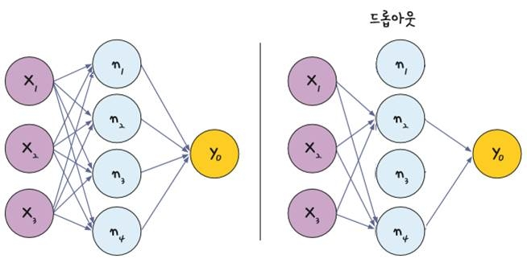

### 7. Flatten()

- 2차원을 1차원으로 변경함: model.add(Flatten()), 평탄화(Dense() 형태로 변경), 네트워크 구성의 종료 전에 선언함.

### 8. 전체적인 흐름
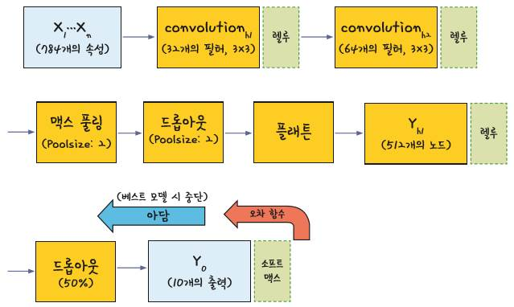

## [02] 이미지 처리 Python script 기초 코드

- 경고 메시지 출력 중지 및 matplotlib 한글 깨짐처리

```python
import warnings
warnings.filterwarnings(action='ignore')

import os
import random
import sys
import time
from time import localtime, strftime
  
import numpy as np
import tensorflow as tf
  
# import cv2
  
import matplotlib
import matplotlib.pyplot as plt
from matplotlib import font_manager, rc


from keras.models import Model
from keras.layers import Input

from keras.models import Sequential
from keras.layers import Activation
from keras.layers import Dense
from keras.layers import Dropout
from keras.utils import to_categorical
from keras.utils import plot_model

from keras.layers import Conv2D
from keras.layers import MaxPooling2D
from keras.layers import Flatten
from keras.utils import np_utils
from keras.utils import to_categorical
from keras.utils import np_utils
from keras.callbacks import EarlyStopping
from keras.callbacks import ModelCheckpoint
from keras.models import load_model
from keras import layers
from keras import models
from keras import optimizers

from keras.preprocessing.image import ImageDataGenerator
from keras.preprocessing.image import array_to_img, img_to_array, load_img
  
from sklearn.preprocessing import LabelEncoder  # class가 문자열인경우 변환
from sklearn.model_selection import train_test_split # 학습셋과 테스트셋을 나눔
from sklearn.model_selection import StratifiedKFold  # K겹 교차 검증
```

```python
# 기본 제공 데이터
from keras.datasets import mnist
from keras.datasets import cifar10

# --------------------------------------------------------------
# CNN 테스트시 failed to create cublas handle: CUBLAS_STATUS_ALLOC_FAILED 에러 발생시 추가
import tensorflow as tf
config = tf.ConfigProto()
# config.gpu_options.per_process_gpu_memory_fraction = 1.0 # 메모리를 사전에 모두 할당
config.gpu_options.allow_growth = True                     # 메모리를 필요시 할당
session = tf.Session(config=config)
sess = tf.Session(config=tf.ConfigProto(log_device_placement=True)) # 연결된 device 확인
# --------------------------------------------------------------

font_name = font_manager.FontProperties(fname="C:/Windows/Fonts/malgun.ttf").get_name()
# windows 10
# font_name = font_manager.FontProperties(fname="C:/Windows/Fonts/malgunsl.ttf").get_name()
rc('font', family=font_name)           # 맑은 고딕 폰트 지정
plt.rcParams["font.size"] = 12         # 글자 크기
# plt.rcParams["figure.figsize"] = (10, 4) # 10:4의 그래프 비율
plt.rcParams['axes.unicode_minus'] = False  # minus 부호는 unicode 적용시 한글이 깨짐으로 설정

# Jupyter에게 matplotlib 그래프를 출력 영역에 표시할 것을 지시하는 명령
%matplotlib inline  

LOG_DIR = '../../logs' # 폴더명만 지정하면 자동으로 생성됨.

# tensorboard --logdir=C:/ai_201904/ws_python/notebook/logs
# graph = tf.get_default_graph()
# with tf.summary.FileWriter(LOG_DIR) as writer:
#     writer.add_graph(graph)

## [03] 시각화 기초 코드

```python
fig, loss_ax = plt.subplots()
# plt.figure(figsize=(6,4)) # ERROR
fig.set_size_inches(10, 5)      # 챠트 크기 설정

acc_ax = loss_ax.twinx()

loss_ax.plot(hist.history['loss'], 'y', label='train loss')
loss_ax.plot(hist.history['val_loss'], 'r', label='val loss')
loss_ax.set_ylim([0.0, 10.0])

acc_ax.plot(hist.history['acc'], 'b', label='train acc')
acc_ax.plot(hist.history['val_acc'], 'g', label='val acc')
acc_ax.set_ylim([0.0, 1.0])

loss_ax.set_xlabel('epoch')
loss_ax.set_ylabel('loss')
acc_ax.set_ylabel('accuray')

loss_ax.legend(loc='upper left')
acc_ax.legend(loc='lower left')

plt.show()
```
