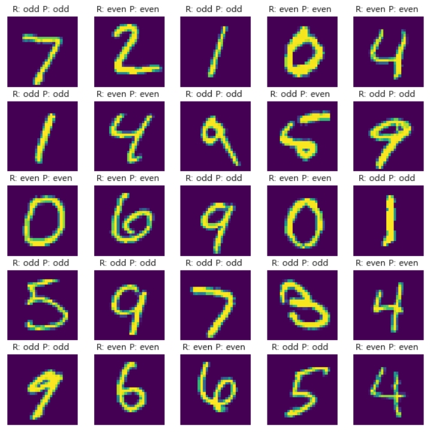
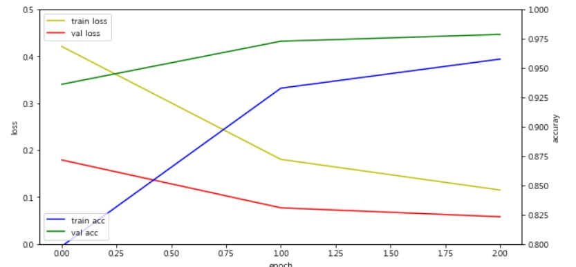
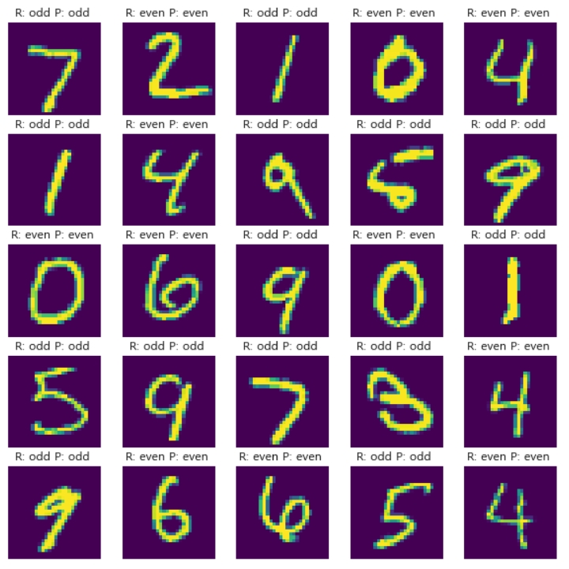

# [01] CNN, GPU를 이용한 영상입력 이진 분류 예측 모델의 개발

## 1. 미국 국립 표준 기술원(NIST)의 MNIST 데이터 셋 인식 모델 제작


- 일반적인 사람에게 이 사진의 숫자를 읽어보라 하면 대부분 ‘504192’라고 읽을 것
  그런데 컴퓨터에게 이 글씨를 읽게하고 이 글씨가 어떤 의미인지를 알게 하는 과정은 쉽지 않음
- 숫자 5는 어떤 특징을 가졌고, 숫자 9는 6과 어떻게 다른지를 기계가 스스로 파악하여 정확하게 읽고
  판단하게 만드는 것은 머신러닝의 오랜 진입 과제였음
- MNIST 데이터셋은 미국 국립표준기술원(NIST)이 고등학생과 인구조사국 직원등이 쓴
  손글씨를 이용해 만든 데이터로 구성되어 있음
- 70,000개의 글자 이미지에 각각 0부터 9까지 이름표를 붙인 데이터셋
- 머신러닝을 배우는 사람이라면 자신의 알고리즘과 다른 알고리즘의 성과를 비교해 보고자
  한번씩 도전해 보는 가장 유명한 데이터 중 하나


## 2. 데이터 전처리

- MNIST 데이터는 케라스를 이용해 간단히 불러올 수 있음
- mnist.load_ data() 함수로 사용할 데이터를 불러옴 `from keras.datasets import mnist`
- 이때 불러온 이미지 데이터를 X로, 이 이미지에 0~9까지 붙인 이름표를 Y_class로 구분하여 명명하겠음 또한, 70,000개 중 학습에 사용될 부분은 train으로, 테스트에 사용될 부분은 test라는 이름으로 불러옴
- 학습에 사용될 부분: X_train, Y_class_train
- 테스트에 사용될 부분: X_test, Y_class_test `(X_train, Y_class_train), (X_test, Y_class_test) = mnist.load_data()`
- 케라스의 MNIST 데이터는 총 70,000개의 이미지 중 60,000개를 학습용으로, 10,000개를 테스트용으로 미리 구분해 놓고 있음
  `print("학습셋 이미지 수 : %d 개" % (X_train.shape[0]))`
  `print("테스트셋 이미지 수 : %d 개" % (X_test.shape[0]))`
  `학습셋 이미지 수: 60000 개`
  `테스트셋 이미지 수: 10000 개`
- matplotlib 라이브러리의 imshow() 함수를 이용해 이미지를 출력할 수 있음
- 모든 이미지가 X_train에 저장되어 있으므로 X_train[0]을 통해 첫 번째 이미지를, `cmap = 'Greys'` 옵션을 지정해 흑백으로 출력되게 함

```python
import matplotlib.pyplot as plt
plt.imshow(X_train[0], cmap='Greys')
plt.show()
```


- 이 이미지는 가로 28 × 세로 28 = 총 784개의 픽셀로 이루어져 있음
- 각 픽셀은 밝기 정도에 따라 0부터 255까지 의 등급을 매김
- 흰색 배경이 0이라면 글씨가 들어간 곳은 1~255까지 숫자 중 하나로 채워져 긴행렬로 이루어진
  하나의 집합으로 변환됨

```python
  for x in X_train[0]:
    for i in x:
      sys.stdout.write('%d\t' % i)
    sys.stdout.write('\n')
```


- 이렇게 이미지는 다시 숫자의 집합으로 바뀌어 학습셋으로 사용됨
- 28 × 28 = 784개의 속성을 이용해 0~9까지 10개 클래스 중 하나를 맞히는 문제가 됨
- 주어진 가로 28, 세로 28의 2차원 배열을 784개의 1차원 배열로 바꿔 주어야 함
- 이를 위해 reshape() 함수를 사용
  reshape(총 샘플 수, 1차원 속성의 수) 형식으로 지정
- 총 샘플 수는 앞서 사용한 X_train.shape[0]을 이용하고, 1차원 속성의 수는 이미 살펴본대로 784개
  X_train = X_train.reshape(X_train.shape[0], 784)
- 머신러닝은 데이터를 0에서 1 사이의 값으로 변환한 다음 구동할 때 최적의 성능을 보임
  따라서 현재 0~255 사이의 값으로 이루어진 값을 0~1 사이의 값으로 바꿔야 함
  바꾸는 방법은 각 값을 255로 나누는 것
  이렇게 데이터의 폭이 클 때 적절한 값으로 분산의 정도를 바꾸는 과정을 데이터
  정규화(normalization)라고 함
- 현재 주어진 데이터의 값은 0부터 255까지의 정수로, 정규화를 위해 255로 나누어 주려면
  먼저 이 값을 실수형으로 바꿔야 함
  따라서 다음과 같이 astype() 함수를 이용해 실수형으로 바꾼 뒤 255로 나눔
  X_train = X_train.astype('float64')
  X_train = X_train / 255
- X_test에도 마찬가지로 이 작업을 적용
- 다음과 같이 한 번에 적용시킴
  X_test = X_test.reshape(X_test.shape[0], 784).astype('float64') / 255
- print("class : %d " % (Y_class_train[0]))
  class : 5
- 최종 출력값으로 class를 비교하려면 0~9까지의 정수형 값을 갖는 현재 형태에서
  0 또는 1로만 이루어진 벡터로 값을 수정해야 함
  예를 들어 class가 ‘3’이라면, [3]을 [0,0,1,0,0,0,0,0,0,0]로 바꿔 주어야 하는 것
- class가 [5]일경우 [0,0,0,0,1,0,0,0,0,0]로 바꿔야 함
  이를 가능하게 해주는 함수가 바로 np_utils.to_categorical() 함수임
  to_categorical(클래스, 클래스의 개수)의 형식으로 지정
  Y_train = np_utils.to_categorical(Y_class_train,10)
  Y_test = np_utils.to_categorical(Y_class_test,10)
  print(Y_train[0])
  [ 0.  0.  0.  0.  1.  0.  0.  0.  0.  0.]  

1) 활용예

- 입력된 얼굴 사진에 남자인지 여자인지 구분
- 촬영된 부품 사진이 정상인지 불량인지 구분
- 의료영상을 보고 질병유무 판독

## 3. 학습 결과

1) 다층퍼셉트론

    
    

2) Conv net

    
    

## 4. Script  

- /ws_python/notebook/machine/cnn_mnist/cnn_mnist1.ipynb

## 5. MLP, CNN script

- /ws_python/notebook/machine/cnn_mnist/cnn_mnist2.ipynb

```python
# 데이터가 0 부터 255로 구성되어 있음으로 255로 나누어서 정규화
x_train = x_train.reshape(60000, width*height).astype('float32') / 255.0
x_test = x_test.reshape(10000, width*height).astype('float32') / 255.0

# 데이터셋 전처리 : 홀수는 1, 짝수는 0으로 변환
y_train = y_train % 2
y_val = y_val % 2
y_test = y_test % 2
print(y_train[0:10])

.....
# 데이터 확인
plt_row = 5
plt_col = 5

plt.rcParams["figure.figsize"] = (10,10)
f, axarr = plt.subplots(plt_row, plt_col)
for i in range(plt_row*plt_col): # 0 ~ 24
    sub_plt = axarr[i//plt_row, i%plt_col] # 행열 위치 설정
    sub_plt.axis('off')
    sub_plt.imshow(x_test[i].reshape(width, height))  # 784 -> 28행 28열로 변경

    sub_plt_title = '구분: '

    if y_test[i] :
        sub_plt_title += 'odd '  # 1
    else:
        sub_plt_title += 'even ' # 0

    sub_plt.set_title(sub_plt_title) # 이미지 제목

plt.show()
```

```python
# 모델 사용하기
yp = model.predict(x_test, batch_size=32)

plt_row = 5
plt_col = 5

plt.rcParams["figure.figsize"] = (10,10)

f, axarr = plt.subplots(plt_row, plt_col)

for i in range(plt_row*plt_col):
    sub_plt = axarr[i//plt_row, i%plt_col]
    sub_plt.axis('off')
    sub_plt.imshow(x_test[i].reshape(width, height))

    sub_plt_title = 'R: '   # 실제값

    # 실제값
    if y_test[i] :
        sub_plt_title += 'odd '
    else:
        sub_plt_title += 'even '

    sub_plt_title += 'P: '  # 예측값

    # 예측한값
    if yp[i] >= 0.5 :   # 0.5 기준 짝수 홀수 분류
        sub_plt_title += 'odd '
    else:
        sub_plt_title += 'even '

    sub_plt.set_title(sub_plt_title)

plt.show()
```
