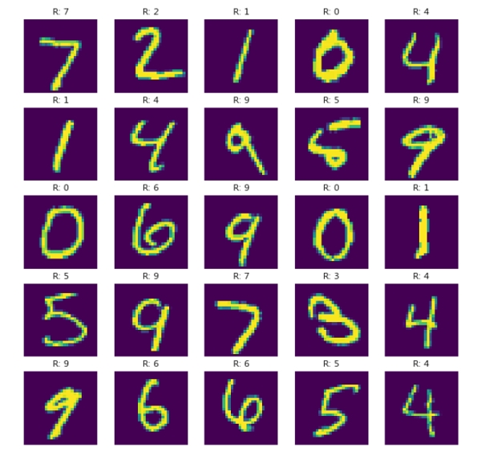
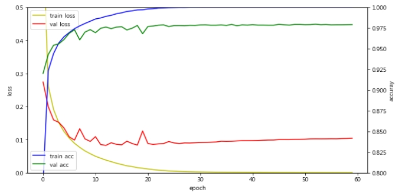
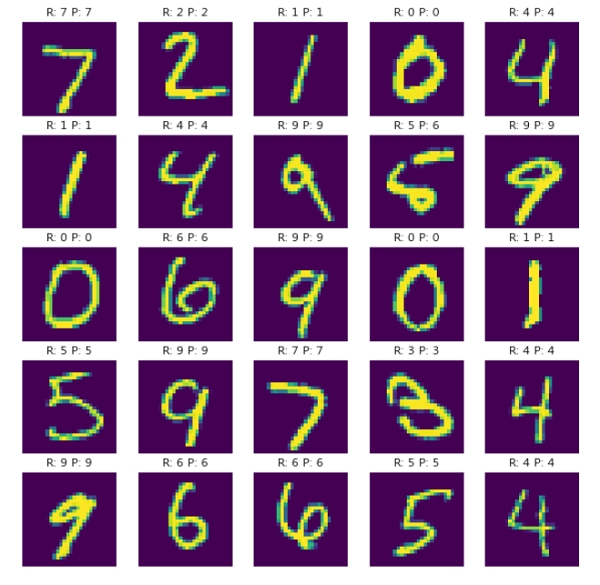
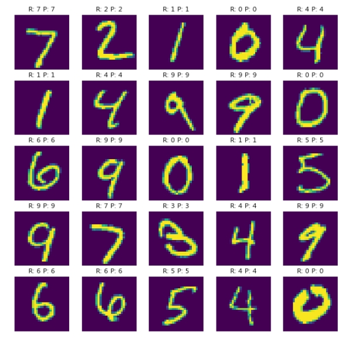
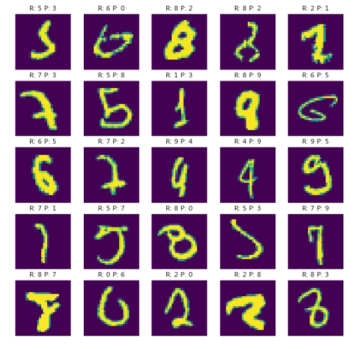
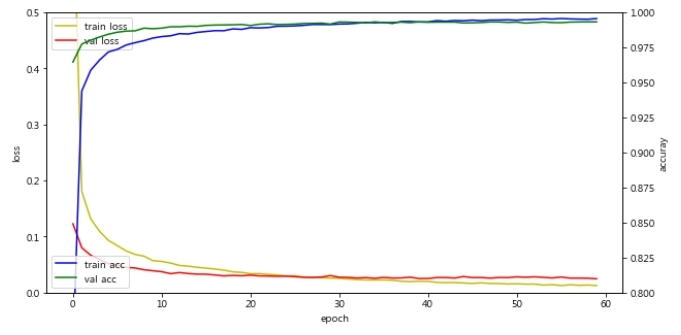

# [01] CNN, GPU를 이용한 영상입력 다중 클래스 분류 예측 모델의 개발

1) 활용예

- 입력된 얼굴 사진에 남자인지 여자인지 구분
- 촬영된 부품 사진이 정상인지 불량인지 구분
- 의료영상을 보고 질병유무 판독
  
## 1. 데이터 확인


## 2. 다층 퍼셉트론 신경망 모델

1) 과적합이 발생한 상황
    
2) 학습 결과
    
3) 정답만 출력한 경우
    
4) 오답만 출력한 경우
    

>> /ws_python/notebook/machine/cnn_mnist/cnn_mnist3.ipynb

```python
width = 28
height = 28

(x_train, y_train), (x_test, y_test) = mnist.load_data()
x_train = x_train.reshape(60000, width*height).astype('float32') / 255.0
x_test = x_test.reshape(10000, width*height).astype('float32') / 255.0

x_train = x_train.reshape(60000, width, height, 1).astype('float32') / 255.0
x_test = x_test.reshape(10000, width, height, 1).astype('float32') / 255.0

x_val = x_train[50000:]
y_val = y_train[50000:]
x_train = x_train[:50000]
y_train = y_train[:50000]

y_train = np_utils.to_categorical(y_train)
y_val = np_utils.to_categorical(y_val)
y_test = np_utils.to_categorical(y_test)

plt_row = 5
plt_col = 5

plt.rcParams["figure.figsize"] = (10,10)

f, axarr = plt.subplots(plt_row, plt_col)

for i in range(plt_row*plt_col):
    sub_plt = axarr[i//plt_row, i%plt_col]
    sub_plt.axis('off')
    sub_plt.imshow(x_test[i].reshape(width, height))
    sub_plt_title = 'R: ' + str(np.argmax(y_test[i]))
    sub_plt.set_title(sub_plt_title)

plt.show()
```

```python
loss_and_metrics = model.evaluate(x_test, y_test, batch_size=32)
print('## evaluation loss and_metrics ##')
print('손실값:',loss_and_metrics[0], ' 정확도:', (loss_and_metrics[1] * 100))

# 모델 사용하기, R: 5 P: 6 잘못된 예측
yp= model.predict(x_test, batch_size=32)

cnt = 0
i = 0

while cnt < 25:
    sub_plt_title = 'R: ' + str(np.argmax(y_test[i])) + ' P: ' + str(np.argmax(yp[i]))
    print(sub_plt_title)

    i += 1
    cnt += 1
```

```python
# 오답 이미지만 출력
loss_and_metrics = model.evaluate(x_test, y_test, batch_size=32)
print('## evaluation loss and_metrics ##')
print('손실값:',loss_and_metrics[0], ' 정확도:', (loss_and_metrics[1] * 100))

yp = model.predict(x_test, batch_size=32)

plt_row = 5
plt_col = 5

plt.rcParams["figure.figsize"] = (10,10)

f, axarr = plt.subplots(plt_row, plt_col)

cnt = 0
i = 0

while cnt < (plt_row*plt_col):

    if np.argmax(y_test[i]) == np.argmax(yhat_test[i]):
        i += 1
        continue # 정답일 경우 출력 안함.

    sub_plt = axarr[cnt//plt_row, cnt%plt_col]
    sub_plt.axis('off')
    sub_plt.imshow(x_test[i].reshape(width, height))
    sub_plt_title = 'R: ' + str(np.argmax(y_test[i])) + ' P: ' + str(np.argmax(yp[i]))
    sub_plt.set_title(sub_plt_title)

    i += 1
    cnt += 1

plt.show()
```

## 3. 컨볼루션 신경망 모델

- Dropout을통해 컨볼루션 신경망 모델의 과적합 문제를 해결


>> /ws_python/notebook/machine/cnn_mnist/cnn_mnist3.ipynb append
