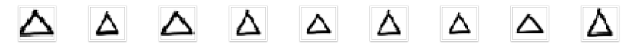

# ImageDataGenerator 를 이용한 데이터 부풀리기

## [01] ImageDataGenerator 를 이용한 데이터 부풀리기

- 부족한 데이터를 생성하여 학습 정확도를 향상시킴.

### 1. 옵션

- rotation_range = 90
  지정된 각도 범위내에서 임의로 원본이미지를 회전, 단위는 도이며, 정수형
  예) 90이라면 0도에서 90도 사이에 임의의 각도로 회전
    

- width_shift_range = 0.1
  지정된 수평방향 이동 범위내에서 임의로 원본이미지를 이동, 수치는 전체 넓이의 비율(실수)로 나타남
    예) 0.1이고 전체 넓이가 100이면, 10픽셀 내외로 좌우 이동
    

- height_shift_range = 0.1
  지정된 수직방향 이동 범위내에서 임의로 원본이미지를 이동, 수치는 전체 높이의 비율(실수)로 나타남
    예) 0.1이고 전체 높이가 100이면, 10픽셀 내외로 상하 이동
    

- shear_range = 0.5
  밀림 강도 범위내에서 임의로 원본이미지를 변형시킴,  수치는 시계반대방향으로 밀림 강도를 라디안으로 나타냄
  1 라디안은 호도로 57.3도, π 라디안은 180도, 0.5 라디안은 28.65도
    예) 0.5이라면, 0.5 라이안내외로 시계반대방향으로 변형시킴
    

- zoom_range = 0.3
  지정된 확대/축소 범위내에서 임의로 원본이미지를 확대/축소함, “1-수치”부터 “1+수치”사이 범위로 확대/축소를 함
  예) 0.3이라면, 0.7배에서 1.3배 크기 변화를 시킴
    
  
- horizontal_flip = True
  수평방향으로 뒤집기를 함
    

- vertical_flip = True
  수직방향으로 뒤집기를 함
    

- fill_mode='nearest'
  이미지 변형으로 인한 입력값 주변의 셀을 채울 방법으로 가장 가까운 인접값으로 채움

### 2. 폴저 구조

```bash
F:\AI3\WS_PYTHON\NOTEBOOK\MACHINE\CNN_SHAPE_EXT
├─.ipynb_checkpoints
├─src               circle.jpg, rectangle.jpg, triangle.jpg
├─validation
│  ├─circle       이미지 20장
│  ├─rectangle  이미지 20장
│  └─triangle    이미지 20장
├─train
│  ├─circle       이미지 80장
│  ├─rectangle  이미지 80장
│  └─triangle    이미지 80장
├─use1
│  └─24X24
├─use2
│  └─24X24
├─use3
│  └─24X24
├─use4
│  └─64X64
├─use5
│  └─128_128
└─use6
    └─256_256
```

### 3. script

>> /ws_python/notebook/machine/cnn_shape_ext/cnn_shape_data_ext.ipynb

```python
import numpy as np

# 랜덤시드 고정시키기
np.random.seed(0)

from keras.preprocessing.image import ImageDataGenerator, array_to_img, img_to_array, load_img

# 데이터셋 불러오기
train_datagen = ImageDataGenerator(rescale=1./255,
                                   rotation_range=15,
                                   width_shift_range=0.1,
                                   height_shift_range=0.1,
                                   shear_range=0.5,
                                   zoom_range=[0.8, 2.0],
                                   horizontal_flip=True,
                                   vertical_flip=True,
                                   fill_mode='nearest')
```

```python
.....
img = load_img('./src/circle.jpg')
x = img_to_array(img)
print(x.shape) # 24 X 24 칼라 이미지
print(x)
```

```python
.....
img = load_img('./src/circle.jpg')
x = img_to_array(img)
x = x.reshape((1,) + x.shape)
i = 0
```

```python
# 이 for는 무한으로 반복되기 때문에 우리가 원하는 반복횟수를 지정하여, 지정된 반복횟수가 되면 빠져나오도록 해야함
# 폴더를 미리 제작 할것
for batch in train_datagen.flow(x, batch_size=1,
                                   save_to_dir='./train/circle',
                                   save_prefix='c',
                                   save_format='jpg'):
    i += 1
    if i >= 105:
        break

img = load_img('./src/rectangle.jpg')
x = img_to_array(img)
x = x.reshape((1,) + x.shape)
i = 0

# 이 for는 무한으로 반복되기 때문에 우리가 원하는 반복횟수를 지정하여, 지정된 반복횟수가 되면 빠져나오도록 해야함
# 폴더를 미리 제작 할것
for batch in train_datagen.flow(x, batch_size=1,
                                   save_to_dir='./train/rectangle',
                                   save_prefix='c',
                                   save_format='jpg'):
    i += 1
    if i >= 105:
        break

img = load_img('./src/triangle.jpg')
x = img_to_array(img)
x = x.reshape((1,) + x.shape)
i = 0

# 이 for는 무한으로 반복되기 때문에 우리가 원하는 반복횟수를 지정하여, 지정된 반복횟수가 되면 빠져나오도록 해야함
# 폴더를 미리 제작 할것
for batch in train_datagen.flow(x, batch_size=1,
                                   save_to_dir='./train/triangle',
                                   save_prefix='c',
                                   save_format='jpg'):
    i += 1
    if i >= 105:
        break
```

## [02] ImageDataGenerator를 이용한 컨볼루션 신경망(CNN) 학습률 향상시키기
  
### 1. 문제 정의

- 문제 형태: 다중 클래스 분류
- 입력: 손으로 그린 삼각형, 사각형, 원 이미지
- 출력: 삼각형, 사각형, 원일 확률을 나타내는 벡터
  
### 2. 데이터 준비하기

```bash
- 훈련
    train
        ├─ circle
        ├─ rectangle
        └─ triangle
- 검증
    validation
    ├─ circle
    ├─ rectangle
    └─ triangle
```

### 3. 데이터셋 생성

- 케라스에서는 이미지 파일을 쉽게 학습시킬 수 있도록 ImageDataGenerator 클래스를 제공,
- ImageDataGenerator 클래스는 데이터 증강 (data augmentation)을 위해 막강한 기능을 제공
- ImageDataGenerator 클래스를 이용하여 객체를 생성한 뒤 flow_from_directory() 함수를 호출하여 제네레이터(generator)를 생성
- flow_from_directory() 함수의 주요인자
  - 첫번재 인자 : 이미지 경로 지정
  - target_size : 패치 이미지 크기를 지정, 폴더에 있는 원본 이미지 크기가 다르더라도 target_size에 지정된 크기로 자동 조절됨
  - batch_size : 배치 크기를 지정
  - class_mode : 분류 방식에 대해서 지정
  - categorical : 2D one-hot 부호화된 라벨로 변환
  - binary : 1D 이진 라벨로 변환
  - sparse : 1D 정수 라벨로 변환  None : 라벨이 변환되지 않음

```python
train_datagen = ImageDataGenerator(rescale=1./255)

train_generator = train_datagen.flow_from_directory(
        'warehouse/handwriting_shape/train',
        target_size=(24, 24),
        batch_size=3,
        class_mode='categorical')

vali_datagen = ImageDataGenerator(rescale=1./255)

vali_generator = vali_datagen.flow_from_directory(
        'warehouse/handwriting_shape/test',
        target_size=(24, 24),
        batch_size=3,
        class_mode='categorical')
```

### 4. 모델 구성

- 컨볼루션 레이어 : 입력 이미지 크기 24 x 24, 입력 이미지 채널 3개, 필터 크기 3 x 3, 필터 수 32개, 활성화 함수 ‘relu’
- 컨볼루션 레이어 : 필터 크기 3 x 3, 필터 수 64개, 활성화 함수 ‘relu’
- 맥스풀링 레이어 : 풀 크기 2 x 2
- 플래튼 레이어
- 댄스 레이어 : 출력 뉴런 수 128개, 활성화 함수 ‘relu’
- 댄스 레이어 : 출력 뉴런 수 3개, 활성화 함수 ‘softmax’

```python
model = Sequential()
model.add(Conv2D(32, kernel_size=(3, 3),
                 activation='relu',
                 input_shape=(24,24,3)))
model.add(Conv2D(64, (3, 3), activation='relu'))
model.add(MaxPooling2D(pool_size=(2, 2)))
model.add(Flatten())
model.add(Dense(128, activation='relu'))
model.add(Dense(3, activation='softmax'))
```

### 5. 모델 학습 과정 설정

- loss : 현재 가중치 세트를 평가하는 데 사용한 손실 함수, 다중 클래스 문제이므로 ‘categorical_crossentropy’로 지정
- optimizer : 최적의 가중치를 검색하는 데 사용되는 최적화 알고리즘으로 효율적인 경사 하강법 알고리즘 중 하나인 ‘adam’을 사용
- metrics : 평가 척도를 나타내며 분류 문제에서는 일반적으로 ‘accuracy’로 지정

```python
model.compile(loss='categorical_crossentropy', optimizer='adam', metrics=['accuracy'])  
```

### 6. 모델 학습

- 케라스에서는 모델을 학습시킬 때 주로 fit() 함수를 사용하지만 제네레이터로 생성된 배치로 학습시킬 경우에는 fit_generator() 함수를 사용함.
- 첫번째 인자: 훈련데이터셋을 제공할 제네레이터를 지정
- steps_per_epoch: 한 epoch에 사용한 스텝 수를 지정, 총 3개의 훈련 샘플이 있고 배치사이즈가 1이므로 3 스텝으로 지정
- epochs: 전체 훈련 데이터셋에 대해 학습 반복 횟수를 지정
- validation_data: 검증 데이터셋을 제공할 제네레이터를 지정
- validation_steps: 한 epoch 종료 시 마다 검증할 때 사용되는 검증 스텝 수를 지정, 총 3개의 검증 샘플이 있고 배치사이즈가 1이므로 3 스텝으로 지정

```python
model.fit_generator(
        train_generator,
        steps_per_epoch=15,
        epochs=50,
        validation_data=vali_generator,
        validation_steps=5)
```
  
### 7. 모델 평가

- 제네레이터에서 제공되는 샘플로 평가할 때는 evaluate_generator 함수를 사용합니다.

```python
print("-- Evaluate --")
scores = model.evaluate_generator(vali_generator, steps=5)
print("%s: %.2f%%" %(model.metrics_names[1], scores[1]*100))
```

### 8. 모델 사용

- 모델 사용 시에 제네레이터에서 제공되는 샘플을 입력할 때는 predict_generator 함수를 사용해야함
- 예측 결과는 클래스별 확률 벡터로 출력되며, 클래스에 해당하는 열을 알기 위해서는 제네레이터의
   ‘class_indices’를 출력하면 해당 열의 클래스명을 알려줌

```python
print("-- Predict --")
output = model.predict_generator(vali_generator, steps=5)
np.set_printoptions(formatter={'float': lambda x: "{0:0.3f}".format(x)})
print(test_generator.class_indices)
print(output)
```

1. script
    - /ws_python/notebook/machine/cnn_shape_ext/cnn_shape_ext.ipynb
