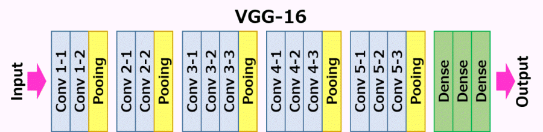

# [01] ImageNet VGG16 전이 학습

## [01] ImageNet VGG16 전이 학습

- 처음부터 학습해야하는 네크워크 모델의 부담을 줄이고 기존에 학습된 모델을 재사용하면서
  새로운 클래스 분류를 추가할 수 있음.
- VGG16에 학습되지 않은 절(Temple), 사원(Shrine)의 class 추가 학습

### 1. 사전 학습 모델 VGG16의 사용

>> /ws_python/notebook/machine/vgg/vgg16_transfer.ipynb
