# [01] PyCharm Community edition 2018.3.3 설치(너무 부하가 심함)

## [01] PyCharm Community edition 2018.3.3 설치(너무 부하가 심함)

- <https://www.jetbrains.com>
- 상용과 무료 버전이 있으며 'Community' 버전은 무료임.

### 1. 다운로드

- '<https://www.jetbrains.com/pycharm/download/#section=windows> --> Previous versions' 접속
- 'pycharm-community-2018.1.2.exe' 또는 'pycharm-community-2018.3.3.exe' 다운로드.

### 2. 'JetBrains PyCharm Community Edition' 실행

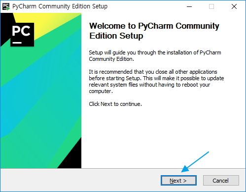
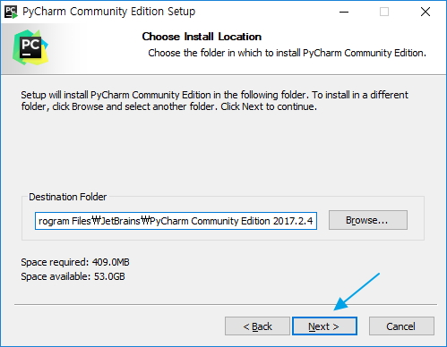
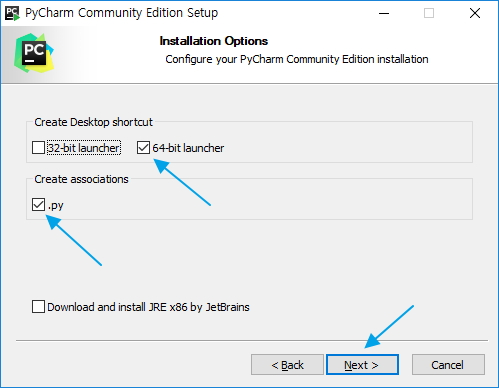
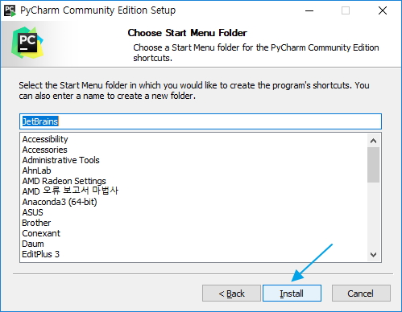
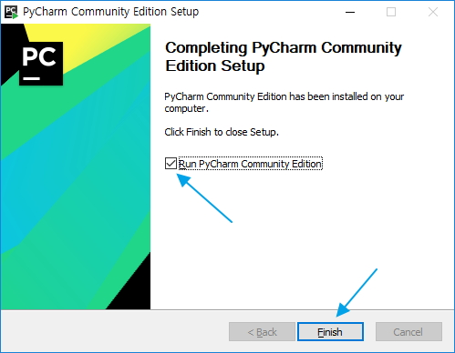

- 저작권동의(2018.3.3 버전은 스크롤 이동 필요 없음)
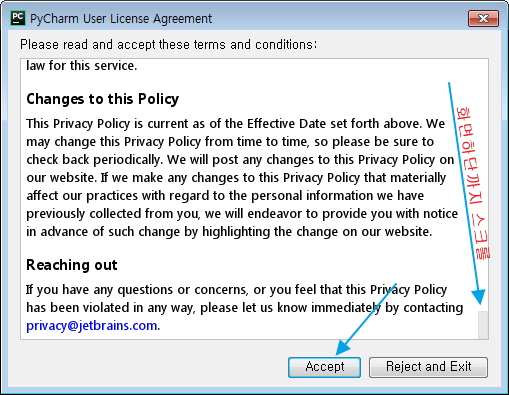

- 화면 테마 지정
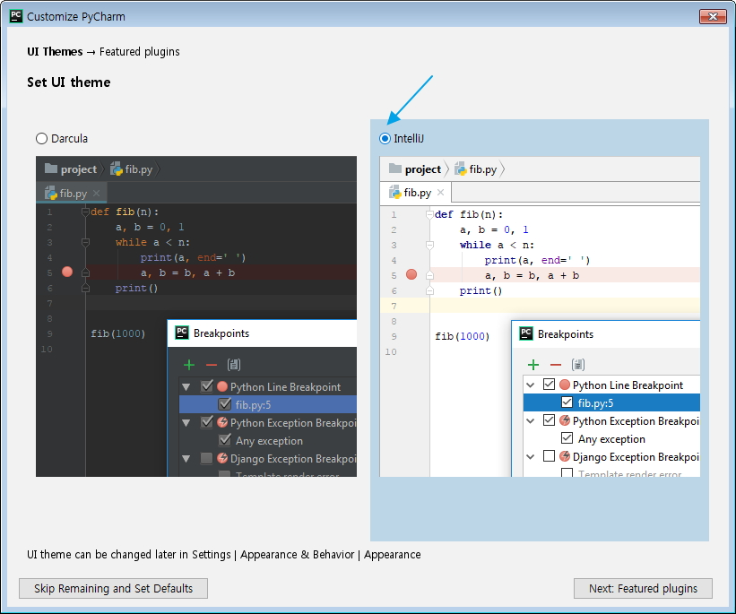

- 추가지원 언어 설치 안함.
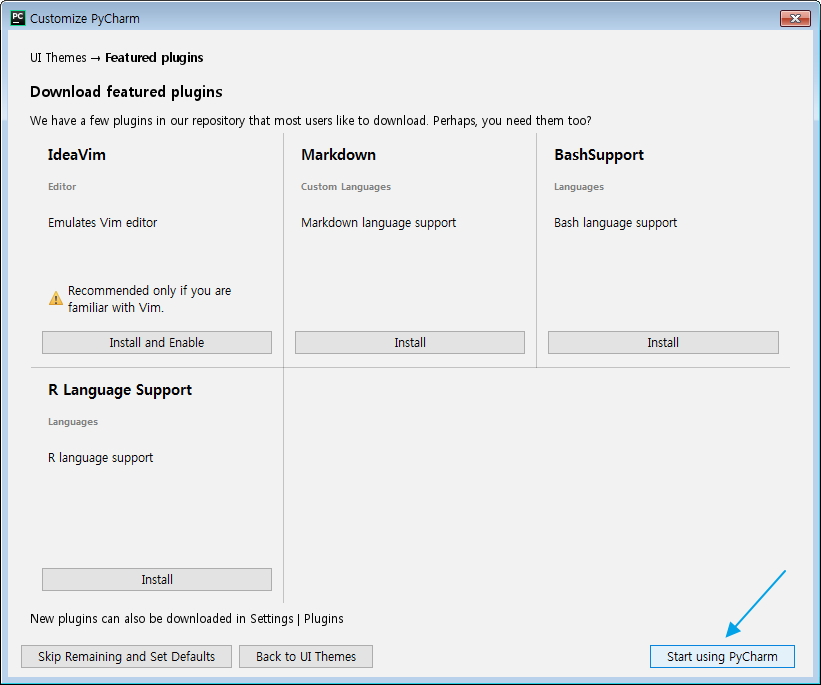
  
### 3. 프로젝트 생성

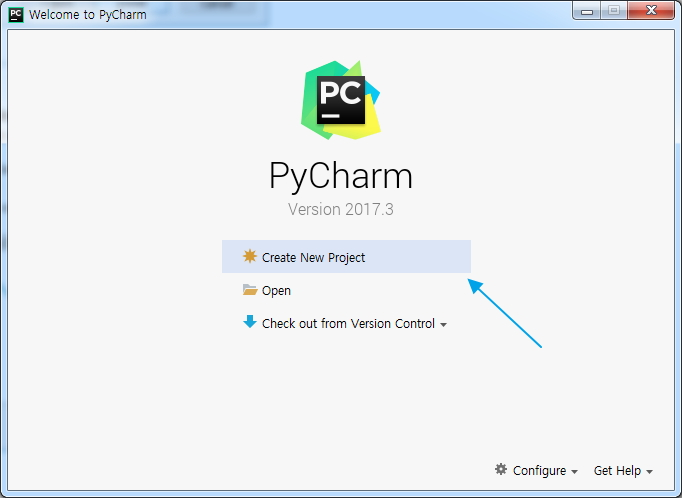

- 프로젝트 폴더 지정  
  C:/HOME/ws_python
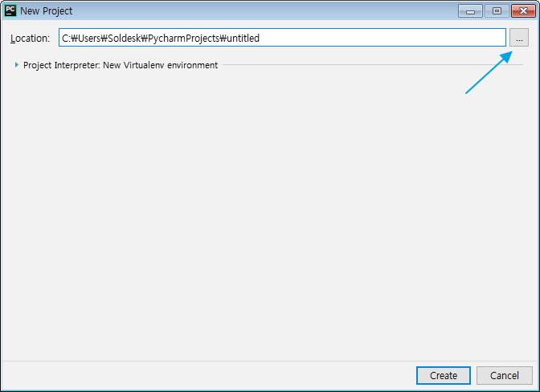

- 여러개의 프로젝트들이 저장될 폴더 지정   예) C:/HOME/ws_python
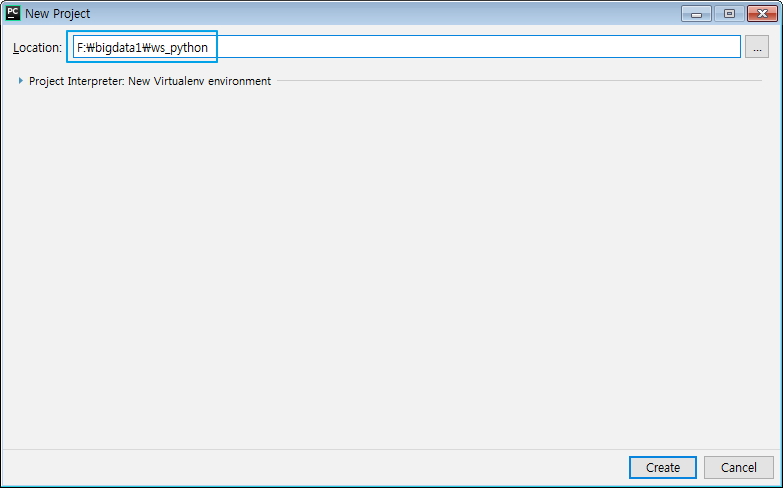

- 가상 환경을 사용하지 않는 경우의 프로젝트
  프로젝트명 'python' 입력  예) C:/HOME/ws_python/python
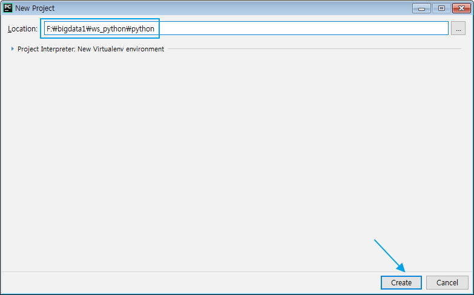

- python 프로젝트 생성됨. Python 파일 추가
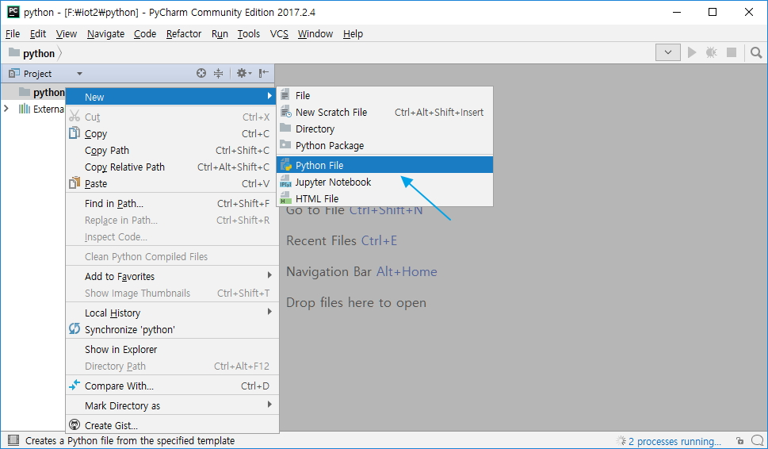

- Hello 입력
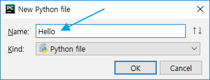

### 4.기초 소스 입력

- PyCharm이 update 되는 동안에는 실행을 할 수 없습니다.

print("Hello 파이썬")

### 5. 실행

- Shift + F10
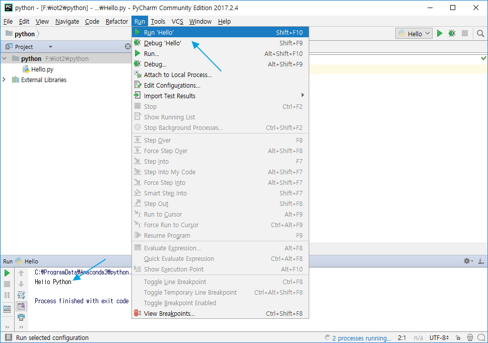

### 6. 편집 환경 설정

1) 색상 지정
    File -> Settings - >Appearance & Behavior -> Appearance -> Theme: 색상 지정
2) 글꼴 지정
   - monospaceed font: 고정폭 폰트, 글자당 width가 동일, '나눔 고딕 코딩'등
    File -> Settings - >Editor -> Font: 'Show only monospaceed font' 체크 해제해야 글꼴이 출력됨.
    글꼴 및 크기 지정(Malgun Gothic, 휴먼 고딕등)
3) 주석 색깔 지정
    File -> Settings -> Editor -> Color Scheme -> Python -> Line Comment 선택후 'Inherited values from' 체크 해제 -> 'Foreground' 선택 후 '088005' 색상 지정, Italic 체크 해제
4) Tag 색깔 지정
    File -> Settings -> Editor -> Color Scheme -> Python -> Docstring -> Tag 선택후 'Inherited values from' 체크 해제 -> 'Foreground'선택 후 '088005' 색상 지정, Italic 체크 해제
5) 다중 라인 문자열(''' ~ ''') 색깔 지정
    File -> Settings -> Editor -> Color Scheme -> Python -> Docstring -> Text 선택후 'Inherited values from' 체크 해제 -> 'Foreground'선택 후 '088005' 색상 지정, Italic 체크 해제
