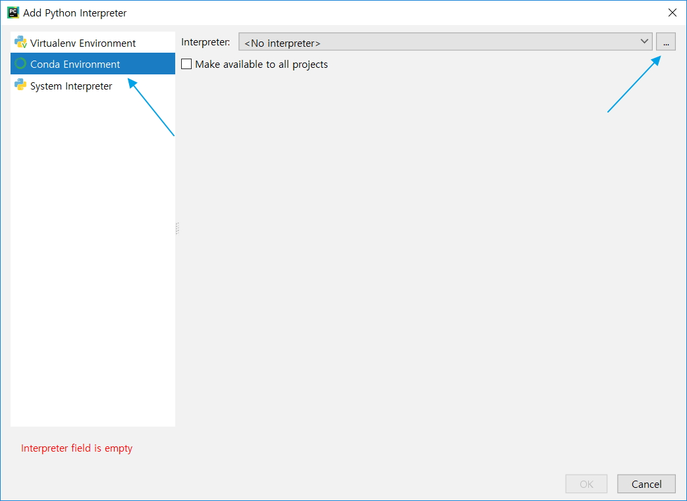

# [01] Conda 환경에서의 PyCharm Tensorflow 개발 환경 설정

## [01] Conda 환경에서의 PyCharm Tensorflow 개발 환경 설정

### 1. 새로운 프로젝트 실행


### 2. 'machine 또는 ai' 프로젝트명 입력, 'Project Interpreter...' 클릭


- ai 프로젝트인경우


### 3. 기존에 생성된 conda 가상 환경 선택 시작


### 4. Conda 설정 진행



### 5. Conda 환경은 숨겨져있음으로 '숨김 파일 표시' 선택


### 6. 경로 이동

- 윈도우에 계정 및 패스워드 없이 로그인 한 경우(관리자 모드): C:\ProgramData\Anaconda3\envs
- 특정 계정으로 로그인한 경우의 폴더: C:\Users\soldesk\AppData\Local\conda\conda\envs

- 아래화면은 'dev'계정 대상으로 'User/dev' 폴더로 이동


### 7. 아래의 폴더로 이동하여 'python.exe' 선택

- 관리자 설치일경우: C:/ProgramData/Anaconda3/envs/machine/python.exe

![7(./images/07.jpg)

### 8. 'Conda' 설정이 되었습니다


### 9. [Create] 버튼을 클릭합니다


- ai 가상 환경을 대상으로 한 경우


### 10. 아래처럼 설치된 패키지 확인중에는 파이참을 사용하지말고 기다립니다


### 11. 'Test.py'를 생성하여 테스트합니다


[ERROR]

```bash
from ._conv import register_converters as _register_converters
  File "h5py\h5r.pxd", line 21, in init h5py._conv
  File "h5py\h5r.pyx", line 145, in init h5py.h5r
AttributeError: type object 'h5py.h5r.Reference' has no attribute '__reduce_cython__'
```

해결:

```bash
(base) C:\Windows\system32>activate machine
(machine) C:\Windows\system32>pip uninstall tensorflow
(machine) C:\Windows\system32>pip uninstall h5py
(machine) C:\Windows\system32>pip install tensorflow==1.5.0
(machine) C:\Windows\system32>pip install h5py
```
