# [01] Pycharm에서의 가상환경을 이용하는 Django project의 생성

## [01] Pycharm에서의 가상환경을 이용하는 Django project의 생성

- MVT(Model, View, Controller+Template) 개발 방법론 적용.

### 1. 구성

- Model: 데이터베이스 정의
- URLconf: 접속 URL 정의
- View: 함수 또는 클래스의 메소드로 정의되며, 웹 요청을 받고 응답을 반환해줌.

- Template: 화면 UI 구성 정의
  
### 2. 개발 순서

1) 프로젝트 뼈대 만들기: 프로젝트 및 앱 개발 에 필요한 디렉토리 와 파일 생성 ·
2) 모델 코딩: 테이블 관련 사항을 개발(modelspy, admin.py 파일)
3) URLconf 코딩: URL 및 뷰 매핑 관계 를 정의 (urls.py 파일)
4) 템플릿 코딩 하기: 화면 UI 개발(templates/디렉토리 하위의 *.html 파일들)
5) 뷰 코딩 하기: 애플리케이션 로직 개발 (views.py 파일)

### 3. 가상환경 Terminal 실행

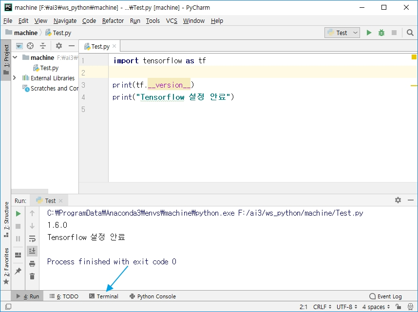

### 4. Django 설정(Anaconda Prompt에서 실행해도됨)

- 커널 변경: C:/ai_201905/ws_python/machine>activate ai
  (ai) C:\ai_201906\ws_python\machine>pip install django

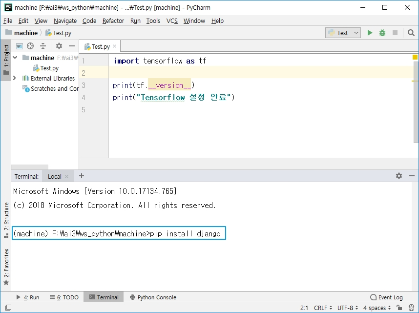

### 5. 프로젝트 기본 환경 설정('.' 앞에 공백 한칸 있어야함)

- django-admin startproject config .

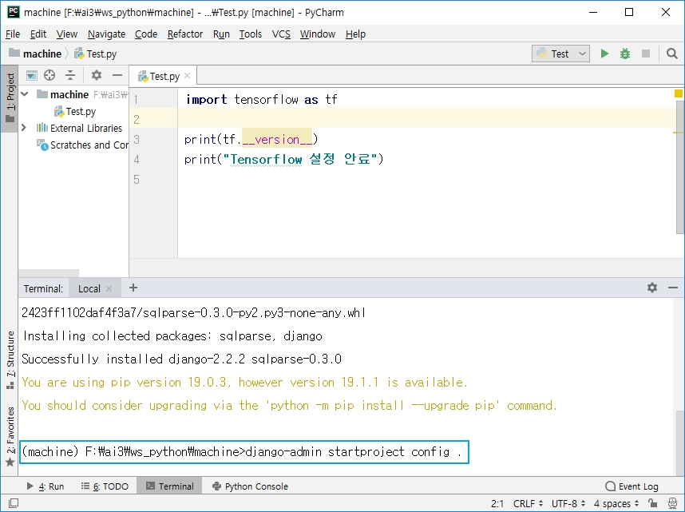

### 6. 환경설정 파일이 생성된 모습

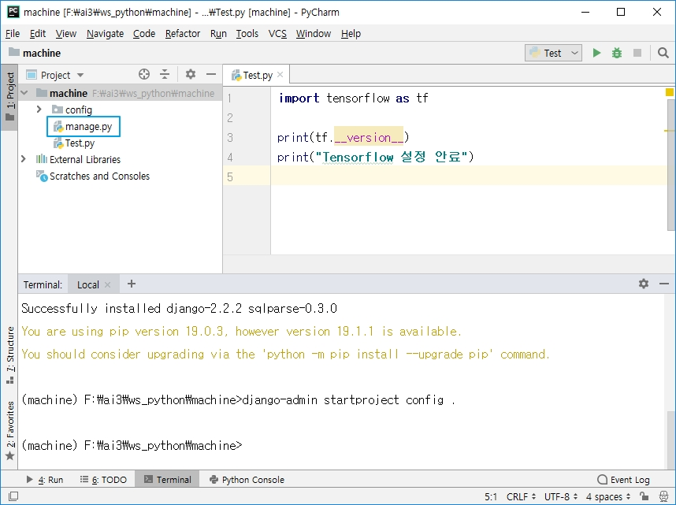

### 7. SQLite DBMS 생성

- SQLite DBMS: Embeded 데이터 베이스로 배포되는 Application에 포함가능
- python manage.py migrate

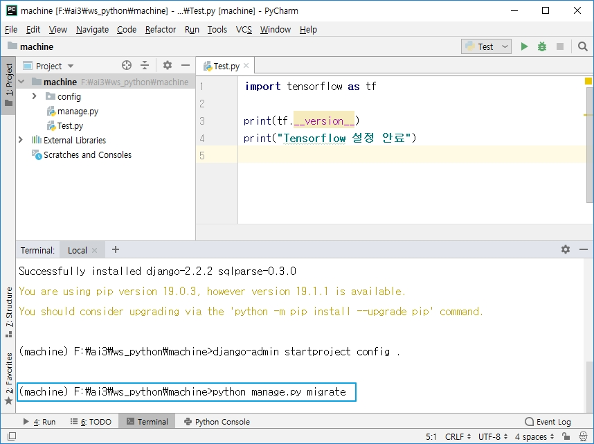

### 8. 프로젝트 기본 구조 생성

- python manage.py startapp app_default

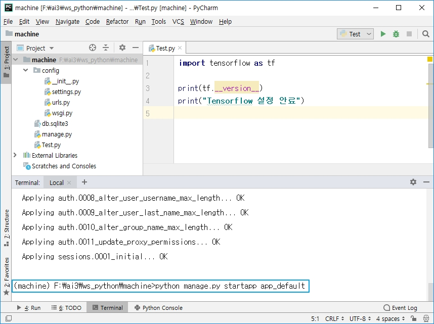

### 9. MTV 기반 프로젝트 구조 생성

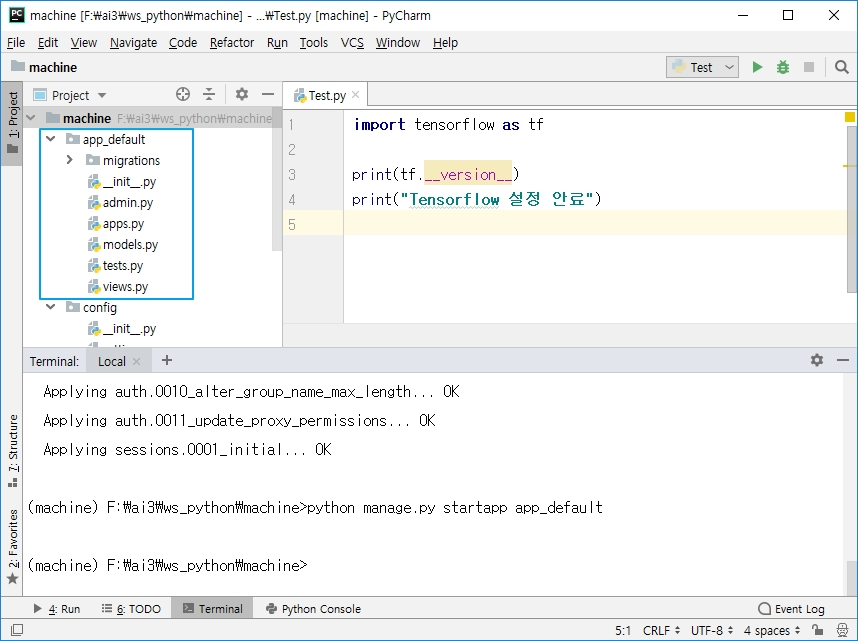

### 10. 관리자 계정 생성

- python manage.py createsuperuser

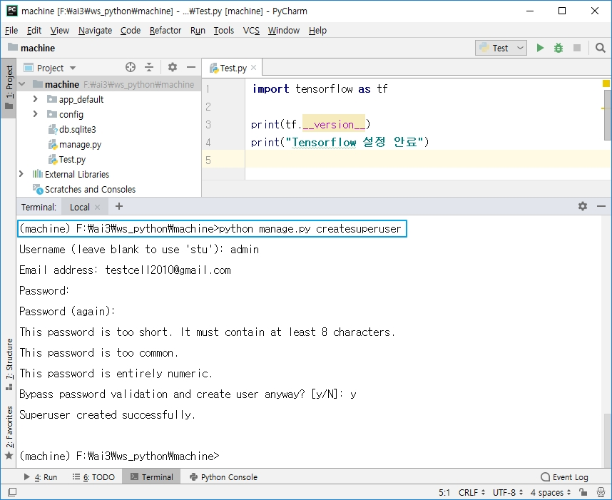

### 11. 서버 실행

- python manage.py runserver

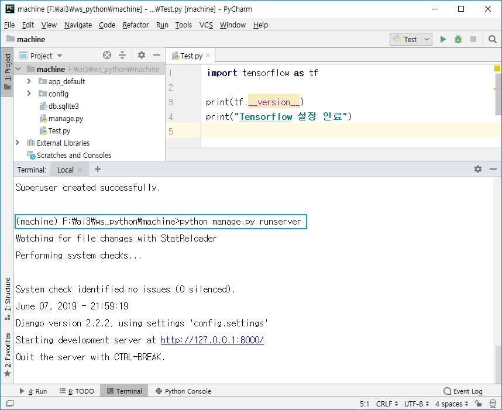

### 12. <http://127.0.0.1:8000> 접속

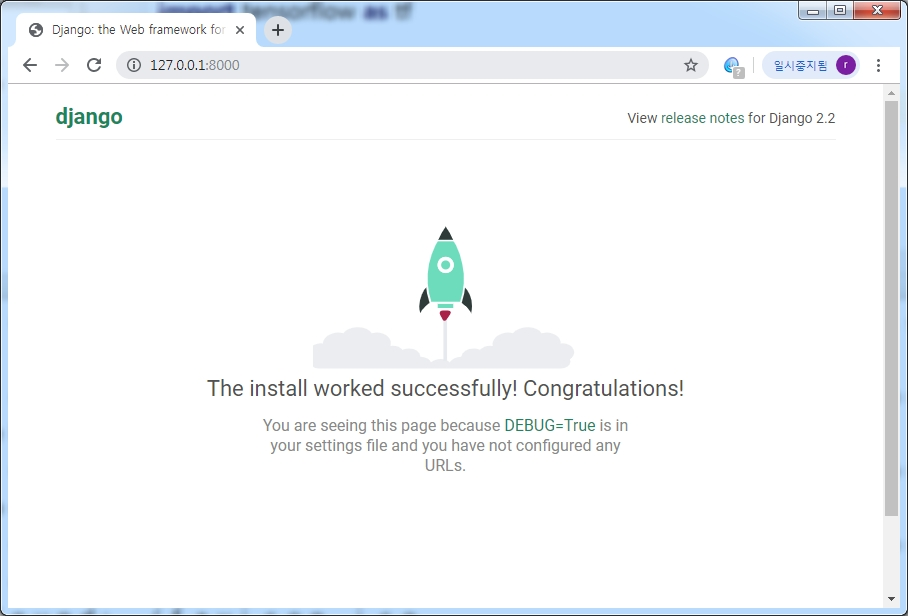

### 13. <http://127.0.0.1:8000/admin> 접속

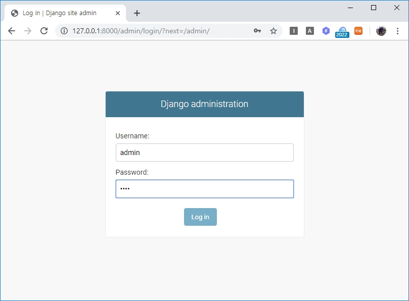
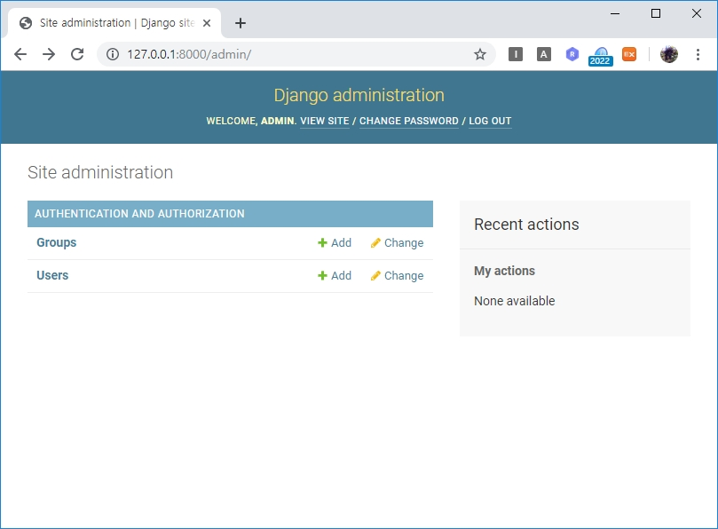
