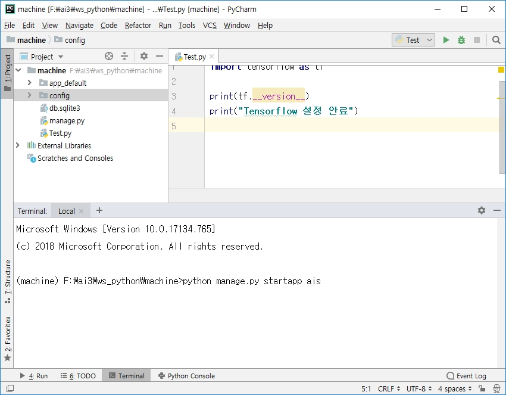
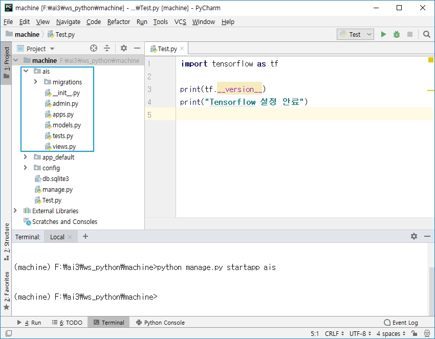

# [01] ais app 생성

## [01] ais app 생성

### 1. ais 어플리케이션 생성

- (machine) C:\ai_201909\ws_python\machine>python manage.py  startapp ais



### 2. 생성된 ais 어플리케이션 결과 화면



### 3. /config/settings.py 설정 파일 변경

1) 서버를 시작할 때의 ip 지정, 기본적으로 생략시 개발 모드, 생략 가능 , 28번 라인 변경
  ALLOWED_HOSTS = ['localhost', '127.0.0.1']

2) 모든 ip 에서의 접속
  ALLOWED_HOSTS = ['*']
  
3) 생성한 application의 등록, 33번 라인
    예) test -> test.apps.TestConfig
         pds -> pds.apps.PdsConfig
INSTALLED_APPS = [
    'django.contrib.admin',
    'django.contrib.auth',
    'django.contrib.contenttypes',
    'django.contrib.sessions',
    'django.contrib.messages',
    'django.contrib.staticfiles',
    'ais.apps.AisConfig',  # ais 패키지의 apps 모듈의 AisConfig class 추가
]
  
4) 데이터 베이스 변경, 79번 라인
   - 사용할 데이터베이스의 지정: 기본값은 SQLite3로 지정되어있음, MySQL, Oracle등 변경 가능
   - 기본값 사용

5) 타임존 설정, 109번 라인
   - 타임존 지정: TIME_ZONE = 'Asia/Seoul'

## [02] 4칙연산의 기능의 제작, <http://127.0.0.1:8000/calc/> 제작, index.html  

### 1. URLconf 설계, URL과 View 매핑

|URL 패턴|View 이름|View가 처리하는 내용|
|:--:|:--:|:--:|
|/calc/|index()|index.html 템플릿 출력|

### 2. URLconf 설정

▷ /config/urls.py

```python
from django.contrib import admin
from django.urls import path
from ais import views # ais 패키지의 views.py 등록

urlpatterns = [
    path('admin/', admin.site.urls),
    path('', views.index), # views 모듈(파일)의 index 함수 호출, index.html
]
```

### 3. /ais/views.py 설정

▷ /ais/views.py

```python
from django.shortcuts import render

# Create your views here.
# http://127.0.0.1:8000 --> /ais/templates/index.html
def index(request):
    return render(request, 'index.html')
```

### 4. static css 파일 사용

▷ /ais/static/css/style.css

```css
 /*
  version 1.9
  <link href="../css/style.css" rel="Stylesheet" type="text/css">
  */
  /* 모든 태그에 적용 */
  *{
     font-family: Malgun Gothic;
     font-size: 26px;
     margin: 0px;
     padding: 0px;
     color: #555555;
     line-height: 30px;
  }

  .container {
    width: 90%;
    margin: 20px auto;
  }

  A:link{  /* 방문전 상태 */
    text-decoration: none; /* 밑줄 삭제 */
    color: #333333;
  }

  A:visited{  /* 방문후 상태 */
    text-decoration: none; /* 밑줄 삭제 */
    color: #333333;
  }
  
  A:hover{  /* A 태그에 마우스가 올라간 상태 */
    text-decoration: underline; /* 밑줄 출력 */
    color: #7777FF;
  }
  
  A:active{  /* A 태그를 클릭한 상태 */
    text-decoration: underline; /* 밑줄 출력 */
    color: #7777FF;
  }
```

### 5. templates 생성

▷ /ais/templates/index.html

- UTF-8로 저장

```html
<!DOCTYPE html>
<html lang="en">
<head>
    <meta charset="UTF-8">
    <title>HOME</title>
    
    <link href="" rel="Stylesheet" type="text/css">
</head>
<body>
<DIV class="container">

<UL style="margin-left: 50px;">
  <LI><A href='./calc/add/50/100'>더하기</A></LI>
  <LI><A href='./country/form'>귀농귀촌 적응 예측 시스템</A></LI>
</UL>
</DIV>
</body>
</html>
```

### 6. 접속 테스트

1) 접속 테스트

```bash
C:\ai4\ws_python\ai>activate ai
(ai) F:\ai3\ws_python\machine>python manage.py runserver
Django version 2.2.2, using settings 'config.settings'
Starting development server at http://127.0.0.1:8000/
Quit the server with CTRL-BREAK.
```

1) 접속: <http://127.0.0.1:8000/>

## [02] 이미지의 출력

- 이미지는 static resource임으로 저장 폴더가 '/config/settings.py'의 121번에 선언되어 있음

1. /ais/static/images/add.png 저장
2. /ais/templates/index.html 사용

  ```html
  <LI style="list-style:none">
     
     <A href='./calc/add/50/100'
       style='display: inline-block; vertical-align: middle; height: 40px; line-height: 40px;'>더하기 1</A>
     <A href='./calc/add?su1=50&su2=100'
       style='display: inline-block; vertical-align: middle; height: 40px; line-height: 40px;'>더하기 2(error)</A>
  </LI>
  ```
