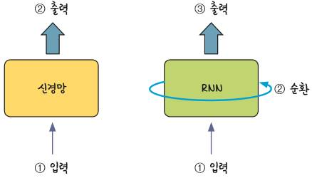
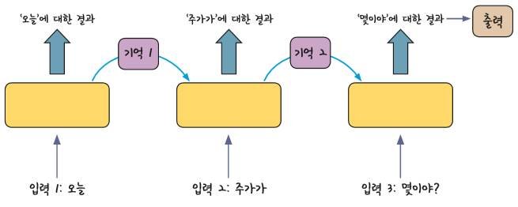
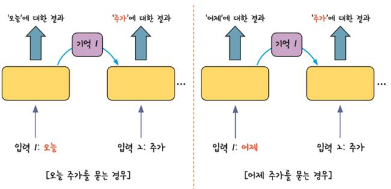
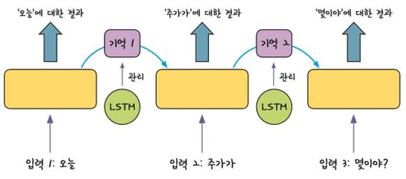

[참고] 순환신경망(RNN: Recurrent Neural Network), LSTM(Long Short Term Memory)        
[01] 순환신경망(RNN)
- 인공지능이 문장을 듣고 이해한다는 것은 많은 문장을 이미 학습해 놓았다는 것
- 문장은 여러 개의 단어로 이루어져 있는데, 그 의미를 전달하려면 각 단어가 정해진 순서대로 입력되어야 함.
- 순환 신경망은 여러 개의 데이터가 순서대로 입력되었을 때 앞서 입력받은 데이터를 잠시 기억해 놓는 방법
- 기억된 데이터가 얼마나 중요한지를 판단하여 별도의 가중치를 줘서 다음 데이터로 넘어감
예) 시계열 데이터
     요일별 매출액, 월별 매출액, 문장 구성 및 음성 인식(언어 순서 규칙), 챗봇

1. RNN 구조
1) 모든 입력 값에 이 작업을 순서대로 실행하므로 다음 층으로 넘어가기 전에 같은 층을 맴도는 것처럼 보임
   이렇게 같은 층 안에서 맴도는 성질 때문에 순환 신경망이라고 부름

 
2) 예를 들어 인공지능 비서에게 “오늘 주가가 몇이야?”라고 묻는다고 가정하자
   그러면 아래의 오른쪽 그림의 2번에 해당하는 순환 부분에서 단어를 하나
   처리할 때마다 단어마다 기억하여 다음 입력 값의 출력을 결정

3) 순환이 되는 가운데 앞서 나온 입력에 대한 결과가 뒤에 나오는 입력 값에 영향을 주는 것을 알 수 있음
   아래의 [입력 2]의 값은 양쪽 모두 ‘주가’이지만, 왼쪽의 주가는 오늘을 기준으로, 오른쪽은 어제를 기준으로 계산되어야 함

4) RNN이 처음 개발된 이후, RNN의 결과를 더욱 개선하기 위한 노력이 계속 되어옴
   이 중에서 LSTM(Long Short Term Memory) 방법을 함께 사용하는 기법이 현재 가장 널리 사용되고 있음
- LSTM은 한 층 안에서 반복을 많이 해야 하는 RNN의 특성상 일반 신경망보다 기울기 소실 문제가 더 많이 발생하고
  이를 해결하기 어렵다는 단점을 보완한 방법 즉, 반복되기 직전에 다음 층으로 기억된 값을 넘길지 안 넘길지를
  관리하는 단계를 하나 더 추가하는 것

 

 
 
[02] COS 그래프의 예측
 
1. 다층 퍼셉트론
▷ /ws_python/notebook/machine/rnn_test/rnn_cos_mlp.ipynb
-------------------------------------------------------------------------------------
 
 
-------------------------------------------------------------------------------------   
 
 
2. LSTM 순환 신경망 모델
▷ /ws_python/notebook/machine/rnn_test/rnn_cos_lstm_1.ipynb
-------------------------------------------------------------------------------------
 
 
-------------------------------------------------------------------------------------   

3. LSTM 상태유지 순환 신경망 모델
▷ /ws_python/notebook/machine/rnn_test/rnn_cos_lstm_2.ipynb
-------------------------------------------------------------------------------------
 

4. LSTM 상태유지 다층 순환 신경망 모델
▷ /ws_python/notebook/machine/rnn_test/rnn_cos_lstm_3.ipynb
-------------------------------------------------------------------------------------
 

