# Google Cloud 서비스 Colab 이용, Google Drive 연동

## [참고] Google Cloud 서비스 Colab 이용, Google Drive 연동

### [01] 구글 Colab 사용법

- 구글 Colab은 구글 드라이브에 연결하여 사용할 수 있는 주피터 노트북 호환 서비스이다.
- 2017년 10월에 공개된 Colab은 별다른 설치 없이 웹 브라우저 만을 이용해 주피터 노트북과 같은 작업을 할 수 있고 다른 사용자들과 공유가 쉬워 연구 및 교육용으로 많이 사용되고 있다.
- 무료로 GPU를 사용할 수 있다.
- Tensorflow, keras, matplotlib, scikit-learn, pandas 등 데이터 분석에 많이 사용되는 패키지들이 미리 설치되어 있다.
- 코드 셀 내에서 필요한 패키지를 설치하고 환경설정을 할 수 있다. 이 점은 서로다른 환경을 가진 다수의 사람이 협업을 할 때 환경을 동일하게 구성해야 하는 수고를 덜어 준다.
- 구글 독스나 구글 스프레드시트 등과 같은식으로 공유와 편집이 가능하다. 만약 두 명 이상의 사람이 동시에 같은 파일을 수정 하더라도 변경사항이 모든 사람에게 즉시 표시된다.
- Colab의 코드는 계정 전용 가상머신에서 실행되는데, 이 가상 머신은 한동안 유휴 상태가 되면 다시 리셋되므로 그때마다 필요한 package를 다시 설치해야 한다.
- GPU를 사용하여 딥러닝 모델을 학습 할 때는 학습시간이 꽤 길어질 수 있는데 오랫동안 연산이 실행되다 보면 학습 도중에 가상머신이 리셋될 수도 있다.
- 시스템 파일을 실수로 덮어썼거나 호환되지 않는 소프트웨어를 설치한 경우에는 상단 툴바의
  "런타임" -> "모든 런타임 재설정"을 클릭하여 사용자가 직접 가상머신을 리셋 할 수도 있다.
- Colab 서비스는 과도한 리소스 소모를 방지하기 위해 '리셋' 작업을 실행할 수 있는 횟수를 제한한다. 재설정에 실패한 경우에는 나중에 다시 시도하면 된다.

1. 설정
   - 구글 드라이브(<https://drive.google.com>) 접속 -> "새로 만들기(New)" -> "더보기(More)"
    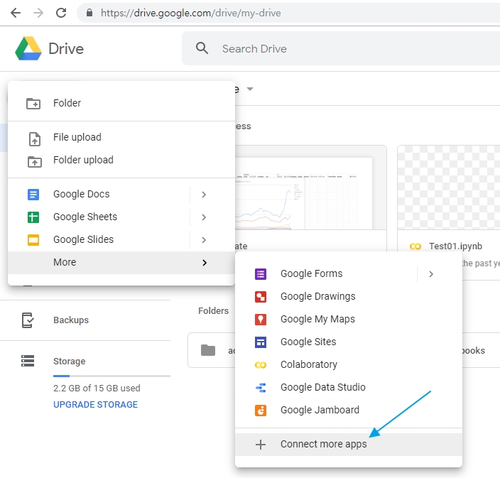
    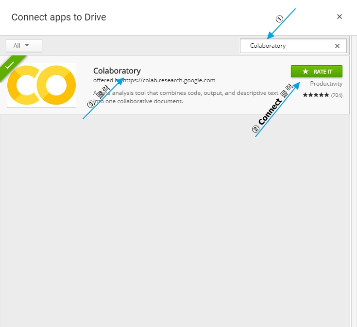
    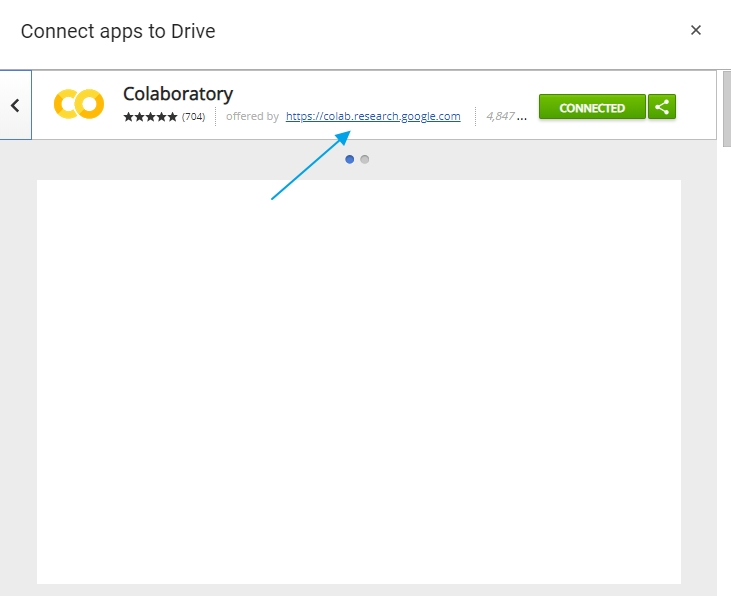
    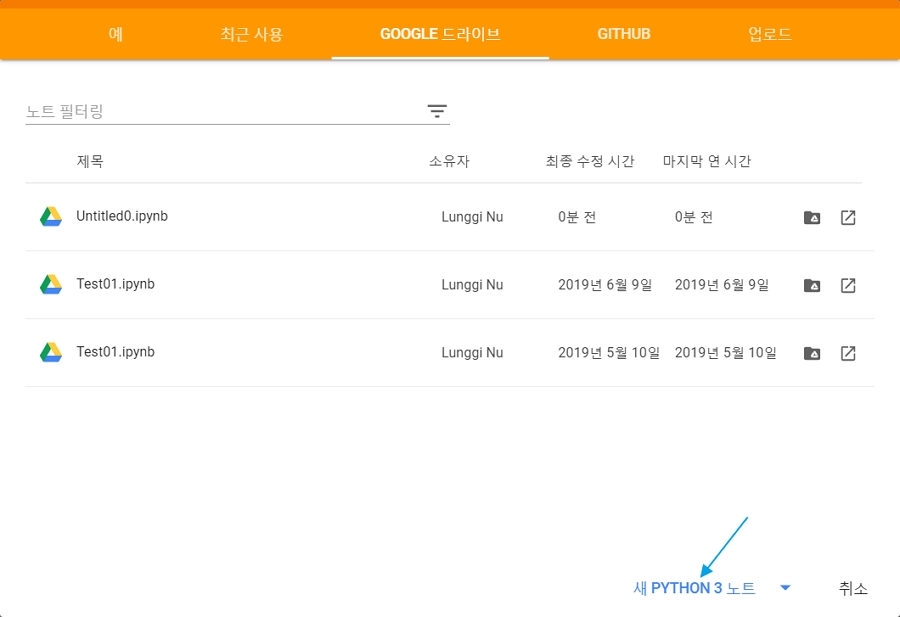
    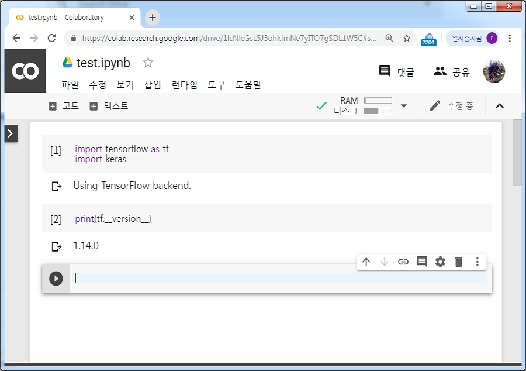

2. 구글 드라이브(<https://drive.google.com>) 접속 -> "새로 만들기(New)" -> "Colaboratory"를 클릭한다. 다음과 같이 파이썬 버전을 확인할 수 있다.

    ▷ /Colab Notebooks/test.ipynb

    ```bash
    # 파이썬 버전 확인
    !python --version

    # OS
    !cat /etc/issue.net

    # CPU 사양
    !head /proc/cpuinfo

    # 메모리 사양
    !head -n 3 /proc/meminfo

    # 디스크 사양
    !df -h
    ```

3. Colab에서 GPU 사용하기
   - Colab에서 GPU를 사용하기 위해서는 런타임 유형을 변경해야 한다.
    Colab 화면 상단의 툴바에서 "런타임" -> "런타임 유형 변경" -> "하드웨어 가속기" 설정을 None 에서 GPU로 변경한다. (TPU로도 변경이 가능하다.)
   - Colab에서 제공하는 GPU는 Tesla K80로 !nvidia-smi 명령어로 확인 할 수 있다. 이 명령어는 GPU의 실행을 모니터링 할 때 사용한다.
   - Tesla K80 spec: <https://www.techpowerup.com/gpu-specs/tesla-k80.c2616>

   1) 런 타임 유형
   - None: CPU == i5 2세대급
   - GPU(Graphic Processing Unit): GTX 1070 6G 급
   - TPU(Tensor Processing Unit): i7 9세대급, Google 제작 프로세서  

    ▷ /Colab Notebooks/test.ipynb append

    ```bash
    !nvidia-smi

    Fri Dec  7 12:31:51 2018
    +--------------------------------------------------------------------------+
    | NVIDIA-SMI 396.44                 Driver Version: 396.44                 |
    |----------------------------+----------------------+----------------------+
    | GPU  Name     Persistence-M| Bus-Id        Disp.A | Volatile Uncorr. ECC |
    | Fan  Temp  Perf  Pwr:Usage/Cap|      Memory-Usage | GPU-Util  Compute M. |
    |============================+======================+======================|
    |   0  Tesla K80         Off  | 00000000:00:04.0 Off |                   0 |
    | N/A   68C    P8    34W / 149W |    0MiB / 11441MiB |     0%      Default |
    +----------------------------+----------------------+----------------------+
    +--------------------------------------------------------------------------+
    | Processes:                                                    GPU Memory |
    |  GPU       PID   Type   Process name                            Usage    |
    |==========================================================================|
    |  No running processes found                                              |
    +--------------------------------------------------------------------------+
    ```

4. Colab 환경 설정
    ▷ /Colab Notebooks/test.ipynb append

    ```python
    import matplotlib.pyplot as plt
    import seaborn as sns
    import statsmodels as sm
    import sklearn as sk
    import tensorflow as tf
    import pandas as pd
    import numpy as np
    import keras
    import scipy
    import sympy
    import datetime
    import xgboost as xgb
    ```

5. 만약 새로운 패키지가 필요하면 !와 Shell 명령어를 실행하여 설치할 수 있다.
   예를 들어 OpenCV 패키지 다음처럼 설치한다.
    ▷ /Colab Notebooks/test.ipynb append

    ```bash
    !pip install opencv-contrib-python
    ```

### [참고 1] 메뉴를 이용한 Google 드라이브 마운트(연동)

- Colab의 notebook 파일에서 Google Drive의 파일을 읽고 쓸수 있는 권한의 적용해야 마운트됨

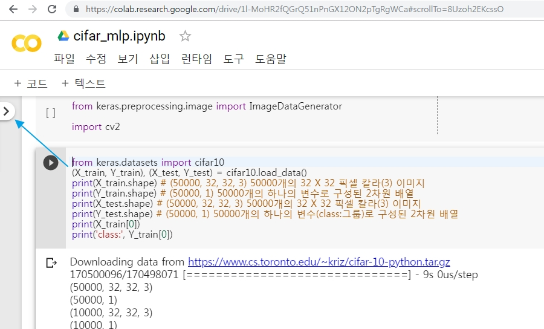
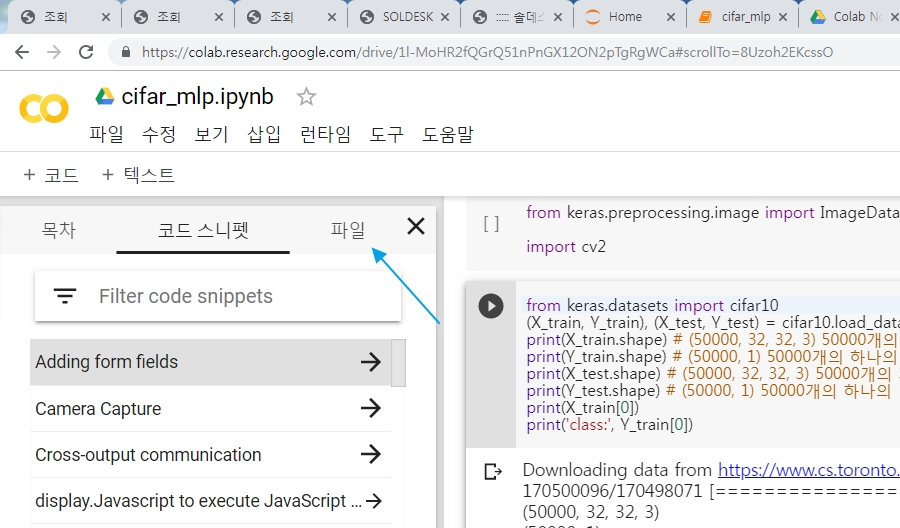
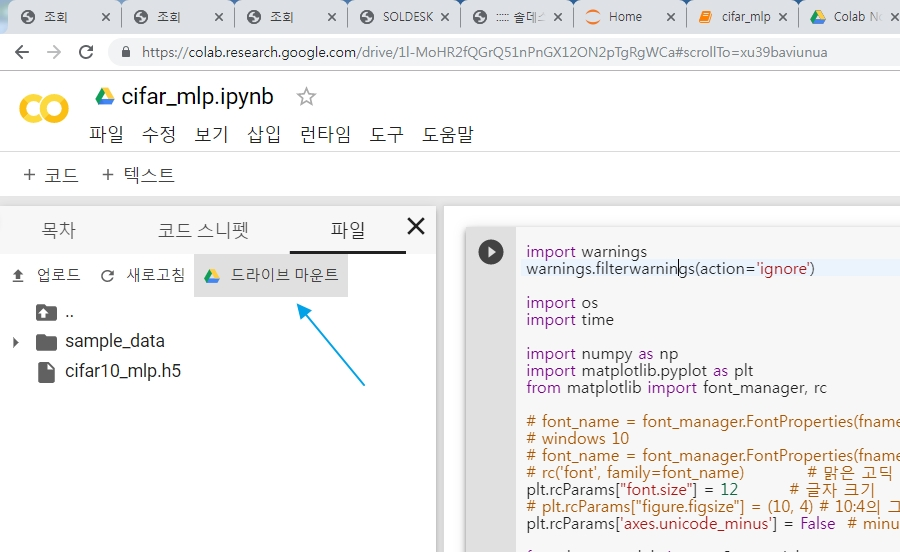
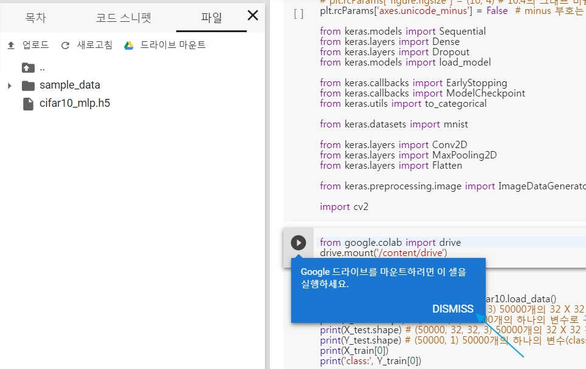
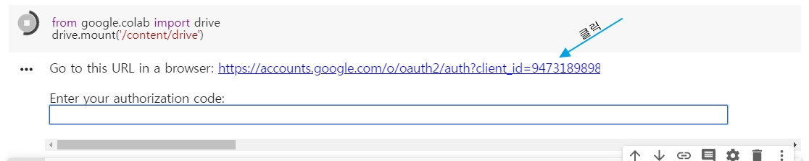
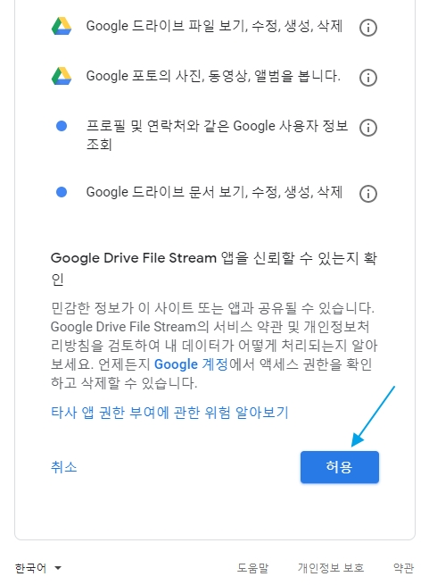

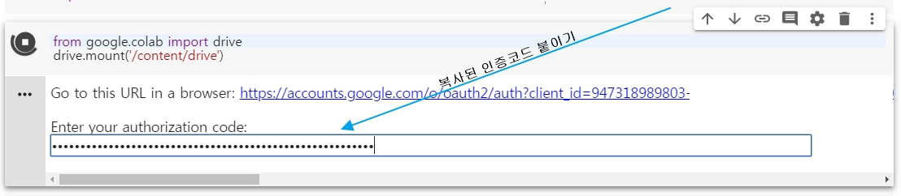
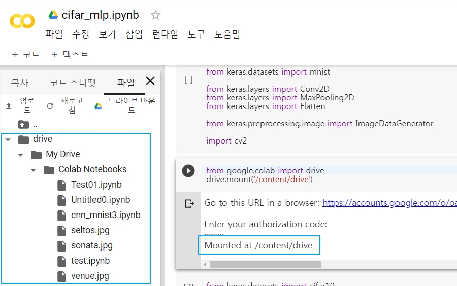
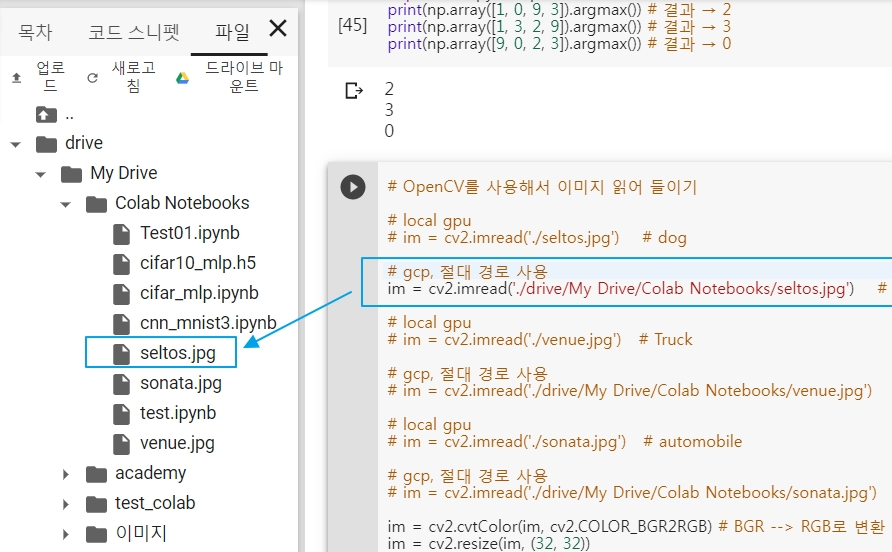

### [참고 2] 코드를 이용한 Google 드라이브 마운트(연동)

Colab을 사용할 때 구글 드라이브와 연동하면 데이터나 모델을 불러오거나 저장할 수 있고 필요시 로그를 구글 드라이브에 저장할 수 있다.

구글 드라이브와 연동하려면 다음 코드를 실행한다.
출력되는 URL에 접속하여 verification code를 발급 받고 이를 입력한다.

▷ /Colab Notebooks/test.ipynb append

```bash
!apt install -y -qq --fix-broken python-pycurl python-apt 2> /dev/null
!apt install -y -qq software-properties-common module-init-tools 2> /dev/null
!add-apt-repository -y ppa:alessandro-strada/ppa 2>&1 > /dev/null
!apt update -qq 2>&1 > /dev/null
!apt install -y -qq google-drive-ocamlfuse fuse 2> /dev/null
```

```python
from google.colab import auth
from oauth2client.client import GoogleCredentials

auth.authenticate_user()
creds = GoogleCredentials.get_application_default()

!google-drive-ocamlfuse -headless -id={creds.client_id} -secret={creds.client_secret} < /dev/null 2>&1 | grep URL

from getpass import getpass

vcode = getpass()

!echo {vcode} | google-drive-ocamlfuse -headless -id={creds.client_id} -secret={creds.client_secret}
```

그 다음 자신의 구글 드라이브와 Colab의 디렉토리를 연결하여 사용한다.
다음 코드는 Colab 가상머신 내에 google_drive라는 폴더를 만들고, 이를 구글드라이브와 연결한다.
▷ /Colab Notebooks/test.ipynb append

```bash
!mkdir -p google_drive
!google-drive-ocamlfuse -o nonempty google_drive
```

다음 코드는 사용자의 구글 드라이브에 test_colab이라는 디렉토리를 생성하고 그 아래에 데이터프레임을 csv 형식으로 저장한다.
▷ /Colab Notebooks/test.ipynb append

```python
!mkdir -p google_drive/test_colab
df = pd.DataFrame(np.random.rand(10, 5))
df.to_csv("google_drive/test_colab/df.csv")
!ls -Fcal google_drive/test_colab
```
