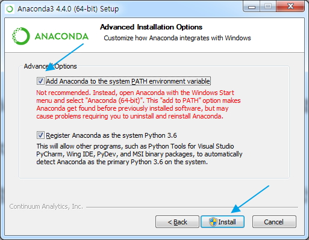

[01] Anaconda 5.1.0 download
- 기본 작업 폴더:
  C:/ai4
  C:/ai4/ws_bigdata
  C:/ai4/ws_bigdata/r
  C:/ai4/ws_bigdata/python

1. Anaconda 5.1.0+ download
   - 파이썬의 머신러닝 라이브러리인 sklearn(scikit-learn, 사이킷런) 등의 패키지와
     Jupyter Notebook 등을 모두 포함한 배포 패키지인
     아나콘다를 설치해야 머신러닝 개발이 편리하다. (개별 Library 설치시 Error 자주 발생)
   - 아나콘다 주요 구성 요소: Python 3.6, PIP, Pandas, Numpy, Scipy, Sklearn등
     수백개의 Library 포함
   - 최신버전 다운로드: https://www.anaconda.com/download/   
   - 모든 버전 다운로드: https://repo.continuum.io/archive/index.html
     'Anaconda3-5.1.0-Windows-x86_64.exe    537.1M    2018-02-15' 다운로드( Python 3.6.0 기준)
     * QT library 에러 발생 버전 설치하지 말것: 5.3.1, 5.3.0, 5.2.0

[02] Anaconda3-5.1.0 설치
 
1. Anaconda3-5.1.0 설치
 
   1) 'Anaconda3-5.1.0-Windows-x86_64.exe' 파일을 관리자 권한으로 실행합니다.
  
   2) 설치시 사용자 지정을 'All User'를 선택하고 설치합니다.(중요 ★)
  
   3) 설치는 기본 경로에 설치합니다.

   4) 설치시 CMD창에서 명령 실행이 편리하도록 옵션을 모두 선택합니다.(중요 ★)
   

 
2. 설치 확인
    - 윈도우 시작 메뉴 -> cmd
 
    > python --version
    Python 3.6.0 (default, Jun 28 2018, 08:04:48) [MSC v.1912 64 bit (AMD64)] :: Anaconda, Inc. on win32
Type "help", "copyright", "credits" or "license" for more information.
  
  
 
[03] R kernel 설치
 
1. R kernel 설치
- 시작 메뉴 -> Anaconda3 Prompt 관리자 권한으로 실행
  (base) C:\Windows\system32>conda install -c r r-irkernel
- 선택 옵션은 'y'를 선택함.
 
 
2. Jupyter Notebook 기본 경로의 주석 처리
   - 여러명이 Jupyter Notebook 사용시는 폴더 충돌이 발생함으로 아래의 설정을 할것.
▷ C:/Users/soldesk/.jupyter/jupyter_notebook_config.py
    (Anaconda 4.4.0은 202번 라인, Anaconda 5.1.0 246번 라인)
.....
# c.NotebookApp.notebook_dir = 'C:/ai_201905/ws_python/notebook'
.....
 
 
3. Jupyter Notebook 실행
- 기본적으로 사용자 계정 폴더가 작업 폴더로 열림으로 아래처럼 실행 파일 생성.
 
▷ C:/ai4/jupyter_r.cmd, 제작후 관리자 권한으로 실행
  C:
  CD\
  CD ai4
  CD ws_bigdata
  Jupyter Notebook 
 

 
4 기타 관련 설정
1) 경고 메시지 숨기기
    old <- getOption('warn') # 기본값: 1, 출력
    old
    options(warn = -1)
  
2) plot 출력시 크기 조절
   library(repr)
   options(repr.plot.width=3, repr.plot.height=3) # plot 크기 inch 지정
  
3) 'stringr' library 설치
   options(repos="https://CRAN.R-project.org")
   install.packages("stringr")
  
4) 설치안되면 저장소의 변경 또는 Jupyter Notebook을 재시작하고 재설치 할것
   options(repos = c(CRAN = "http://cran.rstudio.com"))
   install.packages("xlsx")
